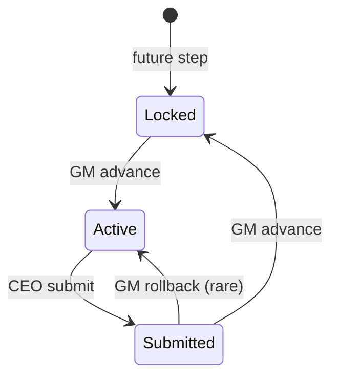
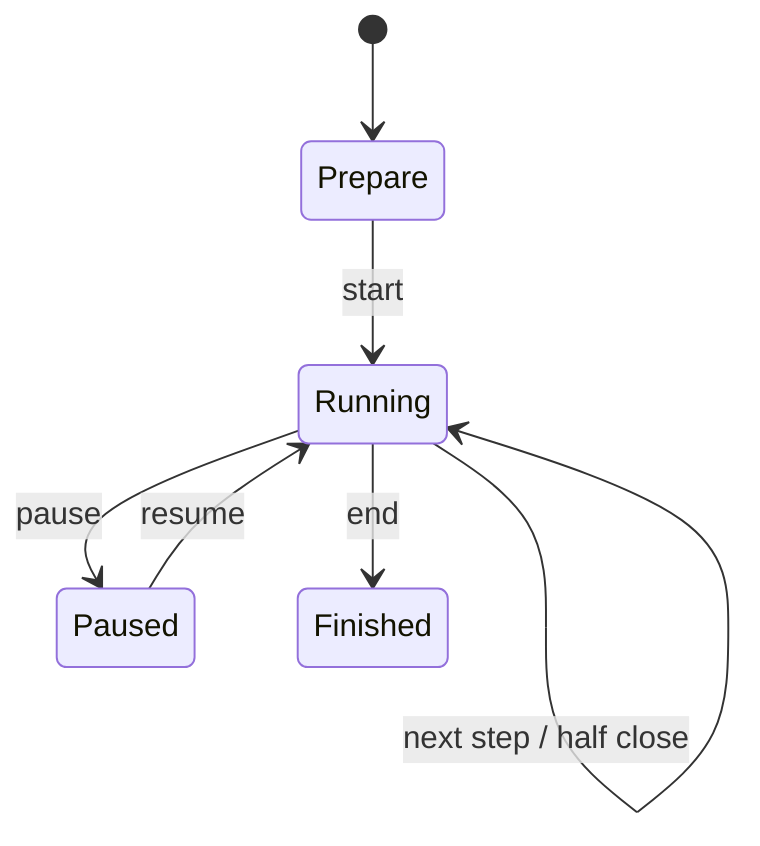

# 02. User Flow (UX v2 — 교육 흐름)

> **Version 1.1** — Step1 1A→1B (D-01); advance modal (D-10)

---

## 역할

| UI | 역할 | 하는 일 |
|----|------|---------|
| **GM** | 강사 | 게임 속도·단계·경제 환경·이벤트 통제 |
| **CEO** | 교육생 | 현재 단계 의사결정·회사 현황·소식 확인 |

---

## Master Loop (수업 중심)

```
GM: 반기·Step 시작
  ↓
CEO: 현재 Step 의사결정 → 제출
  ↓
GM: 팀 완료 확인 (+ 경제 환경 실시간 조정 가능)
  ↓
GM: [다음 단계로]
  ↓ (×7)
GM: [반기 마감] → 다음 상/하반기
  ↓ (×6반기)
GM: 게임 종료 → 순위·피드백
```

---

## Flow A — GM: 게임 준비

```
로그인 → 게임 만들기 → 시나리오 선택
→ 참가 코드 확인 → Prepare 화면
→ CEO 대기실 입장 확인 → [게임 시작]
→ GM Desk · 1년차 상반기 · Step ① 자금 조달
```

---

## Flow B — GM: 단계 진행 (매 Step)

```
GM Desk에서 팀 그리드 확인 (✅/⏳)
→ (선택) 경제 패널 슬라이더 조정 → CEO 소식 반영
→ (선택) Quick Event
→ [다음 단계로]
→ 미제출 팀 경고 → 진행 확인
→ WebSocket: stepChanged → 전 CEO 화면 갱신
```

**GM만** Step 전환 가능. CEO는 대기.

---

## Flow C — GM: 반기 마감

```
Step ⑦ 반기 결산에서 CEO 조회 완료
→ GM [반기 마감하고 ○○ 시작]
  예: "하반기 시작" / "2년차 상반기 시작"
→ 결산 파이프라인 (백엔드)
→ Step ① 로 리셋
→ (연말) AI 경영 피드백 생성 → Results 탭
```

---

## Flow D — CEO: 참가 ~ 대기

```
/join → 코드 → 팀명·이름 → /play/lobby
"GM이 게임을 시작합니다"
→ gameStarted → /play
```

---

## Flow E — CEO: 단계별 의사결정

> **D-01**: Step1 = Phase 1A (연초) → Phase 1B (연중·상환) → one submit

```
/play Tab「지금 할 일」
→ HalfYearBanner + StepTimeline
→ 현재 Step 학습 한 줄 + 폼
→ [결정 제출하기]
→ read-only + "GM이 다음 단계를 진행할 때까지 대기"
→ (소식) GM 경제 변경 시 Tab 3 알림
```

| Step | CEO 행동 |
|------|----------|
| ① 자금 조달 | 차입·예금 |
| ② 설비 투자 | 토지·기계 |
| ③ 인력 채용 | 부서별 인원 |
| ④ 원재료 구매 | 지역·수량 |
| ⑤ 생산 계획 | 생산량 |
| ⑥ 판매 전략 | 지역·가격·수량 |
| ⑦ 반기 결산 | **입력 없음** — 결과·재무 학습 |

---

## Flow F — 경제 환경 실시간 변경

```
GM: Economy Live Panel 조정 → Apply
→ EconomicState 갱신
→ News: "환율 5% 상승"
→ CEO Tab 3 + Tab 1 참고 칩 갱신
→ (해당 Step) 폼 힌트 optional
```

---

## Flow G — 이벤트

```
GM: Quick Event or 보관함
→ Event Engine
→ CEO Tab 3 헤드라인
→ 의사결정에 영향 (백엔드)
```

---

## Flow H — 게임 종료

```
GM: 게임 종료 (3년차 하반기 반기 마감 후)
→ /gm/game/[id]/results
→ CEO: 최종 순위·AI 요약 (Tab 2/3)
```

---

## 상태 다이어그램

### CEO Step (UI)



### Game (GM)



---

## UX vs Backend

| UX 표현 | Backend |
|---------|---------|
| 상반기/하반기 | FiscalPeriod half |
| 단계 4/7 | GameStep |
| 다음 단계로 | advanceStep |
| 반기 마감 | closePeriod |
| 결정 제출 | Decision POST → Journal |

상세 UX: `docs/ux/01-education-flow-ux.md`
