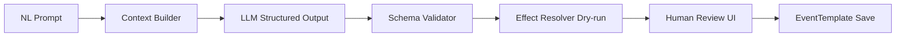

# 06. NL Event Generator (architecture draft)

> **Superseded by** `docs/spec/02-event-engine-spec.md` **v1.1**

## 6.1 목적

강사가 **자연어로 상황을 설명**하면, 시스템이 **검증 가능한 EventTemplate** 초안을 생성한다.  
수동 JSON 작성 부담을 줄이고 교육 시나리오 제작 속도를 높인다.

---

## 6.2 사용자 Flow

```
Admin → Event Templates → NL Generator (SCR-ADM-026)
  → 자연어 입력 (한/영)
  → [옵션] 맥락: 현재 Session 경제값, 대상 Period
  → Generate
  → Preview (title, effects, news, severity)
  → Edit / Regenerate / Save to Library
  → (선택) Session에 즉시 스케줄
```

---

## 6.3 입력

| Field | 필수 | 예 |
|-------|------|-----|
| prompt | ✓ | "2년차 상반기에 환율이 20% 오르고 원자재 수입가가 따라 오른다" |
| sessionContext | | sessionId → EconomicState snapshot |
| targetTiming | | year=2, half=H1 |
| language | | ko (default) |
| severityHint | | 1-5 |

---

## 6.4 출력 (Structured Event Draft)

```json
{
  "title": "환율 급등 및 수입 원자재 가격 상승",
  "description": "...",
  "category": "ECONOMY",
  "severity": 4,
  "defaultTiming": { "year": 2, "half": "H1" },
  "effects": [
    { "type": "ECONOMIC_DELTA", "target": "exchangeRate", "payload": { "mode": "PERCENT", "value": 20 } },
    { "type": "ECONOMIC_DELTA", "target": "rawMaterialIndex", "payload": { "mode": "PERCENT", "value": 12 } }
  ],
  "newsTemplate": {
    "headlineSeed": "원/달러 환율, 반기 만에 20% 급등",
    "tone": "urgent",
    "audience": "CEO"
  },
  "confidence": 0.87,
  "warnings": ["물류비 미언급 — 추가 여부 검토"]
}
```

---

## 6.5 파이프라인



### Stage 1 — Context Builder
- 허용 effect types, economic var keys, region ids 주입
- System prompt: "교육용 제조 경영 시뮬레이션 이벤트 설계자"

### Stage 2 — LLM
- Model: OpenAI (gpt-4o class) structured outputs / JSON mode
- Temperature: 0.3 (일관성)

### Stage 3 — Schema Validator
- Zod/JSON Schema against EventTemplate spec
- Unknown keys → reject + retry once

### Stage 4 — Dry-run
- `EffectResolver.resolve` on mock EconomicState
- Bounds check: exchangeRate > 0, percentages capped (config max ±50%)

### Stage 5 — Human Review
- Admin edits fields before save
- **LLM output never auto-fired without confirm**

---

## 6.6 System Prompt 핵심 (요약)

```
You generate EventTemplate JSON for a manufacturing management simulation.
Allowed effect types: [...]
Allowed economic keys: [...]
Rules:
- Educational, realistic, no catastrophic total wipe
- Prefer ECONOMIC_DELTA and MARKET_DELTA
- Include newsTemplate for AI News Engine
- Output JSON only matching schema
```

---

## 6.7 Few-shot 예시 (Library)

| Prompt | Expected category |
|--------|-------------------|
| "노조 파업으로 한 반기 생산 30% 감소" | LABOR, CAPACITY_DELTA |
| "정부가 탄소세를 새로 도입" | POLICY, TAX_DELTA |
| "AI로 소형 설비 효율 20% 개선" | TECH, CAPACITY_DELTA |

Store anonymized prompt→template pairs for RAG (Phase 2)

---

## 6.8 API (설계)

```
POST /api/v1/admin/event-templates/generate
Body: { prompt, sessionId?, targetTiming?, language? }
Response: { draft, validation, dryRunImpact }

POST /api/v1/admin/event-templates
Body: { ...draft, approved: true }
```

---

## 6.9 비용·제한

| 항목 | 값 |
|------|-----|
| Rate limit | 10 req/hour/instructor |
| Max prompt | 2000 chars |
| Retry | 1 auto on schema fail |
| Log | prompt hash + draft (PII none) |

---

## 6.10 품질·안전

- **Guardrails**: 금지 — 실존 정치인, 차별, 실제 기업명
- **Sanity**: severity≥4 → UI confirm twice
- **Versioning**: generatedFromPrompt stored on template
- **Fallback**: generation fail → manual editor (Scenario Editor)

---

## 6.11 NL Generator ↔ Event Engine

Save → `EventTemplate` in Library  
Schedule → Scenario timeline or `SimulationEvent(SCHEDULED)`  
Fire → standard `EventEngineService.fire`

---

## 6.12 UI (SCR-ADM-026)

```
┌─ Prompt (textarea) ─────────────────┐
│ Context chips: Session, Y2 H1         │
├─ Preview ─────────────────────────────┤
│ Title | Category | Severity           │
│ Effects table (editable)              │
│ News headline preview                 │
│ Dry-run impact: ΔexchangeRate ...     │
├─ [Regenerate] [Save Draft] [Save] ────┤
└─ Warnings list ───────────────────────┘
```
