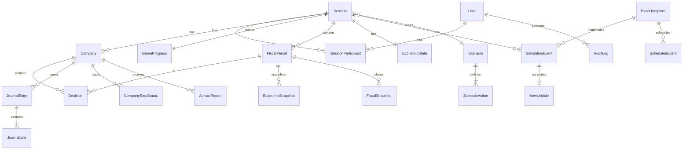

# 07. Database ERD 설계

> **Supreme principles**: `../spec/00-v1-development-principles.md`  
> Phase 0-7 | **Version 1.1** — D-11, D-10, D-07

## 7.1 도메인 그룹

```
Identity ─ Session ─ GameProgress ─ Company ─ Decision
                    │
Accounting ─ Journal ─ Ledger
                    │
Environment ─ EconomicState ─ MarketState
                    │
Events ─ EventTemplate ─ SimulationEvent
                    │
Scenario ─ ScenarioAction ─ ScheduledEvent
                    │
AI ─ NewsArticle ─ AnnualReport
                    │
Admin ─ AuditLog ─ Override
```

---

## 7.2 Core Entities

### Identity
| Entity | Key fields |
|--------|------------|
| User | id, email, role(INSTRUCTOR,CEO), name |
| Session | id, name, status, joinCode, scenarioId, instructorId |
| SessionParticipant | sessionId, userId, companyId, role |

### Game
| Entity | Key fields |
|--------|------------|
| Company | id, sessionId, teamName, ceoUserId |
| FiscalPeriod | id, sessionId, periodIndex, year, half, status |
| GameProgress | sessionId, periodId, currentStep, stepStartedAt |
| CompanyStepStatus | companyId, periodId, step, completedAt, decisionId |

### Decisions
| Entity | Key fields |
|--------|------------|
| Decision | id, companyId, periodId, step, status, payload JSON, idempotencyKey |
| Decision types in payload | Loan, Facility, Hire, Purchase, Production, Sales |

### Accounting
| Entity | Key fields |
|--------|------------|
| ChartOfAccount | code, name, type(ASSET,LIABILITY...) |
| JournalEntry | id, companyId, periodId, entryDate, sourceType, sourceId |
| JournalLine | entryId, accountCode, debit, credit, memo |
| FiscalSnapshot | companyId, periodId, bsJson, plJson, cfJson |

**v1.1 (D-11)**: `FiscalSnapshot` **1:1 per (company, period)** — not cumulative default.

**v1.1 (D-10)**: `CompanyStepStatus.status` += `SKIPPED_ZERO`, `COPIED_FROM_PREVIOUS`.

**v1.1 (D-07)**: `RegionRemaining` sessionId, regionId, materialRemaining, saleRemaining — GM editable.

### Environment
| Entity | Key fields |
|--------|------------|
| EconomicState | sessionId, values JSON |
| EconomicSnapshot | sessionId, periodId, values JSON |
| MarketRegion | id, code, name, baseDemand |
| MarketState | sessionId, regionId, periodId, demandMultiplier, ... |

### Events
| Entity | Key fields |
|--------|------------|
| EventTemplate | id, code, title, category, effects JSON, newsTemplate JSON |
| SimulationEvent | id, sessionId, templateId, status, firedAt, targetScope |
| ScheduledEvent | sessionId, templateId, year, half, onStep, status |

### Scenario
| Entity | Key fields |
|--------|------------|
| Scenario | id, name, description, isPublic |
| ScenarioAction | scenarioId, order, year, half, onStep, actionType, payload JSON |

### AI
| Entity | Key fields |
|--------|------------|
| NewsArticle | id, sessionId, eventId, scope, companyId?, content JSON |
| AnnualReport | id, companyId, year, content JSON, status |

### Admin
| Entity | Key fields |
|--------|------------|
| AuditLog | id, sessionId, actorId, action, entityType, entityId, diff JSON |
| AdminOverride | id, companyId, field, oldValue, newValue, reason |

---

## 7.3 ERD (Mermaid)



---

## 7.4 주요 관계 규칙

| Rule | 설명 |
|------|------|
| Journal only append | UPDATE/delete 금지 (adjustment = new entry) |
| Decision 1:1 Step | company+period+step unique when POSTED |
| GameProgress 1:1 Session | current step singleton |
| EconomicState 1:1 Session | live values |
| FiscalSnapshot | closePeriod 시 생성 |

---

## 7.5 Inventory (논리 — JSON or normalized Phase 2)

Option A (MVP): `CompanyInventory` period-end snapshot  
Option B: `InventoryTransaction` ledger-style  

**설계 선택**: InventoryTransaction (회계 원장과 동일 철학)

| Entity | fields |
|--------|--------|
| InventoryItem | companyId, sku(MAT_A..PROD), qty |
| InventoryTxn | companyId, periodId, sku, delta, sourceType, sourceId |

---

## 7.6 Assets

| Entity | fields |
|--------|--------|
| LandPlot | companyId, count, costBasis |
| Machine | companyId, type(LARGE,SMALL), count, costBasis |
| DepreciationSchedule | assetRef, periodId, amount |

---

## 7.7 Indexes (필수)

- Decision(companyId, periodId, step) UNIQUE POSTED
- JournalEntry(companyId, periodId)
- SimulationEvent(sessionId, status)
- AuditLog(sessionId, createdAt)
- NewsArticle(sessionId, companyId, createdAt)

---

## 7.8 Enum Summary

```
SessionStatus: DRAFT, RUNNING, PAUSED, COMPLETED
GameStep: LOAN, FACILITY, HIRING, MATERIAL, PRODUCTION, SALES, SETTLEMENT
DecisionStatus: DRAFT, SUBMITTED, VALIDATED, POSTED, LOCKED
EventStatus: SCHEDULED, ACTIVE, EXPIRED, CANCELLED
EffectType: ECONOMIC_DELTA, MARKET_DELTA, ...
Half: H1, H2
UserRole: INSTRUCTOR, CEO
```

---

## 7.9 엑셀 매핑 (참고)

| Excel | Entity |
|-------|--------|
| 연습 시트 입력열 | Decision.payload |
| Sheet1 P/L | FiscalSnapshot.plJson |
| Sheet2 B/S | FiscalSnapshot.bsJson |
| H열 OK/다시입력 | ValidationService result |

---

## 7.10 Scale 가정

- 10 companies × 6 periods × 7 steps = 420 decisions/session
- Journal ~5-15 lines/decision → ~4k lines/session
- Events ~100/session max
- AnnualReport 10 × 3 years = 30 LLM jobs/session
