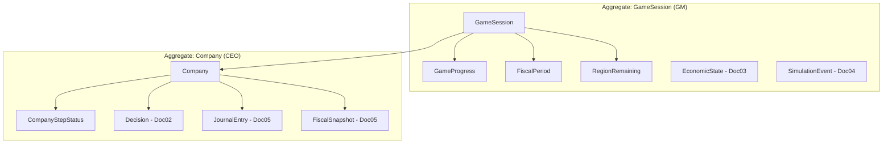
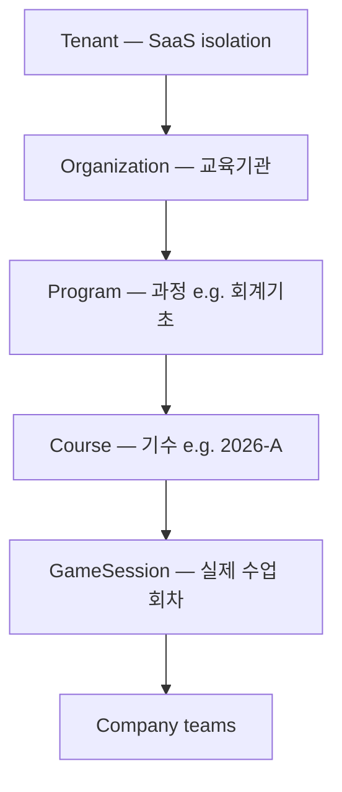
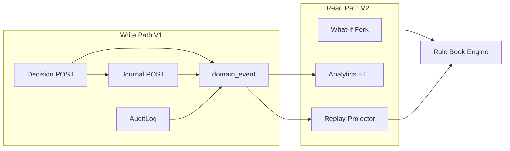

# Architecture Review Report — Core Domain Schema (V1)

> **Review target**: `docs/spec/json/01-core-domain-schema.md`, `schemas/common.json`, `schemas/core-domain.json`  
> **Reference**: ERD `07-erd.md`, Doc 10 §12 Event Store, `00-v1-development-principles.md`  
> **Date**: 2026-07-26  
> **Verdict**: **Conditional Approval** — **Critical 0건** · Major 6건 (Schema patch 후 Doc 02 진행)

---

## Executive Summary

Core Domain Schema는 V1 엑셀 대체 목표에 **적합한 방향**이다. Aggregate 경계(`GameSession`, `Company`)와 append-only Event Store 철학(Principle 5)이 일치한다.

다만 **Education Event Store**와 **GM AuditLog**가 아직 분리·순서 보장이 명시되지 않았고, **Multi-Tenant** 확장 필드가 없으며, `User.role` 모델이 세션 역할과 혼재한다. 이는 V1 GA blocker는 아니나 **Doc 01 patch**로 반영 권고(Major).

| Severity | Count | GA Blocker |
|----------|------:|:----------:|
| **Critical** | 0 | — |
| **Major** | 6 | No (patch 권고) |
| **Minor** | 8 | No |

**Critical이 없으므로** Major patch 적용 후 **Core Domain Schema 승인 → JSON Spec 02 (Decision Schema)** 진행 가능.

---

## 1. Domain Model Review

### 1.1 Entity 책임

| Entity | 책임 | 평가 |
|--------|------|------|
| `GameSession` | 교육 세션 생명주기, joinCode, scenario, settings | ✓ 명확 |
| `GameProgress` | 현재 period/step/closing (runtime cursor) | ⚠ `sessionPhase` 중복 (§1.2) |
| `Company` | 팀(가상 기업) identity, optimistic lock | ✓ |
| `FiscalPeriod` | 6반기 캘린더, OPEN/CLOSED | ✓ |
| `CompanyStepStatus` | GM Desk 그리드 (제출 UX) | ✓ Decision과 보조 |
| `SessionParticipant` | User↔Session↔Company 바인딩 | ✓ |
| `RegionMaster` / `RegionRemaining` | 마스터 vs 세션 cap (D-07) | ✓ |
| `AuditLogEntry` | GM/system 감사 | ✓ (단, Event Store ≠ Audit, §2) |
| `DomainEventEnvelope` | WS/bus **전송** envelope | ✓ persistence 별도 필요 |

**미정의 (후속 JSON Spec)** — 의도적 defer:

- `Decision`, `JournalEntry`, `FiscalSnapshot` → Doc 02, 05
- `CompanyOperationalState` (현황판 DTO persist) → Doc 06 Dashboard
- `EconomicState`, `SimulationEvent` → Doc 03, 04

### 1.2 중복 Entity

| 중복 후보 | 분석 | 권고 |
|-----------|------|------|
| `GameSession.sessionPhase` vs `GameProgress.sessionPhase` | 동일 enum 이중 저장 → drift 위험 | **Major M-02**: `GameProgress`만 authoritative; Session은 `startedAt/finishedAt`만 |
| `GameProgress.currentGameStep` vs `stepPhase` | derivable | Minor: DB에 저장 시 generated column |
| `CompanyStepStatus` vs `Decision.status` | UX grid vs source of truth | ✓ 유지 — Decision이 truth, CSS는 projection |
| ERD `Session` vs Schema `GameSession` | 명칭 불일치 | Minor M-08: ERD alias 통일 |
| `AdminOverride` (ERD) vs `AuditLog.diff` | Override 전용 테이블 vs audit | Doc 05에서 `AdminOverride` record + audit |

**결론**: 제거할 중복 entity 없음. **상태 필드 중복 1건** (sessionPhase) 정리 필요.

### 1.3 Aggregate Root



| Aggregate Root | 일관성 경계 | Invariant 예 |
|----------------|-------------|--------------|
| **GameSession** | 세션 전역 step advance, economy, event, pause | 한 번에 하나의 `stepPhase`; GM mutex |
| **Company** | 팀별 decision, journal, inventory | `(period, step)` POSTED unique; `statusVersion` |
| **User** (weak) | credentials, profile | 세션 gameplay state **포함 금지** |
| **Scenario** (catalog) | 템플릿, read-mostly | Session 생성 시 snapshot copy |

Cross-aggregate: CEO Decision POST → Company aggregate; GM `advanceStep` → GameSession aggregate + CompanyStepStatus projection.

### 1.4 Value Object

| Value Object | Schema 위치 | 불변 |
|--------------|-------------|:----:|
| `MoneyManwon` | common.json | ✓ |
| `PeriodLabel` / `PeriodIndex` | common.json | ✓ |
| `RegionCode` | common.json | ✓ |
| `FeatureFlags` | common.json | ✓ |
| `GameConstants` | core-domain | ✓ (Rule Book) |
| `AuditActor` | common.json | ✓ |
| `Half` / `Year` | common.json | ✓ |

**미분리 (Minor)**: Decision payload 내부 VO → Doc 02 (`LoanAmount`, `PurchaseLine`, …)

### 1.5 V2 Replay / What-if 변경 최소화

| V2 capability | Core Domain 변경 | 방식 |
|---------------|------------------|------|
| Replay | **불필요** | Read model over Decision+Journal+Snapshot |
| What-if | **불필요** | `WhatIfBranch` 별 aggregate (Doc 07+) |
| Advisor/Copilot | **불필요** | Side tables + `featureFlags` |

**조건**: V1부터 append-only + **period-scoped snapshots** (D-11) 필수 — Doc 02/05에서 보장.

---

## 2. Event Store Review

### 2.1 현재 구조 (Doc 10 §12 + Core Domain)

```
Education Event Store (target)
├── Decision (POSTED)          — Doc 02
├── JournalEntry (append)    — Doc 05
├── FiscalSnapshot (period)  — Doc 05
├── SimulationEvent (world)  — Doc 04
├── CompanyStepStatus        — Core ✓
├── EconomicSnapshot         — Doc 03 (period close)
└── AuditLogEntry            — Core ✓ (GM audit)

Transport (ephemeral)
└── DomainEventEnvelope      — Core ✓ (not durable alone)
```

### 2.2 Capability Matrix

| Capability | 지원 | Gap |
|------------|:----:|-----|
| **Replay** | ⚠ Partial | `ReplayFrame` read model, `RankingSnapshot`, `WorldStateAtStep` 미정의 |
| **What-if** | ⚠ Partial | `GameEndSnapshot`, `WhatIfBranch` 미정의 (V3) |
| **Audit** | ✓ | `AuditLogEntry` + Journal source linkage |
| **Undo** | ✗ By design | **물리적 Undo 없음** — compensating journal + audit only (Principle 5) |
| **Analytics** | ⚠ Partial | `stepStartedAt` 있음; `DecisionSubmitted` timing, `ValidationFailed` 없음 |

### 2.3 부족한 Event / Record (제안)

**Persisted domain events** (신규 테이블 `domain_event` 권고):

| eventType | Purpose | V1 persist |
|-----------|---------|:----------:|
| `decision.submitted` | Analytics latency | ✓ |
| `decision.validated` / `decision.failed` | QA, Analytics | ✓ |
| `decision.posted` | Replay, WS | ✓ (already listed) |
| `journal.posted` | Replay financial delta | ✓ Doc 05 |
| `settlement.step.completed` | GM closing UI, Replay | ✓ |
| `ranking.updated` | Replay rank delta | ✓ |
| `economy.patched` | Replay world overlay | ✓ |
| `event.fired` | Replay | ✓ |
| `company.status.changed` | Dashboard version | optional V1 |
| `inventory.txn` | Material/FG trace | ✓ Doc 05 |
| `gm.override.applied` | Audit + Replay annotate | ✓ |
| `advisor.signal.shown` | Analytics V2 | flag off |
| `copilot.action` | Analytics V2 | flag off |

**Envelope 확장 (Major M-03)**:

```json
{
  "sessionId": "uuid",
  "sequence": 1842,
  "eventType": "decision.posted",
  "occurredAt": "...",
  "aggregateType": "Company",
  "aggregateId": "uuid",
  "payload": {},
  "causationId": "uuid",
  "correlationId": "trace-id"
}
```

- `sequence`: monotonic per `sessionId` — Replay ordering SSOT
- `DomainEventEnvelope` = view; **`domain_event` table** = durable store

### 2.4 Undo 정책 (명시)

| 요청 | 지원 | 구현 |
|------|:----:|------|
| CEO "제출 취소" | ✗ | POSTED immutable |
| GM Override | ✓ | `AdminOverride` + compensating journal |
| GM Decision zero/copy | ✓ | D-10 system Decision + audit |
| DB rollback | ✗ | Transaction rollback only (uncommitted) |

---

## 3. Database Review (PostgreSQL)

### 3.1 적합성

**적합**. JSONB(`payload`, `diff`, `plJson`), enum, FK, partial unique index 모두 V1에 적합.

### 3.2 Index 제안

| Table | Index | Purpose |
|-------|-------|---------|
| `game_session` | `UNIQUE(join_code) WHERE session_phase IN ('PREPARE','RUNNING','PAUSED')` | Active code |
| `game_session` | `(organization_id, created_at DESC)` | Multi-tenant list (V2) |
| `company` | `UNIQUE(session_id, team_name)` | |
| `company` | `(session_id)` | GM desk |
| `fiscal_period` | `UNIQUE(session_id, period_index)` | |
| `game_progress` | PK `(session_id)` | |
| `company_step_status` | `UNIQUE(company_id, period_id, step)` | |
| `decision` | `UNIQUE(company_id, period_id, step) WHERE status='POSTED'` | partial |
| `journal_entry` | `(company_id, period_id, created_at)` | |
| `journal_line` | `(entry_id)` | |
| `domain_event` | `(session_id, sequence)` UNIQUE | Replay order |
| `audit_log` | `(session_id, occurred_at DESC)` | |
| `fiscal_snapshot` | `UNIQUE(company_id, period_id)` | D-11 |

### 3.3 Foreign Keys

```
organization → game_session → company → decision → journal_entry
                           → fiscal_period
                           → game_progress (1:1)
company.ceo_user_id → user
session_participant (session_id, user_id) → game_session, user
journal_line.entry_id → journal_entry ON DELETE RESTRICT
```

- **No CASCADE delete** on Decision/Journal (append-only archive)
- Session soft-delete: `deleted_at` + retain data

### 3.4 Composite Keys

| Logical key | PK strategy |
|-------------|-------------|
| `(company_id, period_id, step)` Decision POSTED | UUID PK + partial UNIQUE |
| `(session_id, period_index)` FiscalPeriod | UUID PK + UNIQUE |
| `(session_id, sequence)` domain_event | composite UNIQUE |

### 3.5 Partition

| Table | V1 | V2+ |
|-------|:--:|:---:|
| `journal_entry` | single | `PARTITION BY HASH(session_id)` or RANGE(created_at) |
| `domain_event` | single | RANGE(created_at) monthly |
| `audit_log` | single | RANGE(occurred_at) |
| `decision` | single | HASH(session_id) at 100+ teams |

V1 (10팀×6기×7step ≈ 420 rows/session): **partition 불필요**.

### 3.6 Audit & History

| Layer | Mechanism |
|-------|-----------|
| GM actions | `audit_log` append |
| Gameplay | `decision` + `journal_entry` append |
| World | `economic_snapshot` + `simulation_event` per period/step |
| Point-in-time | `fiscal_snapshot`, `economic_snapshot` at close |
| Temporal query | Replay read model (V2), not SQL time-travel |

---

## 4. Scalability Review

### 4.1 Load Model

| Scale | Concurrent sessions | Teams/session | CEOs | Decisions/session |
|-------|--------------------:|--------------:|-----:|------------------:|
| **Baseline** | 1–5 | 10 | 10–50 | ~420 |
| **Medium** | 10–20 | 30 | 300–600 | ~1,260 |
| **High** | 50+ | 100 | 5,000+ | ~4,200 |

### 4.2 Bottleneck Analysis

| Component | 10 teams | 30 teams | 100 teams | Mitigation |
|-----------|----------|----------|-----------|------------|
| Decision POST | ✓ parallel | ✓ | ✓ | Stateless API, company row lock only |
| Validation+Journal | ✓ | ✓ | ⚠ spike | Queue per company; idempotency |
| **Settlement (`closeHalf`)** | ✓ ~30s | ⚠ ~90s | **🔴 ~5min+** | Async job + progress; batch workers |
| Ranking recompute | ✓ | ✓ | ⚠ | Materialized at close; incremental |
| GM Desk WS fanout | ✓ | ✓ | ⚠ | Channel per session; delta payloads |
| DB writes (journal) | ~4k rows | ~12k | ~40k | Accept V1; partition V2 |
| NL Event generate | N/A | N/A | GM-only | Rate limit, async |

**Primary bottleneck**: **`closeHalf` settlement pipeline** × N teams — not Core Domain issue; **Accounting Engine job design** (Doc 05).

### 4.3 V1 Target

Doc 11 NFR: **10 teams × 1 session** — current schema **충분**.

---

## 5. Security Review

### 5.1 Role Model (제안)

V1 implements **4 logical roles**; schema `UserRole`는 **2값만** — 확장 필요 (Major M-04).

| Role | V1 | Description | Scope |
|------|:--:|-------------|-------|
| **Platform Admin** | optional | 기관·시스템 설정, 전 세션 | `organization_id = *` |
| **Instructor (GM)** | ✓ | 세션 생성·진행·economy·event | `game_session.instructor_id` |
| **Student (CEO)** | ✓ | 본인 팀 Decision submit | `company.ceo_user_id` |
| **Observer** | defer V2 | Read-only desk (assistant) | `session_participant.role=OBSERVER` |

**Schema mapping**:

```json
{
  "SessionParticipantRole": ["INSTRUCTOR", "CEO", "OBSERVER"],
  "PlatformRole": ["ADMIN", "INSTRUCTOR", "USER"]
}
```

- `User.platformRole` — login identity
- `SessionParticipant.role` — **session-scoped** gameplay role (CEO ≠ global User.role)

### 5.2 API Permission Matrix (요약)

| API group | Admin | Instructor | CEO | Observer |
|-----------|:-----:|:----------:|:---:|:--------:|
| `/auth/*` | ✓ | ✓ | ✓ | — |
| `/gm/sessions` CRUD | ✓ | own | ✗ | read* |
| `/gm/sessions/:id/progress/*` | ✓ | ✓ | ✗ | read |
| `/gm/sessions/:id/economy` PATCH | ✓ | ✓ | ✗ | read |
| `/gm/sessions/:id/events/fire` | ✓ | ✓ | ✗ | ✗ |
| `/play/decisions` POST | ✗ | ✗ | own company | ✗ |
| `/play/status` GET | ✗ | ✗ | own | read* |
| `/play/financials` GET | ✗ | ✓ all | own | read* |

\* Observer V2

### 5.3 Security Controls (V1)

- JWT: `sub`, `sessionId?`, `companyId?`, `roles[]`
- Row-level: CEO queries `WHERE company_id = token.companyId`
- Rate limit: Decision POST 30/min/team (Doc 11 NFR-S05)
- Audit: all GM mutations

---

## 6. V2 Compatibility

| Feature | Core Domain 변경 | Additive only |
|---------|------------------|:-------------:|
| **Replay** | No | `replay_session`, `replay_frame` read models; consume `domain_event` |
| **Advisor** | No | `advisor_interaction` table |
| **Copilot** | No | `copilot_action` table |
| **Analytics** | No | `analytics_event` or stream from `domain_event` |
| **What-if** | No | `what_if_branch`, `what_if_result` — fork from `game_end_snapshot` |

**Core Domain 수정 없이** feature 추가 가능 — **조건**:

1. V1 `featureFlags` on `SessionSettings` (already present)
2. `extensions` on entities (already present)
3. Major M-01 `organizationId` nullable on `GameSession`
4. `domain_event` sequence (M-03) — not Core Entity but infra

---

## 7. Multi-Tenant Readiness

### 7.1 현재 구조 분석

| Scope | V1 지원 | Gap |
|-------|:-------:|-----|
| **한 회사 (single org)** | ✓ | implicit single tenant |
| **여러 회사** | ✗ | no `Organization` |
| **여러 교육기관** | ✗ | no tenant isolation |
| **여러 강사** | ⚠ | `instructorId` only — no org membership |

V1 **Single Tenant**: deploy with fixed `organization_id = DEFAULT`.

### 7.2 제안 계층 (V2 Multi-Tenant)



| Entity | V1 | V2 | Responsibility |
|--------|:--:|:--:|----------------|
| **Tenant** | implicit | ✓ | DB/schema isolation, billing |
| **Organization** | default UUID | ✓ | Institution branding, user directory |
| **Program** | — | ✓ | Curriculum template (scenario packs) |
| **Course** | — | optional | Cohort / class (multiple sessions) |
| **GameSession** | ✓ | ✓ | Single class run (current model) |

### 7.3 V1 Minimal Patch (Major M-01)

`GameSession`에 **nullable** 추가 — V1 = constant default:

```json
{
  "organizationId": "00000000-0000-0000-0000-000000000001",
  "courseId": null
}
```

- V1: single org seed, no UI
- V2: RLS `WHERE organization_id = current_setting('app.org_id')`
- **Tenant entity table V1 불필요** — Organization만으로 충분 (single-tenant SaaS later)

### 7.4 강사 다중 소속

V2: `organization_member(organization_id, user_id, role)` — Instructor는 org별 권한.

---

## 8. Review Result

### 8.1 Critical (0)

없음. V1 GA 또는 Core Domain 승인을 **차단하지 않음**.

### 8.2 Major (6) — Schema patch 권고 (Doc 01 revision)

| ID | Item | Action |
|----|------|--------|
| **M-01** | Multi-tenant | Add `organizationId` (required, default org seed) + optional `courseId` on `GameSession` |
| **M-02** | `sessionPhase` duplication | Remove from `GameSession` OR `GameProgress` — single SSOT on `GameProgress` |
| **M-03** | Event ordering | Add `DomainEventRecord` schema with `(sessionId, sequence)`; extend envelope |
| **M-04** | Role model | Split `User.platformRole` vs `SessionParticipant.role`; add `OBSERVER` enum reserved |
| **M-05** | Education vs Audit | Document: `AuditLogEntry` = GM audit; `domain_event` + Decision/Journal = Education Event Store |
| **M-06** | RankingSnapshot | Defer to Doc 05/06 — add to Event Store list in Doc 01 §3.6 cross-ref |

### 8.3 Minor (8)

| ID | Item |
|----|------|
| m-01 | ERD `Session` → `GameSession` naming align |
| m-02 | `GameProgress.currentGameStep` — document as derived, optional in DB |
| m-03 | `joinCode` unique partial index documented in Doc 01 §5 |
| m-04 | `User.email` required for INSTRUCTOR in validation schema (Doc 08) |
| m-05 | `Scenario.organizationId` for private scenarios (V2) |
| m-06 | `InventoryTxn` in ERD — confirm Doc 05 |
| m-07 | `SessionStatus` vs `SessionPhase` enum drift in ERD §7.8 |
| m-08 | Add `schemaVersion` on `GameSession` for migration |

---

## 9. Decision

| Question | Answer |
|----------|--------|
| Core Domain 방향 적절? | **Yes** |
| Critical blocker? | **No (0)** |
| 승인 가능? | **Yes — after Major M-01~M-05 patch applied to Doc 01** |
| Next step | Patch `01-core-domain-schema` → **Approve** → **JSON Spec 02 Decision Schema** |

### 9.1 Approval Checklist (post-patch)

- [ ] M-01 `organizationId` on GameSession
- [ ] M-02 sessionPhase SSOT
- [ ] M-03 DomainEventRecord in common/core schema
- [ ] M-04 Role split documented
- [ ] M-05 Event Store diagram in Doc 01
- [ ] **Core Domain Schema approved**
- [ ] Proceed to **02 Decision Schema**

---

## Appendix A — Event Store Target Architecture (V1→V3)



---

## Appendix B — Document Updates

| Doc | Action |
|-----|--------|
| `json/01-core-domain-schema.md` | Apply M-01~M-05 |
| `schemas/core-domain.json` | Patch fields |
| `schemas/common.json` | Role enums, DomainEventRecord |
| `07-erd.md` | Post JSON Spec sync (Phase 1b) |

**Status**: Approved — Core Domain Schema canonical 2026-07-26
