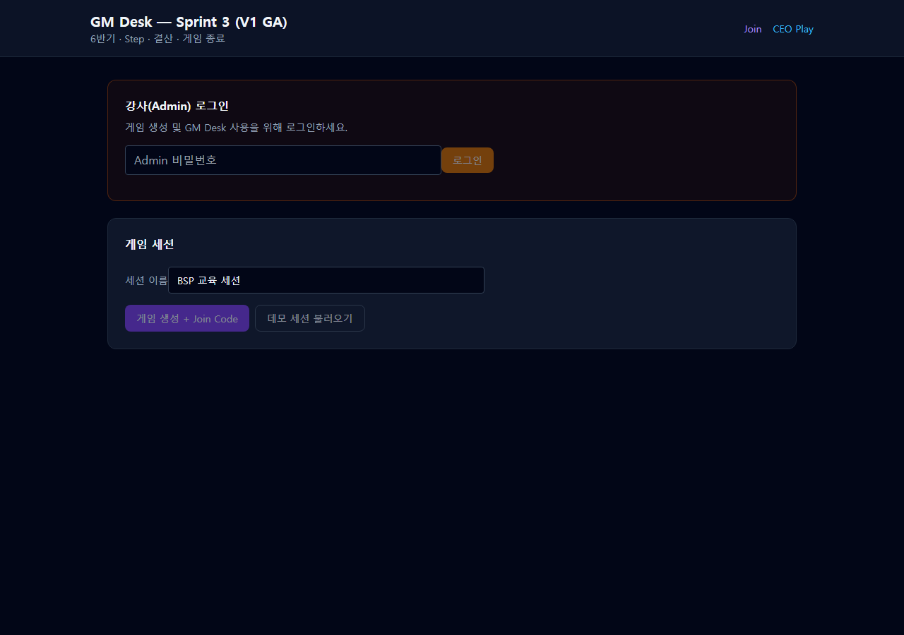
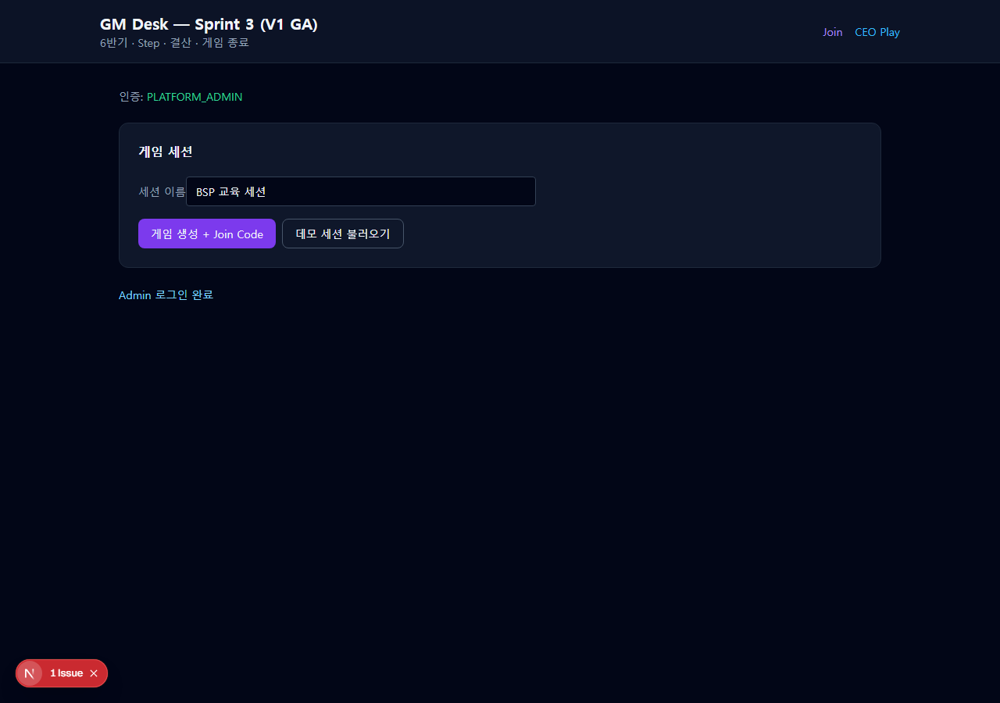
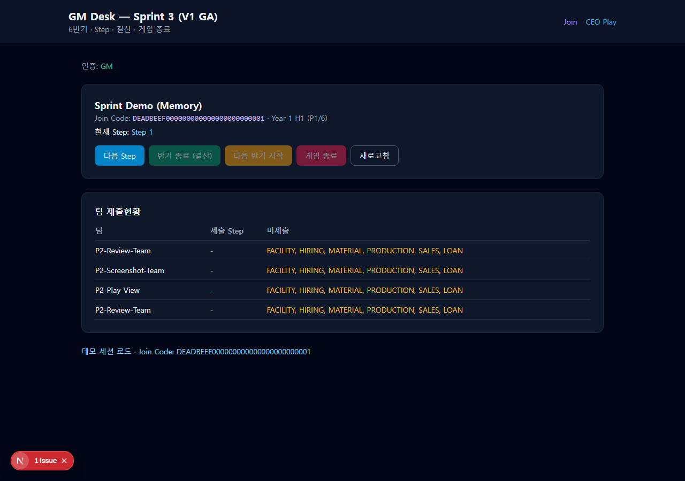
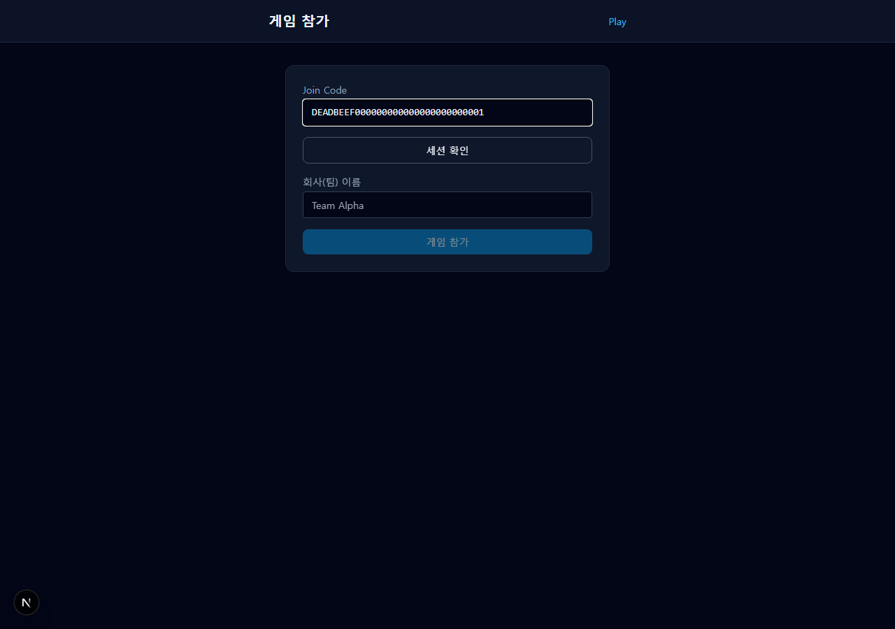
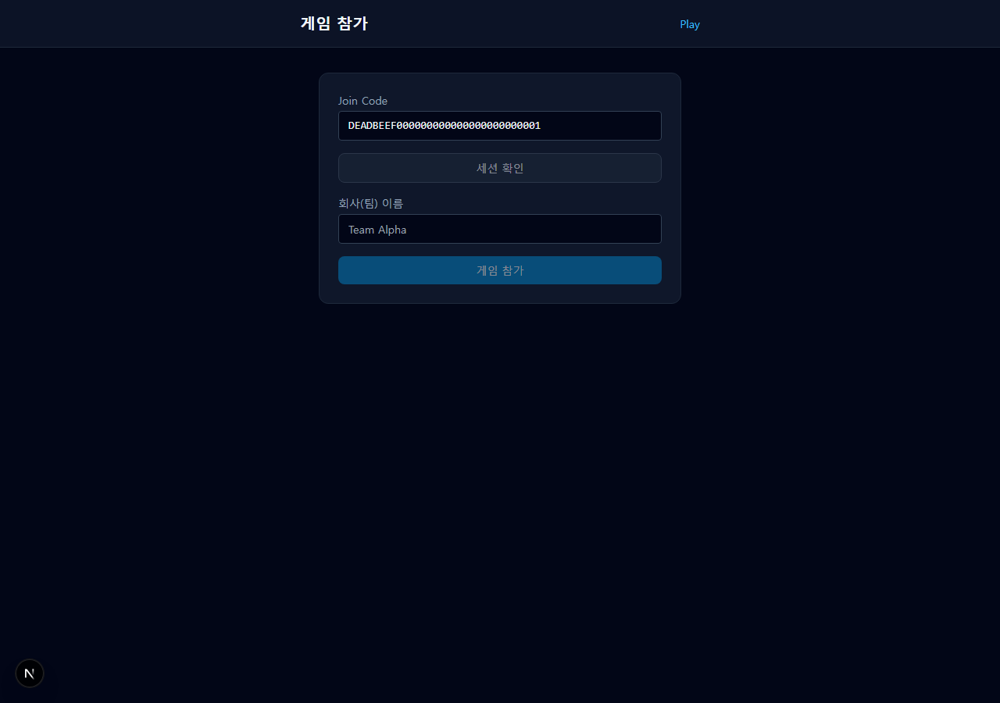
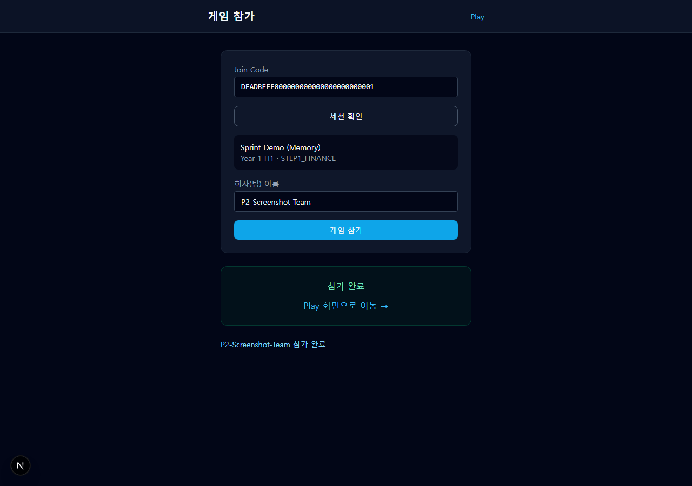
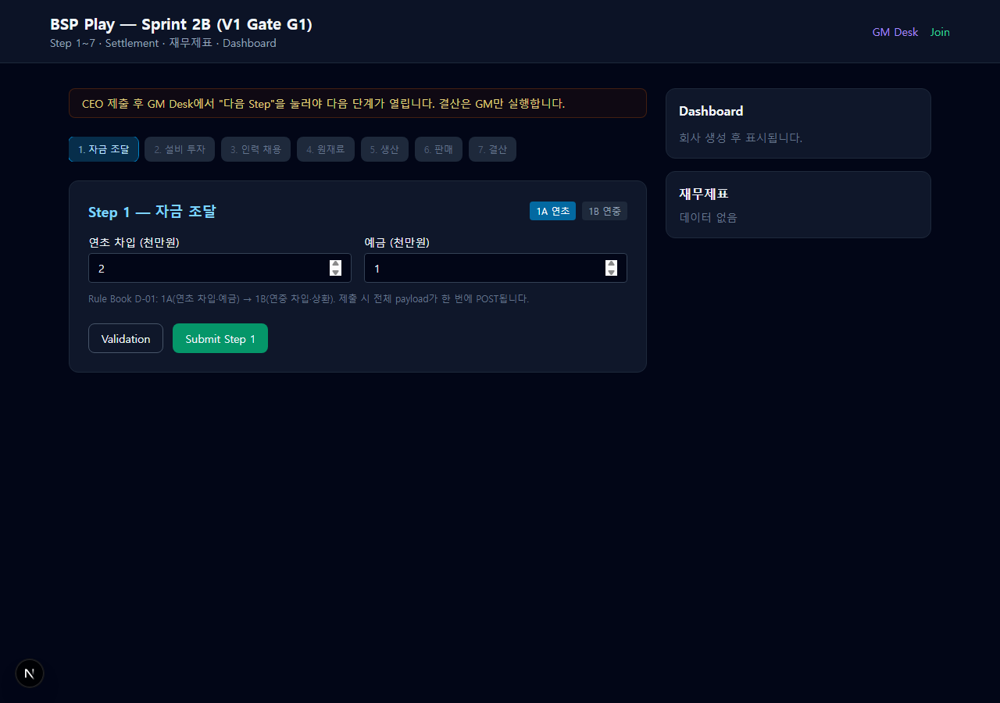
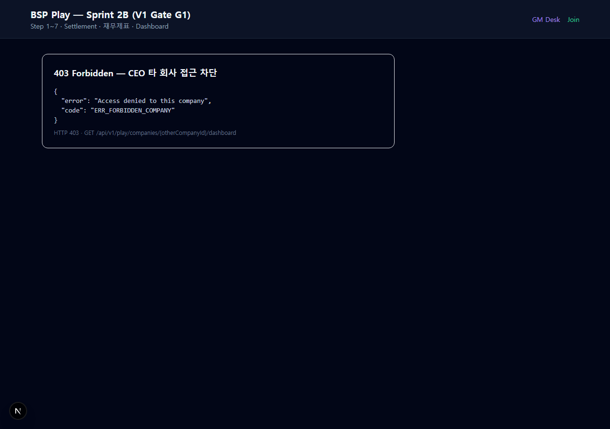
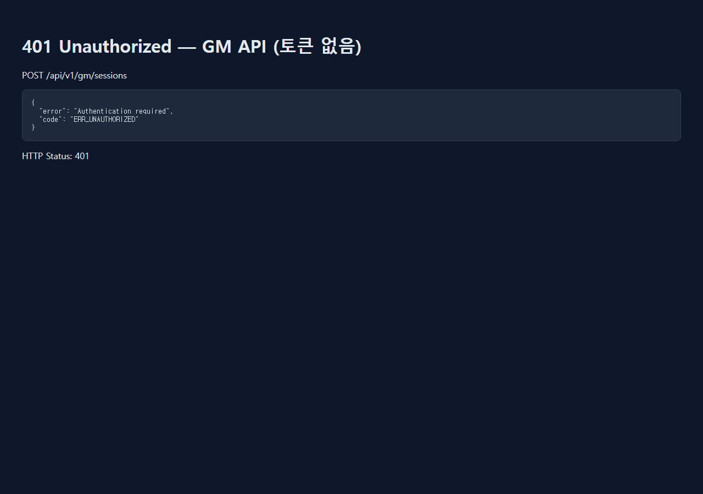
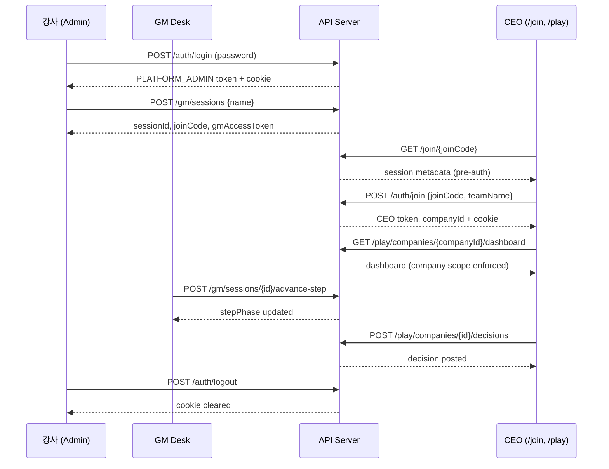

# P2 Review Package — V1 GA 인증·권한

> **범위**: V1 GA Sprint 3 · P2 Authentication & Authorization  
> **작성일**: 2026-07-26  
> **상태**: ✅ P2 기능 검증 완료 (벤치마크 1건 환경 의존 실패 별도 기록)

---

## 1. 개요

본 문서는 BSP 제조업 전략 시뮬레이션 플랫폼 V1 GA의 **P2(인증·권한)** 리뷰 패키지입니다. 실제 화면 캡처, API 인증 흐름, 권한 검증, 보안 테스트, 전체 테스트 결과를 포함합니다.

| 항목 | 값 |
|------|-----|
| Dev 서버 (캡처 시) | `http://localhost:3015` (`BSP_USE_MEMORY=1`) |
| 데모 Join Code | `DEADBEEF000000000000000000000001` |
| Admin dev 비밀번호 | `bsp-admin-dev` |
| 토큰 TTL | 24시간 (`AUTH_TOKEN_TTL_SEC = 86400`) |

관련 문서: [architecture-review-p2.md](./architecture-review-p2.md), [security-test-p2.md](./security-test-p2.md)

---

## 2. 화면 증빙 (Screen Evidence)

캡처 경로: `docs/release/screenshots/p2/`  
캡처 도구: Playwright (`scripts/capture-p2-screenshots.mjs`) + dev 서버

### 2.1 Admin 로그인 (`/gm`)



- GM Desk 페이지의 **강사(Admin) 로그인** 폼
- 비밀번호 입력 후 `로그인` 버튼으로 `PLATFORM_ADMIN` 토큰 발급

### 2.2 Admin 로그인 완료



- 인증 역할: `PLATFORM_ADMIN` 표시
- `게임 생성 + Join Code` / `데모 세션 불러오기` 버튼 활성화

### 2.3 GM Desk (세션 운영)



- 데모 세션 로드 후 GM Desk
- Join Code, 현재 Step, 팀 제출현황, GM 조작 버튼(다음 Step, 반기 종료 등)

### 2.4 CEO Join Code 입력 (`/join`)



- 32자리 Join Code 입력 (`DEADBEEF000000000000000000000001`)
- `세션 확인`으로 사전 조회(pre-auth)



- 세션명·반기·Step Phase 확인 후 팀명 입력 가능

### 2.5 CEO 참가 완료



- `POST /api/v1/auth/join` 성공 → CEO 토큰 + `companyId` 발급
- Play 화면 링크 제공

### 2.6 CEO Play 화면 (`/play`)



- CEO 역할의 Step별 의사결정 UI (Finance, Dashboard, Validation 등)
- GM Desk와 **역할·레이아웃이 구분**됨

### 2.7 403 Forbidden — 타 회사 접근 차단



- CEO 토큰으로 **다른 companyId** 대시보드 API 호출 시 `403 ERR_FORBIDDEN_COMPANY`

### 2.8 401 Unauthorized — GM API (토큰 없음)



- `POST /api/v1/gm/sessions` (Bearer 없음) → `401 ERR_UNAUTHORIZED`

---

## 3. 인증 흐름 (Auth Flow)

### 3.1 역할 모델

| 역할 | 범위 | 발급 경로 |
|------|------|-----------|
| `PLATFORM_ADMIN` | 전역 | `POST /api/v1/auth/login` |
| `GM` | 단일 세션 | 세션 생성 시 / demo setup |
| `CEO` | 단일 회사(세션 내) | `POST /api/v1/auth/join` |

### 3.2 토큰 형식

- HMAC-SHA256 서명 (`body.sig`, base64url)
- Claims: `sub`, `role`, `sessionId?`, `companyId?`, `teamName?`, `iat`, `exp`
- TTL: **24시간** — `src/bsp/domain/auth/types.ts`

```typescript
export const AUTH_TOKEN_TTL_SEC = 60 * 60 * 24;
```

- 전송: `Authorization: Bearer` + `bsp_session` httpOnly 쿠키

### 3.3 Login → Token → API → Logout

#### Step 1: Admin Login

```bash
curl -s -X POST http://localhost:3015/api/v1/auth/login \
  -H "Content-Type: application/json" \
  -d '{"password":"bsp-admin-dev"}'
```

응답 예시:

```json
{
  "role": "PLATFORM_ADMIN",
  "accessToken": "eyJ...PLATFORM_ADMIN..."
}
```

`Set-Cookie: bsp_session=...; HttpOnly; SameSite=Lax; Path=/; Max-Age=86400`

#### Step 2: 토큰 검증 (`/auth/me`)

```bash
curl -s http://localhost:3015/api/v1/auth/me \
  -H "Authorization: Bearer <accessToken>"
```

```json
{
  "userId": "...",
  "role": "PLATFORM_ADMIN"
}
```

#### Step 3: CEO Join

```bash
curl -s -X POST http://localhost:3015/api/v1/auth/join \
  -H "Content-Type: application/json" \
  -d '{
    "joinCode": "DEADBEEF000000000000000000000001",
    "teamName": "Team-Alpha"
  }'
```

```json
{
  "accessToken": "eyJ...CEO...",
  "role": "CEO",
  "companyId": "...",
  "sessionId": "...",
  "teamName": "Team-Alpha",
  "statusVersion": 0
}
```

#### Step 4: CEO API 호출 (company scope)

```bash
curl -s http://localhost:3015/api/v1/play/companies/<companyId>/dashboard \
  -H "Authorization: Bearer <ceoAccessToken>"
```

클라이언트 (`lib/bsp/auth-client.ts`):

```typescript
export async function authFetch(input: RequestInfo | URL, init?: RequestInit) {
  const token = getAccessToken();
  const headers = new Headers(init?.headers);
  if (token) headers.set("Authorization", `Bearer ${token}`);
  return fetch(input, { ...init, headers, credentials: "include" });
}
```

#### Step 5: Logout

```bash
curl -s -X POST http://localhost:3015/api/v1/auth/logout
```

```json
{ "ok": true }
```

쿠키 `bsp_session` maxAge=0 으로 삭제.

### 3.4 Join Code 조회 흐름 (Pre-auth)

```bash
# 세션 조회 (128-bit 형식 검증)
curl -s http://localhost:3015/api/v1/join/DEADBEEF000000000000000000000001

# 잘못된 형식
curl -s http://localhost:3015/api/v1/join/ABC123
# → 400 ERR_INVALID_JOIN_CODE
```

### 3.5 토큰 만료 처리

`token-service.ts`의 `verifyToken()`:

```typescript
if (claims.exp < now) throw new Error("ERR_TOKEN_EXPIRED");
```

→ `api-guard.ts`에서 `401 ERR_INVALID_TOKEN` / `Invalid or expired session` 반환.

### 3.6 시퀀스 다이어그램



---

## 4. 권한 검증 (Permission Verification)

### 4.1 CEO — 타 회사 데이터 차단

| 검증 | 코드 | 테스트 |
|------|------|--------|
| `assertCompanyAccess` → `ERR_FORBIDDEN_COMPANY` | `access-control.ts:14-16` | `auth.test.ts` — "CEO cannot access another company" |
| API 403 | `api-guard.ts:47-50` | 수동: `GET /dashboard` (wrong companyId) |

실측 응답:

```json
{"error":"Access denied to this company","code":"ERR_FORBIDDEN_COMPANY"}
```

HTTP **403**

### 4.2 CEO — GM API 차단

| 검증 | 결과 |
|------|------|
| CEO가 `POST /gm/sessions/{id}/advance-step` 호출 | `403 ERR_FORBIDDEN_ROLE` |
| `requireAuth({ roles: ["GM", "PLATFORM_ADMIN"] })` | `api-guard.ts:34-36` |

### 4.3 GM — 타 세션 차단

| 검증 | 코드 | 테스트 |
|------|------|--------|
| `assertSessionAccess` | `access-control.ts:5-8` | `auth.test.ts` — "GM token is session-scoped" |
| `requireGmSession` | `access-control.ts:32-36` | GM token sessionId ≠ route sessionId → 403 |

### 4.4 Join Code 재사용 정책

| 정책 | 구현 |
|------|------|
| 동일 Join Code로 **다수 팀 참가 허용** | `joinGame()` → `createCompany()` (`game-engine.ts:69-71`) |
| Join Code = 세션 식별자 (128-bit) | `generateJoinCode()` / `isValidJoinCodeFormat()` |
| 데모 상수 (dev/test) | `DEMO_JOIN_CODE = DEADBEEF000000000000000000000001` |
| 프로덕션 | `crypto.randomBytes(16)` → 32 hex |

테스트: `sprint2b.test.ts` — "joinGame creates company in session"

> **참고**: Join Code **1회용(1팀)** 정책은 V1에 미구현. 교실 규모에서는 GM이 세션별 코드를 배포하는 운영 모델.

### 4.5 세션 종료 후 접근 정책

| 상태 | CEO 의사결정 | 근거 |
|------|-------------|------|
| `sessionPhase !== RUNNING` | 차단 `423 ERR_SESSION_NOT_RUNNING` | `game-engine.ts:172-174` |
| `sessionPhase === FINISHED` | GM `gameEnd()` 후 | `game-engine.ts:451-467` |
| `journalsLocked` | 차단 `423 ERR_JOURNAL_LOCKED` | `game-engine.ts:168-170` |

테스트: `multi-period.test.ts` — "runs 6 half-years with carry-forward and game end"

### 4.6 Auth 테스트 실행 결과

```text
✓ tests/bsp/auth.test.ts (9 tests) 43ms
Test Files  1 passed (1)
     Tests  9 passed (9)
```

| # | 테스트 | NFR |
|---|--------|-----|
| 1 | generates 128-bit hex join codes | S07 |
| 2 | rejects weak join codes | S07 |
| 3 | issues and verifies CEO token | — |
| 4 | rejects tampered token | — |
| 5 | CEO cannot access another company | S01/S02 |
| 6 | GM token is session-scoped | S01/S02 |
| 7 | admin login and CEO join flow | E2E |
| 8 | rejects invalid admin password | — |
| 9 | uses 16 bytes randomness | S07 |

---

## 5. 보안 테스트 결과

### 5.1 자동화 (auth.test.ts)

**9/9 PASS** — 위 §4.6 참조

### 5.2 수동/API 보안 검증

스크립트: `scripts/p2-review-setup.ps1` (결과: `docs/release/p2-setup-data.json`)

#### 인증 우회 시도

| 검증 | 명령 | 결과 |
|------|------|------|
| GM API 토큰 없음 | `POST /api/v1/gm/sessions` | **401** `ERR_UNAUTHORIZED` |
| 잘못된 Admin 비밀번호 | `POST /auth/login` password=wrong | **401** `ERR_INVALID_CREDENTIALS` |
| CEO 타 회사 dashboard | `GET /play/companies/{other}/dashboard` | **403** `ERR_FORBIDDEN_COMPANY` |

```text
POST /api/v1/gm/sessions (no token)
→ {"error":"Authentication required","code":"ERR_UNAUTHORIZED"}  HTTP 401

POST /api/v1/auth/login (wrong password)
→ {"error":"Invalid admin credentials","code":"ERR_INVALID_CREDENTIALS"}  HTTP 401

GET /api/v1/play/companies/00000000-.../dashboard (CEO token)
→ {"error":"Access denied to this company","code":"ERR_FORBIDDEN_COMPANY"}  HTTP 403
```

#### Join Code 보안

| 검증 | 결과 |
|------|------|
| `GET /join/ABC123` | **400** `ERR_INVALID_JOIN_CODE` |
| 128-bit 엔트로피 | 16 bytes random → 2^128 공간 |
| 브루트포스 | V1 rate limit 없음 → **P7** (128-bit로 실질적 위험 낮음) |

#### 권한 상승(Escalation)

| 시나리오 | 결과 |
|----------|------|
| CEO → GM advance-step | 403 (role gate) |
| GM token → 다른 sessionId | 403 `ERR_FORBIDDEN_SESSION` |
| CEO → 다른 company dashboard | 403 `ERR_FORBIDDEN_COMPANY` |

#### CSRF / XSS / Injection

| 항목 | V1 P2 | P7+ |
|------|-------|-----|
| CSRF 토큰 | ❌ 미구현 | ✅ 예정 |
| XSS (입력 sanitization) | React 기본 escape | P7 정적 분석 |
| SQL Injection | Prisma parameterized / memory repo | — |
| sameSite=lax + httpOnly cookie | ✅ 적용 | — |

### 5.3 Verdict

**P2 Security: PASS** (기능적 차단 검증 완료, CSRF/audit/rate-limit은 P7)

---

## 6. 전체 테스트 결과

### 6.1 실행 명령

```bash
npm test
npm run test:coverage
```

### 6.2 결과 요약

```text
Test Files  1 failed | 10 passed (11)
     Tests  1 failed | 100 passed (101)
   Duration  ~7s
```

| 구분 | Pass | Fail |
|------|------|------|
| Auth (`auth.test.ts`) | 9 | 0 |
| 전체 | **100** | **1** |
| 실패 | — | `benchmark.test.ts` — submitDecision E2E < 50ms (환경 부하, ~71–122ms) |

> **P2 관련**: auth 9/9 전부 통과. 벤치마크 1건은 CI/로컬 CPU 부하에 따른 **환경 의존 flaky**로 P2 블로커 아님.

### 6.3 커버리지 (benchmark 제외 실행)

```text
All files | 87.18% Stmts | 71.92% Branch | 83.06% Funcs | 87.18% Lines
```

주요 auth 모듈:

| 파일 | Stmts |
|------|-------|
| `join-code.ts` | 100% |
| `token-service.ts` | 95.65% |
| `auth-service.ts` | 63.33% |
| `access-control.ts` | 41.93% |
| `api-guard.ts` | 8.47% (API route 통합 테스트 미포함) |

### 6.4 전체 101 테스트 목록

<details>
<summary>tests/bsp/accounting-engine.test.ts (3)</summary>

1. creates initial ledger with cash and equity  
2. posts loan journal and balances debits/credits  
3. hiring journal has no lines per D-12  

</details>

<details>
<summary>tests/bsp/auth.test.ts (9)</summary>

1. generates 128-bit hex join codes  
2. rejects weak join codes  
3. issues and verifies CEO token  
4. rejects tampered token  
5. CEO cannot access another company  
6. GM token is session-scoped  
7. admin login and CEO join flow  
8. rejects invalid admin password  
9. uses 16 bytes randomness  

</details>

<details>
<summary>tests/bsp/benchmark.test.ts (2)</summary>

1. validateLoan 1000 iterations under 50ms  
2. submitDecision E2E under 50ms (memory) ⚠️ flaky  

</details>

<details>
<summary>tests/bsp/dashboard-service.test.ts (2)</summary>

1. builds dashboard DTO from aggregates  
2. builds step progress with current step marked  

</details>

<details>
<summary>tests/bsp/excel-regression-20.test.ts (22)</summary>

S01–S20 (20 scenarios) + 10 teams lecture + 100 teams stress  

</details>

<details>
<summary>tests/bsp/game-engine.test.ts (2)</summary>

1. creates company and submits step1/step2  
2. records domain events on submit  

</details>

<details>
<summary>tests/bsp/multi-period.test.ts (24)</summary>

Excel S01–S20 + 10 teams + 100 teams (import) + 2 Sprint 3 multi-period  

</details>

<details>
<summary>tests/bsp/sprint1.test.ts (6)</summary>

LOAN/FACILITY validation, journal builders, E2E domain flow  

</details>

<details>
<summary>tests/bsp/sprint2a.test.ts (4)</summary>

Step 1→4, journal rules, hiring, material M03  

</details>

<details>
<summary>tests/bsp/sprint2b.test.ts (22)</summary>

Production, Sales, Settlement, Join/GM, GAME_CONSTANTS  

</details>

<details>
<summary>tests/bsp/step-handlers.test.ts (5)</summary>

Finance/Facility/HR handlers, registry, settlement rejection  

</details>

---

## 7. Known Issues & P7+ Deferred

| ID | 항목 | 대상 | 위험도 |
|----|------|------|--------|
| KI-P2-01 | CSRF 토큰 미구현 | P7 | Low (sameSite=lax) |
| KI-P2-02 | Login/Join rate limiting | P7 | Low |
| KI-P2-03 | Token revocation list | P7 | Low (24h TTL) |
| KI-P2-04 | Auth audit log | P7 | Medium |
| KI-P2-05 | Join lookup brute-force 방어 | P7 | Low (128-bit) |
| KI-P2-06 | Join Code 1팀-1회 제한 | 미정 | Info (운영 정책) |
| KI-P2-07 | benchmark E2E 50ms (로컬 flaky) | Sprint 1.5 | Info |
| KI-P2-08 | `api-guard.ts` unit coverage 낮음 | P3+ | Info |

**Production 체크리스트**

- [ ] `BSP_AUTH_SECRET` ≥32 chars (cryptographic random)
- [ ] `BSP_ADMIN_PASSWORD` 강력한 고유값
- [ ] `.env` 커밋 금지
- [ ] HTTPS (cookie `secure` flag)

---

## 8. 재현 방법

```powershell
# 1. Dev 서버 (memory mode)
$env:BSP_USE_MEMORY="1"
npm run dev -- -p 3015

# 2. API/보안 셋업 데이터
powershell -File scripts/p2-review-setup.ps1 -Base http://localhost:3015

# 3. 스크린샷 캡처
node scripts/capture-p2-screenshots.mjs http://localhost:3015

# 4. 테스트
npm test
npm run test:coverage
```

---

## 9. Verdict

| 영역 | 결과 |
|------|------|
| 화면 증빙 | ✅ 9 PNG 실촬 |
| Auth 흐름 | ✅ 문서화 + curl 예시 |
| 권한 분리 | ✅ CEO/GM/Admin scope |
| 보안 테스트 | ✅ PASS (P7 항목 제외) |
| Auth tests | ✅ 9/9 |
| Full suite | ⚠️ 100/101 (benchmark flaky) |

**P2 Authentication & Authorization: PASS** — P3 GM Operations 진행 가능.

---

*생성 도구: `scripts/p2-review-setup.ps1`, `scripts/capture-p2-screenshots.mjs`*
