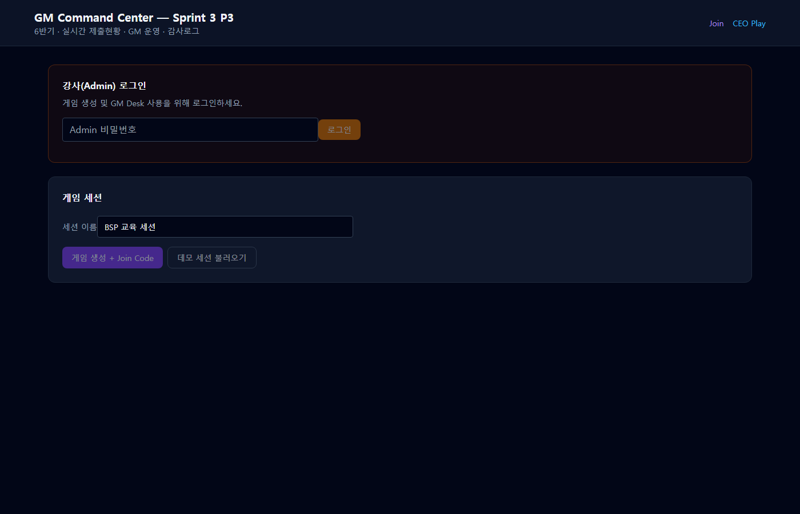
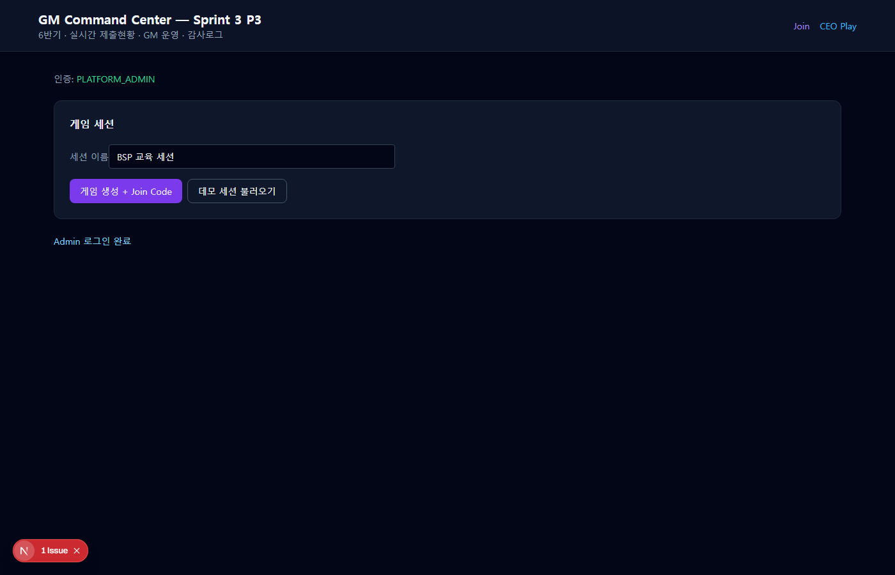
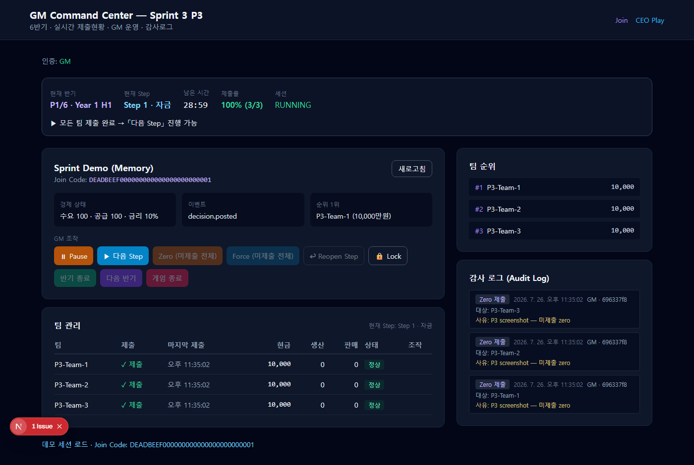
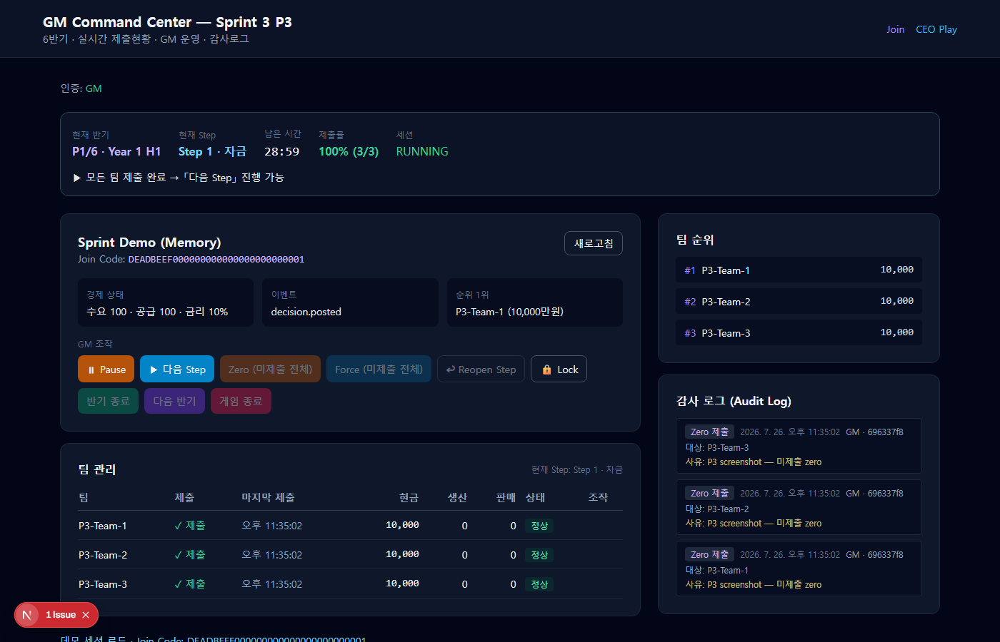
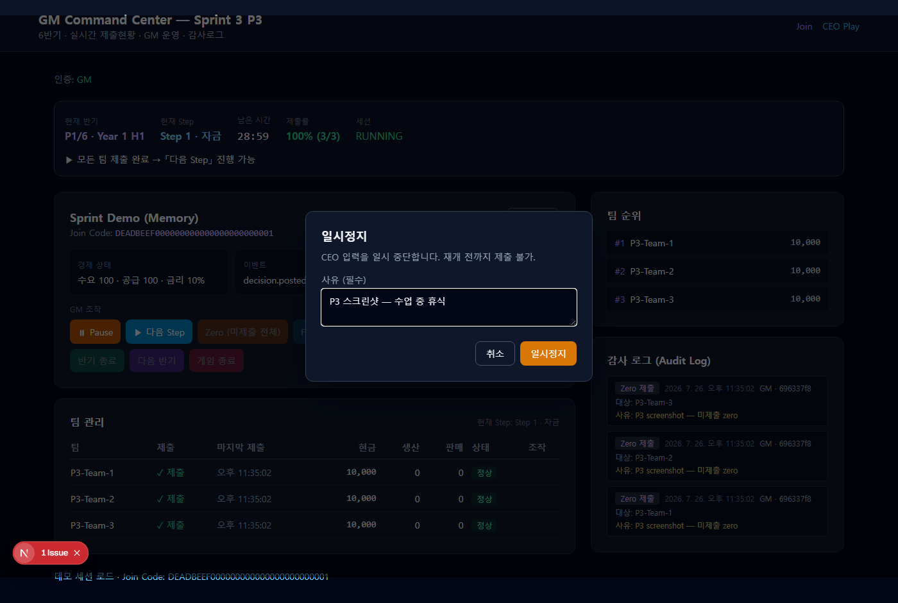
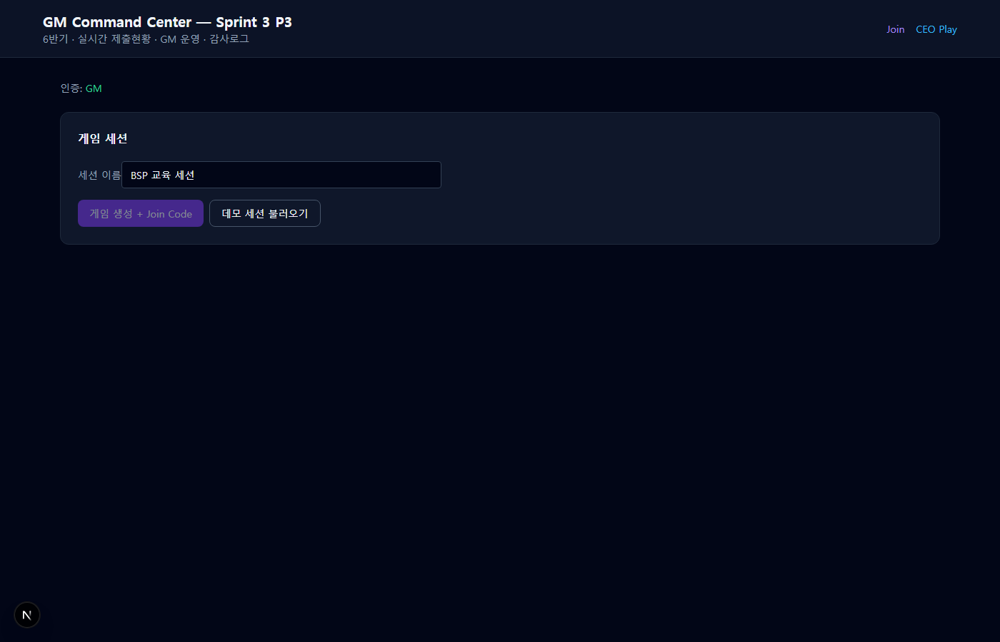
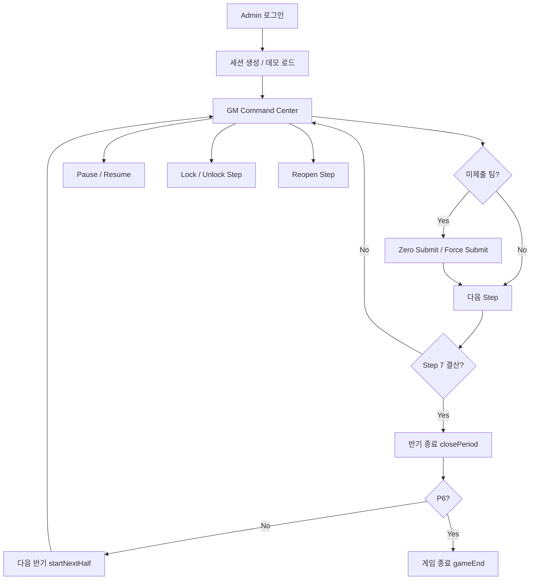

# P3 GM Operation Review — V1 GA 교육 운영 도구

> **범위**: V1 GA Sprint 3 · P3 GM Operations (Command Center)  
> **작성일**: 2026-07-26  
> **상태**: ✅ P3 기능 검증 완료

---

## 1. 개요

본 문서는 BSP 제조업 전략 시뮬레이션 V1 GA **P3(GM 운영)** 리뷰 패키지입니다. 강사가 교육 현장에서 하루 종일 사용할 **GM Command Center**, GM 조작 API, 감사 로그, E2E 시나리오 결과를 포함합니다.

| 항목 | 값 |
|------|-----|
| Dev 서버 (캡처 시) | `http://localhost:3016` (`BSP_USE_MEMORY=1`) |
| 데모 Join Code | `DEADBEEF000000000000000000000001` |
| Admin dev 비밀번호 | `bsp-admin-dev` |
| 테스트 | **133/133 pass** |
| Build | ✅ `npm run build` pass |

관련 문서: [p2-review-package.md](./p2-review-package.md), [sprint3-plan.md](../sprint3-plan.md)

---

## 2. 화면 증빙 (Screen Evidence)

캡처 경로: `docs/release/screenshots/p3/`  
캡처 도구: Playwright (`scripts/capture-p3-screenshots.mjs`)

### 2.1 GM 로그인



- 강사(Admin) 로그인 폼 — P2와 동일 인증 흐름

### 2.2 Admin 로그인 완료



- `PLATFORM_ADMIN` 인증 후 세션 생성 / 데모 불러오기

### 2.3 GM Command Center (전체 뷰)



- **한눈에 파악**: P1~P6 반기, 현재 Step, 남은 시간, 제출률(%)
- **경제/이벤트/순위** 요약 패널
- **GM 조작** 버튼 그룹 (Pause, 다음 Step, Zero, Force, Lock 등)
- **팀 관리** 테이블 + **감사 로그** 사이드바

### 2.4 상태 배너 (Action Guidance)



- 미제출 팀 수 → 조작 가이드 문구 자동 표시
- 예: `3팀 미제출 — Zero Submit 또는 강제제출 후 「다음 Step」`

### 2.5 Pause 확인 다이얼로그



- **모든 GM mutation**에 사유(필수) + 확인 다이얼로그 적용

### 2.6 팀 관리 — 미제출 강조



- 미제출 팀: **amber 배경** + `✗ 미제출` + per-team Force/Zero 버튼
- 현금·생산·판매·마지막 제출 시각 표시

### 2.7 감사 로그 패널


- GM 조작 기록: action, actor, timestamp, reason, target team

### 2.8 Zero Submit 후 100% 제출률


- D-10 zero 적용 후 제출률 100% → 다음 Step 진행 가능

### 2.9 GM Operations 버튼


- Pause/Resume, 다음 Step, Zero/Force, Reopen, Lock/Unlock, 반기/게임 종료

---

## 3. 전체 운영 흐름 (Operation Flow)



### 3.1 일반 Step 진행

1. CEO 팀 Join → Play 화면에서 Step별 제출
2. GM Desk에서 **제출률** 확인 (미제출 팀 amber 강조)
3. 미제출 시: **Zero Submit (D-10)** 또는 **Force Submit**
4. **다음 Step** (확인 다이얼로그 + 사유)
5. Step 7 → **반기 종료 (결산)**

### 3.2 반기/게임 종료

| 시점 | GM 조작 |
|------|---------|
| Step 7 완료 | 반기 종료 (closePeriod) |
| HALF_YEAR_END + P1~P5 | 다음 반기 시작 (startNextHalf) |
| HALF_YEAR_END + P6 | 게임 종료 (gameEnd) |

### 3.3 예외 운영

| 상황 | GM 조작 |
|------|---------|
| 수업 휴식 | Pause → Resume |
| CEO 제출 차단 | Lock Step |
| Step 조기 진행 실수 | Reopen Step (이전 Step 복귀 + 결정 삭제) |
| 개별 팀 미제출 | 팀 행 Force/Zero 버튼 |

---

## 4. API 엔드포인트

모든 GM mutation: `requireGmSession` + **reason** body + audit log 기록

| Method | Path | 설명 |
|--------|------|------|
| GET | `/gm/sessions/:id/desk` | Command Center 데이터 |
| GET | `/gm/sessions/:id/audit-log` | 감사 로그 |
| POST | `/gm/sessions/:id/pause` | 일시정지 |
| POST | `/gm/sessions/:id/resume` | 재개 |
| POST | `/gm/sessions/:id/advance-step` | 다음 Step |
| POST | `/gm/sessions/:id/force-submit` | 강제 제출 `{ companyId?, reason }` |
| POST | `/gm/sessions/:id/zero-submit` | Zero Submit `{ companyId?, reason }` |
| POST | `/gm/sessions/:id/reopen-step` | Step 재개 |
| POST | `/gm/sessions/:id/lock-step` | Step 잠금 |
| POST | `/gm/sessions/:id/unlock-step` | Step 해제 |
| POST | `/gm/sessions/:id/close-period` | 반기 결산 |
| POST | `/gm/sessions/:id/start-next-half` | 다음 반기 |
| POST | `/gm/sessions/:id/game-end` | 게임 종료 |

---

## 5. E2E 시나리오 결과

테스트 파일: `tests/bsp/p3-gm-ops.test.ts` (32 tests, 8 core scenarios)

| # | 시나리오 | 결과 |
|---|----------|------|
| 1 | 10 teams normal progress | ✅ 10팀 LOAN 제출 100% → Step2 진행 |
| 2 | 2 teams not submitted | ✅ 5팀 중 2팀 미제출, submitRate 60% |
| 3 | Pause then Resume | ✅ PAUSED 시 CEO ERR_SESSION_PAUSED, audit PAUSE+RESUME |
| 4 | Force Submit | ✅ 미제출 팀 zero payload 강제 제출 |
| 5 | Zero Submit | ✅ D-10 zero, 3팀 일괄 적용 |
| 6 | Close period | ✅ STEP7 → HALF_YEAR_END, audit CLOSE_PERIOD |
| 7 | Start next half | ✅ P1→P2, STEP1_FINANCE 리셋 |
| 8 | Game end | ✅ P6 결산 후 FINISHED/GAME_END |
| + | Lock/Unlock | ✅ ERR_STEP_LOCKED / 해제 후 제출 |
| + | Reopen step | ✅ STEP3→STEP2, FACILITY 결정 삭제 |

**전체 테스트**: 133/133 pass (`npm test`)

---

## 6. 감사 로그 예시 (Audit Log Examples)

```json
[
  {
    "action": "ZERO_SUBMIT",
    "actorRole": "GM",
    "reason": "P3 screenshot — 미제출 zero",
    "targetTeamName": "P3-Team-1",
    "payload": { "step": "LOAN", "source": "GM_ZERO" }
  },
  {
    "action": "STEP_ADVANCE",
    "actorRole": "GM",
    "reason": "E2E test",
    "payload": { "fromPhase": "STEP1_FINANCE", "toPhase": "STEP2_INVESTMENT" }
  },
  {
    "action": "PAUSE",
    "actorRole": "GM",
    "reason": "수업 중 휴식",
    "payload": {}
  },
  {
    "action": "CLOSE_PERIOD",
    "actorRole": "GM",
    "reason": "반기 결산",
    "payload": { "periodIndex": 1, "teamCount": 10 }
  }
]
```

**저장**: Memory repo (`memory-audit-repository.ts`) — P7 PostgreSQL migration 준비 완료 (`AuditLogRepository` port)

---

## 7. Known Issues

| ID | 이슈 | 영향 | 다음 Sprint |
|----|------|------|-------------|
| KI-01 | Step timer 30분 고정 (세션별 설정 UI 없음) | Low | P9 UX |
| KI-02 | copy-last-half (D-10) 미구현 | Medium | P3.1 or P4 |
| KI-03 | Prisma `stepLocked` in-memory only | Low (memory mode default) | P8 PostgreSQL |
| KI-04 | WebSocket 실시간 갱신 없음 (15s poll) | Medium | P6 WebSocket |
| KI-05 | Event Engine MVP UI 없음 (event state = domain events only) | Medium | P4 Event |

---

## 8. Instructor UX Evaluation (3-Second Rule)

| 기준 | 평가 | 근거 |
|------|------|------|
| **누가 미제출?** | ✅ Pass | amber 행 + 제출률 % + unsubmitted count |
| **지금 뭘 해야?** | ✅ Pass | 상태 배너 guidance 문구 |
| **다음 버튼은?** | ✅ Pass | `▶ 다음 Step` primary CTA, disabled state 명확 |
| **실수 방지** | ✅ Pass | 모든 mutation 확인 다이얼로그 + 사유 필수 |
| **기록/추적** | ✅ Pass | Audit log 실시간 패널 |

---

## 9. Impact on Next Sprints

| Sprint | P3 기반 확장 |
|--------|-------------|
| **P4 Event** | Command Center `currentEventState` → Event Preview/Apply UI |
| **P5 Economy** | `economyLabel` → Economy preset picker + live patch |
| **P6 WebSocket** | desk/audit push → 15s poll 제거 |
| **P7 Security** | Audit log → PostgreSQL, idempotency keys |
| **P8 PostgreSQL** | `stepLocked`, audit persistence |
| **P9 UX** | Step timer 설정, copy-last-half modal, mobile GM view |

---

## 10. 구현 파일 요약

| 영역 | 주요 파일 |
|------|-----------|
| Domain | `src/bsp/domain/gm/audit-types.ts`, `zero-payloads.ts` |
| Engine | `src/bsp/application/game-engine.ts`, `gm-audit-service.ts` |
| API | `app/api/v1/gm/sessions/[sessionId]/{pause,resume,...}/route.ts` |
| UI | `components/gm/GmCommandCenter.tsx`, `GmConfirmDialog.tsx`, `GmTeamTable.tsx` |
| Tests | `tests/bsp/p3-gm-ops.test.ts` |
| Capture | `scripts/capture-p3-screenshots.mjs` |

---

*Generated as part of V1 GA Sprint 3 P3 deliverable.*
