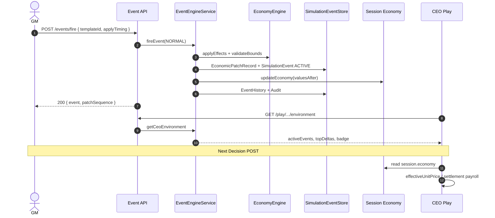

# P4 Event Engine Review — V1 GA

> **범위**: Sprint 3 · P4 Event Engine MVP (no AI/V2)  
> **작성일**: 2026-07-26  
> **상태**: ✅ P4 기능 검증 완료

---

## 1. 개요

BSP V1 GA **P4 Event Engine** 리뷰 패키지입니다. GM이 Scenario Library 이벤트를 검색·미리보기·발화·스케줄·종료하고, **Economy Patch** 파이프라인을 통해 CEO Decision/Accounting/Dashboard에 반영됩니다.

| 항목 | 값 |
|------|-----|
| Dev 서버 (캡처 시) | `http://localhost:3017` (`BSP_USE_MEMORY=1`) |
| 데모 Join Code | `DEADBEEF000000000000000000000001` |
| Admin dev 비밀번호 | `bsp-admin-dev` |
| P4 E2E 테스트 | **15/15 pass** |
| 전체 테스트 | **147/148 pass** (benchmark 50ms flaky 1건 — P2.5 기존) |
| Build | ✅ `npm run build` pass |

---

## 2. Event Architecture

```
EventTemplate (Catalog)
  ↓ GM Fire / Schedule (NORMAL only)
EventEngineService.mapEffects()
  ↓ validateBounds
EconomicPatchRecord (source=EVENT_FIRE)
  ↓ update session.economy
CEO Decision POST → material-pricing / settlement uses economy
  ↓
Journal · Dashboard · FinancialStatements
```

**V1 규칙 (D-15)**: Fire 시 **NORMAL** 시나리오만 runtime economy 반영. Best/Worst/AI Generator **미포함**.

### 핵심 모듈

| 모듈 | 경로 |
|------|------|
| Event Catalog (18 templates) | `src/bsp/domain/events/event-catalog.ts` |
| Event Types | `src/bsp/domain/events/event-types.ts` |
| Economy Engine (patch apply) | `src/bsp/domain/economy/economy-engine.ts` |
| Event Engine Service | `src/bsp/application/event-engine-service.ts` |
| Simulation Event Store | `src/bsp/infrastructure/memory/memory-simulation-event-repository.ts` |

### 카탈로그 카테고리 (최소 8종 ✅)

| 카테고리 | 대표 Event ID |
|----------|---------------|
| 환율 | EVT-001, EVT-002 |
| 금리 | EVT-005, EVT-006 |
| 원자재 | EVT-009, EVT-010 |
| 공급망 | EVT-013, EVT-015 |
| 관세 | EVT-020, EVT-021 |
| 경쟁사 | EVT-046, EVT-049 |
| 정부정책 | EVT-050, EVT-051, EVT-052 |
| 자연재해 | EVT-039, EVT-040, EVT-042 |

---

## 3. Sequence Diagram



---

## 4. Economy Integration

| 단계 | 동작 |
|------|------|
| Event Fire | `normalEffects[]` → `EconomicPatchRecord` |
| Patch source | `EVENT_FIRE` / `EVENT_END` (종료 시 reverse) |
| G-02 | 이미 POSTED Decision **불변** · 다음 POST부터 새 economy |
| CEO Badge | `pendingBadgeForCeo` → "경제 환경이 변경되었습니다" |
| Period Open | `periodOpenEconomy` snapshot → delta 표시 |

**예시 EVT-001 (환율 +12%)**: `exchangeRate` 1300 → 1456 → ASIA import `effectiveUnitPriceManwon` 상승 (Step4 MATERIAL).

---

## 5. GM API (Auth: requireGmSession)

| Method | Path | 설명 |
|--------|------|------|
| GET | `/api/v1/gm/events/catalog` | 카탈로그 검색/필터 |
| GET | `/api/v1/gm/sessions/{id}/events` | active / scheduled / history |
| GET | `/api/v1/gm/sessions/{id}/events/preview?templateId=` | dry-run |
| POST | `/api/v1/gm/sessions/{id}/events/fire` | 즉시 / next step / next half |
| POST | `/api/v1/gm/sessions/{id}/events/schedule` | 반기 스케줄 |
| POST | `/api/v1/gm/sessions/{id}/events/{eid}/end` | 종료·reverse |
| GET | `/api/v1/gm/sessions/{id}/events/history` | Event Sequence |
| GET | `/api/v1/gm/sessions/{id}/economy` | live + patchHistory |

CEO: `GET/POST /api/v1/play/companies/{companyId}/environment`

---

## 6. UI

### GM — Event Control Panel (`components/gm/GmEventControlPanel.tsx`)

- 카탈로그 검색 · 카테고리 필터
- 미리보기 (impact + economy delta)
- Fire: IMMEDIATE / NEXT_STEP / NEXT_HALF
- Active · Scheduled · History 패널
- Command Center 통합 (`GmCommandCenter`)

### CEO — Event Feed (`components/bsp/CeoEventFeed.tsx`)

- 활성 이벤트 (제목·설명·영향 — **전략 힌트 없음**)
- Economy change badge + topDeltas chips
- Play sidebar 통합

---

## 7. Screen Evidence

캡처: `docs/release/screenshots/p4/`  
도구: `scripts/capture-p4-screenshots.mjs`

| 파일 | 설명 |
|------|------|
| `01-gm-login.png` | GM Admin 로그인 |
| `02-gm-event-panel.png` | 이벤트 제어 패널 전체 |
| `03-event-preview-fx.png` | EVT-001 미리보기 |
| `06-ceo-event-feed.png` | CEO 시장 이벤트 + economy chips |
| `08-event-history.png` | GM 이벤트 이력 |

---

## 8. Audit Log

P3 `gm-audit-service` 패턴 확장:

| Action | When |
|--------|------|
| `EVENT_FIRED` | Economy patch applied |
| `EVENT_SCHEDULED` | Schedule / deferred fire |
| `EVENT_ENDED` | GM manual end |
| `EVENT_EXPIRED` | Period end auto-expire |
| `EVENT_APPLY` | Patch effects payload |

Event History (`EventHistoryEntry`): `EVENT_CREATED`, `EVENT_FIRED`, `ECONOMY_PATCH_APPLIED`, `EVENT_EXPIRED`, `EVENT_ENDED`

---

## 9. E2E Results (`tests/bsp/p4-event-engine.test.ts`)

| # | Scenario | Result |
|---|----------|--------|
| 1 | FX rise (EVT-001) | ✅ exchangeRate patched |
| 2 | Rate hike (EVT-005) | ✅ loan rate 13% |
| 3 | Raw material spike | ✅ material unit price ↑ |
| 4 | Supply chain (EVT-013) | ✅ logistics + supply index |
| 5 | Scheduled event | ✅ fires on startNextHalf |
| 6 | Immediate event | ✅ tariff 25% + CEO badge |
| 7 | Duplicate event | ✅ 409 ERR_EVENT_DUPLICATE |
| 8 | Event end | ✅ economy reversed |
| 9 | Persistence after half close | ✅ PERIOD → EXPIRED |
| 10 | History 6 half-years | ✅ history + audit |
| + | NEXT_STEP timing | ✅ applies on gmAdvanceStep |
| + | Catalog 8 categories | ✅ 18 events |
| + | Patch pipeline / preview / bounds | ✅ |

---

## 10. Known Issues / P5 Blockers

| ID | Issue | P5 Impact |
|----|-------|-----------|
| K-01 | Simulation events in **memory store** even with Prisma sessions | P5: Prisma schema + persistence |
| K-02 | Full 53-event library not loaded (18 MVP templates) | P5: import remaining Scenario Library |
| K-03 | Region-specific marketImpact (NA demand −5%) not modeled — global indices only | P5: MarketRegionState per spec |
| K-04 | AI Event Generator / NL draft **out of scope** | P5 or V2 |
| K-05 | WebSocket `economy.patched` not wired to UI | P5: realtime push |
| K-06 | `recommendedPeriod` / avoidPeriod GM warning modal not implemented | P5: D-04 UX |
| K-07 | Benchmark test flaky >50ms on CI | Low — tune threshold |

---

## 11. Approval

- [x] Event → Economy Patch pipeline (no direct economy mutation)
- [x] GM Event Control + CEO Feed UI
- [x] Auth on all GM routes
- [x] Audit + Event History
- [x] E2E 10 scenarios + extras
- [x] Build pass

**Reviewer**: _______________ **Date**: 2026-07-26
