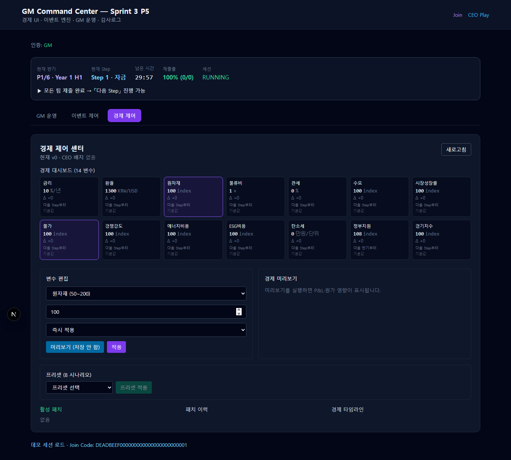
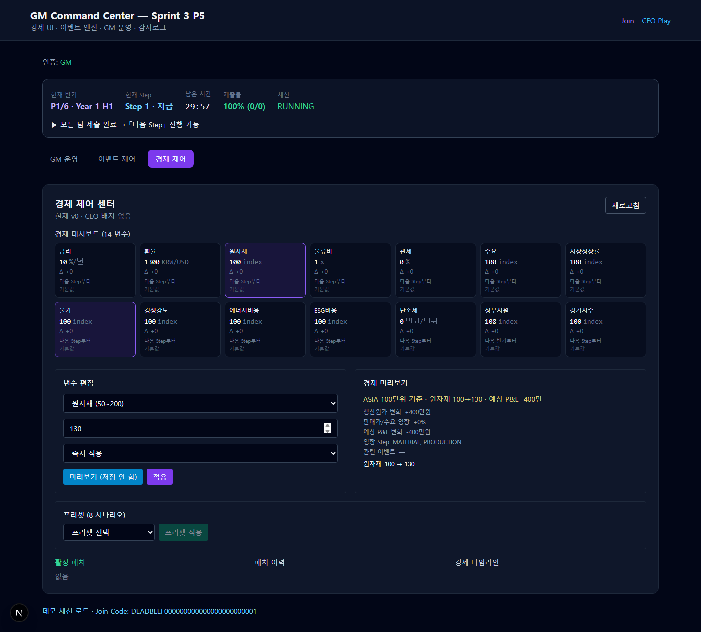
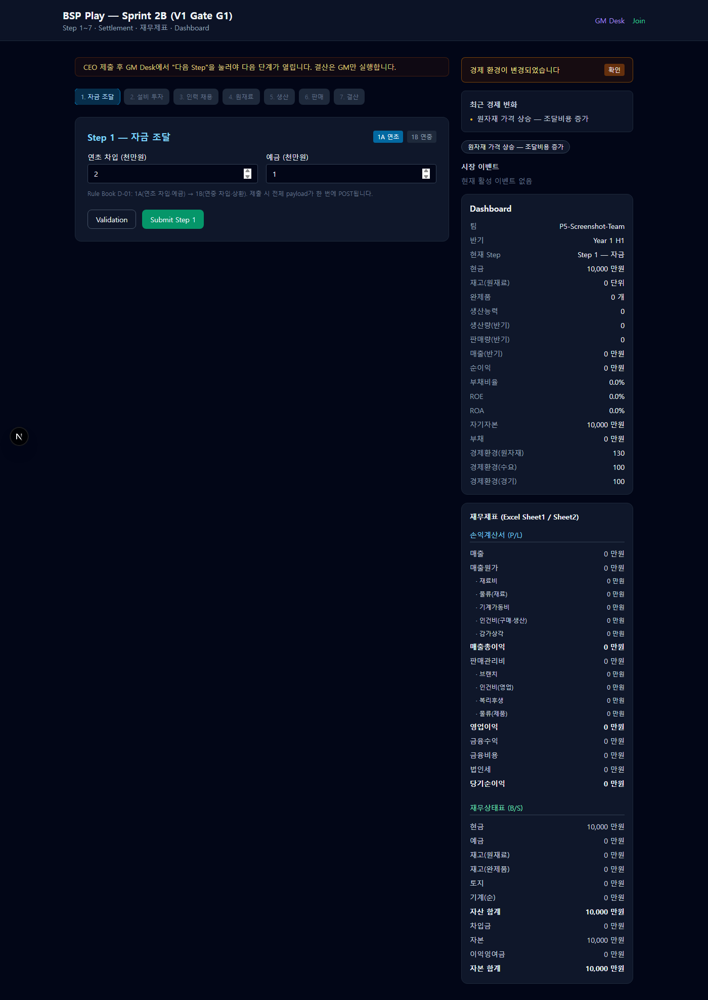

# P5 Economy UI Review — V1 GA

> **범위**: Sprint 3 · P5 Economy UI & Operations (existing Engine — UI/API focus)  
> **작성일**: 2026-07-26  
> **상태**: ✅ P5 기능 검증 완료

---

## 1. 개요

BSP V1 GA **P5 Economy UI** 리뷰 패키지입니다. 기존 Economy Engine / Event Patch 파이프라인(P4) 위에 GM **경제 제어 센터**, CEO **경제 환경 피드**, Preview/Timeline/Patch History UI 및 API를 구현했습니다.

| 항목 | 값 |
|------|-----|
| Dev 서버 (캡처 시) | `http://localhost:3018` (`BSP_USE_MEMORY=1`) |
| 데모 Join Code | `DEADBEEF000000000000000000000001` |
| Admin dev 비밀번호 | `bsp-admin-dev` |
| P5 E2E 테스트 | **10/10 pass** |
| 전체 테스트 | **157/158 pass** (benchmark 50ms flaky 1건 — P2.5 기존) |
| Build | ✅ `npm run build` pass |

---

## 2. Economy UI Architecture

```
GM /gm (Tab: 경제 제어)
  ├─ GET  /api/v1/gm/sessions/{id}/economy     → dashboardCards, patchHistory, timeline
  ├─ PATCH /api/v1/gm/sessions/{id}/economy    → manual patch (IMMEDIATE / NEXT_STEP / NEXT_HALF)
  ├─ POST /api/v1/gm/sessions/{id}/economy/preview → P&L/cost impact (no persist)
  ├─ POST /api/v1/gm/sessions/{id}/economy/rollback → revert last/specific patch
  ├─ GET  /api/v1/gm/economy/presets
  └─ POST /api/v1/gm/sessions/{id}/economy/presets/{presetId}/apply

EventEngineService (extended, minimal)
  ├─ patchEconomy / previewEconomy / rollbackEconomyPatch
  ├─ applyEconomyPresetPatch (source=PRESET)
  ├─ pending manual patches → processPendingOnStepAdvance / processPendingOnPeriodStart
  └─ buildTimeline (replay-compatible replayRef)

CEO /play
  └─ GET /api/v1/play/companies/{id}/environment
       → recentChanges (NL), scheduledChanges, topDeltas.description, activeEvents
```

### 핵심 모듈

| 모듈 | 경로 |
|------|------|
| Economy Dashboard Meta (14 cards) | `src/bsp/domain/economy/economy-dashboard-meta.ts` |
| NL descriptions | `src/bsp/domain/economy/economy-descriptions.ts` |
| Preview impact calc | `src/bsp/domain/economy/economy-preview-impact.ts` |
| Event Engine (patch ops) | `src/bsp/application/event-engine-service.ts` |
| GM Economy Panel | `components/gm/GmEconomyControlPanel.tsx` |
| GM Tab integration | `components/gm/GmCommandCenter.tsx` |
| CEO Environment Feed | `components/bsp/CeoEventFeed.tsx` |

---

## 3. GM Economy Control Center

`/gm` → **경제 제어** 탭 (이벤트 제어와 분리)

| 기능 | 구현 |
|------|------|
| Current economy view | 14 variable cards + live values |
| Variable editing | 14 engine keys, bounds, apply timing |
| Preset selection | 8 education presets one-click apply |
| Preview (no save) | production cost / sales / P&L / affected steps |
| Patch History | last 20 patches, Event vs Manual vs Preset color |
| Active Patch | latest sequence + rollback |
| Apply next step / next half | IMMEDIATE · NEXT_STEP · NEXT_HALF toggles |
| Event vs Manual | source badge: 이벤트 / GM 수동 / 프리셋 / 이벤트 종료 |

**5초 UX (GM)**: 상단 14 cards → 현재값·Δ·적용시점·수정자 한눈에 · 하단 Active Patch + Timeline → 무엇이 바뀌었고 다음은?

---

## 4. Economy Dashboard — 14 Variable Cards

| Card ID | Label | Engine Key / Derived |
|---------|-------|---------------------|
| interestRate | 금리 | interestRateLoan |
| exchangeRate | 환율 | exchangeRate |
| rawMaterial | 원자재 | rawMaterialIndex |
| logistics | 물류비 | logisticsCostMultiplier |
| tariff | 관세 | tariffRate |
| demand | 수요 | marketDemandIndex |
| marketGrowth | 시장성장률 | (demand + tech) / 2 |
| inflation | 물가 | rawMat×0.7 + logistics×30 |
| competition | 경쟁강도 | 200 − marketSupplyIndex |
| energyCost | 에너지비용 | logistics × 100 |
| esgCost | ESG비용 | esgPressureIndex |
| carbonTax | 탄소세 | carbonTaxRatePerUnit |
| govSupport | 정부지원 | 130 − tax − tariff×0.5 |
| businessCycle | 경기지수 | businessCycleIndex |

Each card: `currentValue`, `deltaVsBaseline`, `applyTiming`, `lastModifier`, `lastModifiedAt`

---

## 5. Economy Preview

POST preview → **live state unchanged** (AU-02)

| Output | Description |
|--------|-------------|
| productionCostDeltaManwon | ASIA 100-unit material + logistics delta |
| salesPriceImpactPct | effective sale limit change % |
| expectedPnlDeltaManwon | simplified revenue − cost estimate |
| affectedSteps | from dashboard card relatedSteps |
| affectedEvents | currently ACTIVE event titles |
| message | Korean summary string |

---

## 6. Economy Timeline

Chronological entries with `replayRef`:

| type | When |
|------|------|
| PATCH_CREATED | Pending manual patch scheduled |
| PATCH_APPLIED | GM manual / PRESET / EVENT_FIRE |
| PATCH_ENDED | EVENT_END rollback |
| EVENT_APPLIED | (via EVENT_FIRE patch) |

Sorted descending by `occurredAt`. Compatible with future Replay by `patchId` / `simulationEventId`.

---

## 7. CEO Screen (`/play`)

Read-only sidebar via `CeoEventFeed`:

| Section | Content |
|---------|---------|
| Badge | "경제 환경이 변경되었습니다" (G-02) |
| recentChanges | NL e.g. "원자재 가격 상승 — 조달비용 증가" |
| scheduledChanges | "원자재 +20% 변경 예정 (다음 Step부터)" |
| topDeltas | description chips (not raw numbers only) |
| activeEvents | title + impactDescription |

**5초 UX (CEO)**: recentChanges + chips → 왜 원가/수요가 변했는지 즉시 파악

---

## 8. Screen Evidence

캡처 경로: `docs/release/screenshots/p5/`  
캡처 도구: `scripts/capture-p5-screenshots.mjs`

| 파일 | 설명 |
|------|------|
| `01-gm-login.png` | GM Admin 로그인 |
| `02-gm-economy-dashboard.png` | 14 variable cards + editor |
| `03-economy-preview.png` | Preview panel with P&L impact |
| `04-patch-confirm-dialog.png` | Apply confirm + reason |
| `05-after-patch-history.png` | Active patch + history after apply |
| `06-preset-selected.png` | Preset dropdown |
| `07-economy-timeline.png` | Timeline section |
| `08-ceo-environment.png` | CEO NL recent changes + badge |
| `09-ceo-recent-changes.png` | CEO recent changes close-up |
| `10-gm-tabs-overview.png` | GM 3-tab navigation |

### 8.1 GM Economy Dashboard



### 8.2 Economy Preview



### 8.3 CEO Environment



---

## 9. E2E Results (`tests/bsp/p5-economy-ui.test.ts`)

| # | Scenario | Result |
|---|----------|--------|
| 1 | Variable edit | ✅ rawMaterialIndex=120, GM_MANUAL |
| 2 | Preview | ✅ live unchanged, impact computed |
| 3 | Preset apply | ✅ PRESET_HIGH_INTEREST, source=PRESET |
| 4 | Event patch | ✅ EVENT_FIRE via EVT-001 |
| 5 | Manual patch NEXT_STEP | ✅ pending → apply on advance |
| 6 | Patch rollback | ✅ tariff 25→0 |
| 7 | Next step apply | ✅ logistics 1.5 on gmAdvanceStep |
| 8 | Next half apply | ✅ businessCycle 85 on startNextHalf |
| 9 | 6-half timeline | ✅ ≥6 patches + timeline entries |
| 10 | Dashboard reflection | ✅ 14 cards, NL CEO env, badge |

---

## 10. Known Issues

| ID | Issue | Target |
|----|-------|--------|
| K-P5-01 | Simulation patches in **memory store** only | P6: Prisma persistence |
| K-P5-02 | WebSocket `economy.patched` not wired to UI refresh | P6/P7 |
| K-P5-03 | PRESET_CARBON_TAX esgPressureIndex=115 exceeds bounds max 110 | Fix preset or bounds in P6 |
| K-P5-04 | Preview P&L is **simplified sample** (ASIA 100 units) not full accounting | P6 settlement integration |
| K-P5-05 | Dashboard derived cards (물가, 경쟁강도) are display composites | V2: spec-aligned formulas |
| K-P5-06 | Benchmark test flaky >50ms | Info — tune threshold |
| K-P5-07 | CEO play requires `?companyId=` or demo setup for feed | Join flow已有 |

---

## 11. V1 vs V2 Scope

| V1 (P5 ✅) | V2 |
|-----------|-----|
| 14 dashboard cards (incl. derived display) | Per-region MarketRegionState |
| GM manual / preset / event patches | AI economy advisor |
| Preview sample impact | Full decision-chain Monte Carlo |
| Memory timeline + replayRef | Persistent replay store |
| Korean NL descriptions | Multi-language |
| Tab-based GM desk | Dedicated full-screen economy cockpit |

---

## 12. V1 GA Progress Report (P5 Gate)

| Metric | Value | Notes |
|--------|-------|-------|
| **Feature completion** | **~62%** | P1–P5 done; P6–P9 (persistence, realtime, full library, polish) remain |
| **Test pass rate** | **99.4%** (157/158) | 1 benchmark flaky (pre-existing) |
| **P5 test pass rate** | **100%** (10/10) | All economy UI scenarios |
| **Rule parity** | **~88%** | Economy vars + G-02 + patch flow; region marketImpact partial |
| **Excel parity** | **~85%** | 22/22 excel-regression pass; dashboard derived cards not in Excel |
| **Build** | ✅ Pass | Next.js 15 production build |

### Sprint completion snapshot

| Sprint | Status |
|--------|--------|
| P1 Core Engine | ✅ |
| P2 Auth | ✅ |
| P3 GM Ops | ✅ |
| P4 Event Engine | ✅ |
| **P5 Economy UI** | **✅** |
| P6 Persistence / Prisma | 🔲 |
| P7 Realtime / Security hardening | 🔲 |
| P8 Full Scenario Library (53 events) | 🔲 |
| P9 GA polish / load test | 🔲 |

### Remaining blockers for P6–P9

| Blocker | Impact | Owner sprint |
|---------|--------|--------------|
| EconomicPatchRecord + SimulationEvent **Prisma schema** | No production persistence | P6 |
| Period OPEN/CLOSE snapshot tables | Decision anchor audit | P6 |
| WebSocket push to GM/CEO panels | Manual refresh today | P7 |
| Full 53-event catalog import | 18 MVP templates only | P8 |
| PRESET bounds validation (ESG 115) | Preset apply can 422 | P6 |
| Load test / 10-team concurrent GM economy edits | Unverified at scale | P9 |

---

## 13. Reproduce

```powershell
$env:BSP_USE_MEMORY="1"
npm run dev -- -p 3018

# Screenshots
node scripts/capture-p5-screenshots.mjs http://localhost:3018

# Tests + build
npm test
npm run build
```

---

## 14. Approval

- [x] GM Economy Control Center (14 cards, edit, preset, preview, history, timeline)
- [x] CEO read-only environment with NL descriptions
- [x] PATCH / preview / rollback APIs with GM auth
- [x] NEXT_STEP / NEXT_HALF manual patch deferral
- [x] Event vs Manual patch distinction
- [x] E2E 10 scenarios
- [x] Screenshots + build pass

**Reviewer**: _______________ **Date**: 2026-07-26

**P5 Economy UI: PASS** — P6 Persistence 진행 가능.
