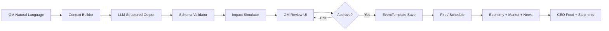

# 2. Event Engine Specification

> **Supreme principles**: `00-v1-development-principles.md`  
> **Version 1.1** — D-04, D-15 complete

## 2.1 설계 원칙

1. **AI는 초안 생성기** — 자동 발화 금지, GM confirm 후 적용
2. **엑셀 계산 규칙 불변** — Event는 Economy/Market **파라미터**만 변경
3. **교육 패키지** — 경제 영향 + Best/Normal/Worst + 토론 질문
4. **역추적** — `generatedFromPrompt`, `approvedBy`, `approvedAt`
5. **v1.1 (D-15)** — Fire 시 **NORMAL only** default; Best/Worst = GM 토론·What-if (V2); **PROBABILISTIC disabled** in V1
6. **v1.1 (D-04)** — `recommendedPeriod[]` on EventTemplate; GM Desk warns if severity>3 in Y1H1

---

## 2.2 파이프라인



---

## 2.3 GM 입력

| Field | Required | Example |
|-------|----------|---------|
| prompt | ✓ | "미국이 중국산 자동차에 25% 관세를 부과하였다." |
| sessionId | | 현재 게임 경제 스냅샷 주입 |
| targetTiming | | year=2, half=H1, onStep=MATERIAL |
| language | | ko |

---

## 2.3.1 v1.1 — recommendedPeriod (D-04)

EventTemplate / ScenarioAction metadata:

```json
{
  "recommendedPeriod": ["Y2H1", "Y2H2", "Y3H1", "Y3H2"],
  "avoidPeriod": ["Y1H1"],
  "maxSeverityInAvoid": 3
}
```

**GM Desk rules**

- Fire in `avoidPeriod` with `severity > maxSeverityInAvoid` → confirm modal: "교육 arc 경고"
- Scenario Editor: filter by `recommendedPeriod`
- Scenario Library packs tagged (see `07-scenario-library.md`)

---

## 2.4 AI 출력 스키마 — `EventDraftPackage`

```json
{
  "meta": {
    "title": "미·중 자동차 관세 25% 부과",
    "summary": "교육용 2문장 요약",
    "category": "POLICY|TRADE|SUPPLY|LABOR|TECH|DISASTER|ECONOMY",
    "severity": 1,
    "confidence": 0.85,
    "sourcePromptHash": "sha256..."
  },
  "industryImpact": {
    "primaryIndustry": "AUTOMOTIVE",
    "secondaryIndustries": ["STEEL", "LOGISTICS"],
    "rationale": "완성차·부품·철강·물류 연쇄"
  },
  "marketImpact": {
    "regions": [
      { "regionId": "NA", "demandDelta": -0.08, "priceCapDelta": -0.05 },
      { "regionId": "ASIA", "supplyDelta": -0.12 }
    ],
    "globalDemandDelta": -0.03
  },
  "variableImpact": {
    "effects": [
      { "key": "tariffRate", "mode": "ABSOLUTE", "value": 25, "unit": "pct" },
      { "key": "rawMaterialIndex", "mode": "PERCENT", "value": 8 },
      { "key": "logisticsCostMultiplier", "mode": "MULTIPLY", "value": 1.1 }
    ]
  },
  "scenarios": {
    "best": {
      "label": "최선",
      "probability": 0.2,
      "narrative": "국내 조달 전환 성공, …",
      "additionalEffects": [
        { "key": "marketDemandIndex", "mode": "PERCENT", "value": -2 }
      ]
    },
    "normal": {
      "label": "일반",
      "probability": 0.6,
      "narrative": "비용 상승·수요 일부 감소",
      "additionalEffects": []
    },
    "worst": {
      "label": "최악",
      "probability": 0.2,
      "narrative": "공급 차질 + 환율 급등 복합",
      "additionalEffects": [
        { "key": "exchangeRate", "mode": "PERCENT", "value": 10 },
        { "key": "rawMaterialIndex", "mode": "PERCENT", "value": 15 }
      ]
    }
  },
  "education": {
    "learningPoints": [
      "관세는 매출원가와 가격 전가의 trade-off",
      "공급망 다변화의 필요성"
    ],
    "discussionQuestions": [
      "국내 vs 수입 원재료 mix를 어떻게 바꿀 것인가?",
      "판매 가격 인상 vs 점유율 방어?"
    ],
    "relatedSteps": ["MATERIAL", "SALES", "SETTLEMENT"]
  },
  "news": {
    "headline": "美, 中산 자동차에 25% 관세",
    "lead": "…",
    "tone": "urgent",
    "ceoActionHints": ["원재료 조달 지역 재검토", "판매 가격 시뮬레이션"]
  },
  "warnings": ["플랫폼 기본 산업은 일반 제조 — 자동차는 비유로 설명"],
  "simulationPreview": {
    "avgPurchaseCostDeltaPct": 9.2,
    "avgMarginDeltaPct": -3.1
  }
}
```

---

## 2.5 AI 생성 필드 정의

| 필드 | 설명 | GM 편집 |
|------|------|---------|
| **영향 산업** | `industryImpact.primary/secondary` | ✓ |
| **영향 시장** | `marketImpact.regions[]` | ✓ |
| **영향 변수** | `variableImpact.effects[]` | ✓ |
| **최선 시나리오** | narrative + additionalEffects | ✓ |
| **일반 시나리오** | base case (Fire 시 default) | ✓ |
| **최악 시나리오** | tail risk | ✓ |
| **확률** | best/normal/worst sum=1 | ✓ |
| **교육 포인트** | learningPoints[] | ✓ |
| **토론 질문** | discussionQuestions[] | ✓ |

### Industry Enum (확장)

`GENERAL_MANUFACTURING` (default), `AUTOMOTIVE`, `SEMICONDUCTOR`, `STEEL`, `BATTERY`, `CHEMICAL`, `LOGISTICS`

> 현재 Rule Book은 **일반 제조** — AI는 비유·연관 산업으로 교육 맥락 제공.

---

## 2.6 시나리오 적용 모델

### Fire 시 GM 선택 (v1.1)

| Mode | V1 | V2+ |
|------|-----|-----|
| **NORMAL** | **default & only runtime apply** | default |
| **BEST** | Review UI / 토론 only | optional apply |
| **WORST** | Review UI / 토론 only | optional apply |
| **PROBABILISTIC** | **disabled** | GM opt-in advanced |

### Duration

| Type | 설명 |
|------|------|
| INSTANT | 1회성 (결산 시 reverse optional) |
| PERIOD | 현재 반기 |
| N_PERIODS | n 반기 |

---

## 2.7 Runtime — `SimulationEvent`

| Field | 설명 |
|-------|------|
| id | UUID |
| sessionId | |
| draftPackageId | 승인된 패키지 |
| status | SCHEDULED \| ACTIVE \| EXPIRED \| CANCELLED |
| appliedScenario | NORMAL \| BEST \| WORST |
| resolvedEffects | JSON snapshot |
| firedAt | |
| newsArticleId | |

### Apply 순서

```
1. Lock session economic patch
2. Apply variableImpact (+ scenario delta)
3. Apply marketImpact per region
4. Persist SimulationEvent
5. Enqueue AI News (news block)
6. Push education package to GM (토론) + optional CEO hints
7. WebSocket: eventFired
```

---

## 2.8 GM Review UI (Spec — 구현 전)

```
┌─ AI Event Draft ─────────────────────────────────────────────┐
│ Prompt: "미국이 중국산 자동차에 25% …"                         │
├──────────────────────────────────────────────────────────────┤
│ [Meta] [Variables] [Markets] [Scenarios] [Education] [News]  │
├─ Variables (editable table) ─────────────────────────────────┤
│ tariffRate +25% │ rawMaterialIndex +8% │ logistics ×1.1       │
├─ Scenarios ──────────────────────────────────────────────────┤
│ Best  20% [edit] │ Normal 60% [edit] │ Worst 20% [edit]      │
├─ Education ──────────────────────────────────────────────────┤
│ Learning points · Discussion questions (editable)            │
├─ Preview ────────────────────────────────────────────────────┤
│ Dry-run: avg purchase +9.2% │ Apply as: [Normal ▼]           │
│ [ Regenerate ] [ Save Draft ] [ Approve & Fire ] [ Schedule]│
└──────────────────────────────────────────────────────────────┘
```

**Approve & Fire** → `SimulationEvent` + Economy/Market patch  
**Save Draft** → `EventTemplate` library

---

## 2.9 AI News 연동

Event 승인 시 `news` 블록 → AI News Engine:

- GLOBAL headline + market impact summary
- Per-company: inventory/debt/region exposure personalization
- `ceoActionHints` → Step 4~6 form hints

---

## 2.10 AI Consultant (결산 연동)

Step 7 / 연말: Event 이력 + Statements →

- 강점/약점/리스크/개선안 (기존 Annual AI)
- **Event 대응 평가** (교육, 순위 가중 낮음)

---

## 2.11 Validation & Guardrails

| Rule | |
|------|--|
| Schema | Zod strict, 1 retry |
| Bounds | single var Δ ≤ ±50% unless GM override |
| Probability | sum = 1 ± 0.01 |
| Content | no hate, real politician names |
| Severity ≥4 | double confirm |

---

## 2.12 API (Spec)

```
POST /api/v1/gm/event-packages/generate
POST /api/v1/gm/event-packages/{id}/approve
POST /api/v1/gm/sessions/{id}/events/fire
POST /api/v1/gm/sessions/{id}/events/schedule
GET  /api/v1/gm/sessions/{id}/events
POST /api/v1/gm/sessions/{id}/events/{eid}/cancel
```

---

## 2.13 EventTemplate (Library) vs DraftPackage

| | EventTemplate | EventDraftPackage |
|---|---------------|-------------------|
| 생성 | AI / manual | AI only |
| 시나리오 3종 | optional | required |
| 교육 필드 | optional | required |
| 재사용 | ✓ | approve 후 template화 |

---

## 2.14 엑셀·Rule Book 관계

- Event **does not** change BOM, base machine specs, journal structure
- Event **does** change: Economy vars, region demand/price limits, capacity multipliers (temporary)

See: `03-economy-engine-spec.md`, `01-game-rule-book.md` §1.10
