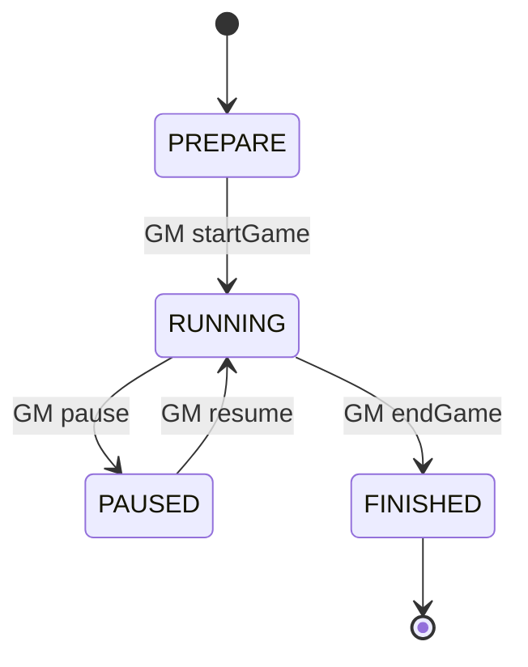
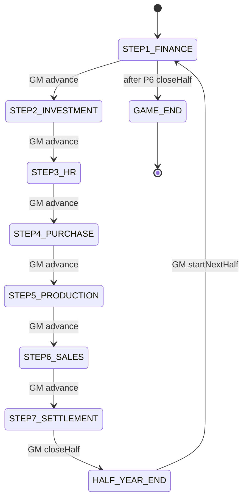

# 5. Game State Machine Specification

> **Supreme principles**: `00-v1-development-principles.md`  
> **Version 1.1** — D-01, D-03, D-10 complete

---

## 5.1 State Hierarchy

```
GameSession (top)
 ├── sessionPhase: PREPARE | RUNNING | PAUSED | FINISHED
 ├── periodIndex: 1..6
 ├── half: H1 | H2
 ├── year: 1..3
 └── stepPhase: STEP_* | HALF_YEAR_END | GAME_END
 └── step1SubPhase: 1A | 1B | null   // D-01, LOAN only
```

---

## 5.2 Session Phase



| State | CEO | GM | Locked |
|-------|-----|-----|--------|
| **PREPARE** | lobby join | prepare, edit scenario | all decisions |
| **RUNNING** | current step | desk full | non-current steps |
| **PAUSED** | view only | resume, override | all CEO submit |
| **FINISHED** | final report view | export, archive | all decisions |

---

## 5.3 Step Phase (RUNNING only)



### State Enum

| Code | UI Label | Excel |
|------|----------|-------|
| `STEP1_FINANCE` | ① 자금 조달 | Row 25-27 |
| `STEP2_INVESTMENT` | ② 설비 투자 | Row 28-29 |
| `STEP3_HR` | ③ 인력 채용 | Row 32-34; restructuring year≥2 (D-02) |
| `STEP4_PURCHASE` | ④ 원재료 구매 | 재료구입 |
| `STEP5_PRODUCTION` | ⑤ 생산 | 생산공정 |
| `STEP6_SALES` | ⑥ 판매 | 제품판매 |
| `STEP7_SETTLEMENT` | ⑦ 반기 결산 | Row 124-127 |
| `HALF_YEAR_END` | 반기 마감 처리 | Sheet1/2 |
| `NEXT_HALF` | (transient) | — |
| `GAME_END` | 게임 종료 | Final |

---

## 5.4 Per-State Matrix — CEO Actions

| State | submit | view dashboard | view financials | view news | edit past step |
|-------|--------|----------------|-----------------|-----------|----------------|
| PREPARE | ✗ | ✗ | ✗ | ✗ | ✗ |
| STEP1_FINANCE | LOAN 1A/1B | ✓ | prior | ✓ | read — |
| STEP2_INVESTMENT | FACILITY | ✓ | prior | ✓ | read P1 |
| STEP3_HR | HIRE | ✓ | prior | ✓ | read P1-2 |
| STEP4_PURCHASE | PURCHASE | ✓ | prior | ✓ | read … |
| STEP5_PRODUCTION | PRODUCTION | ✓ | prior | ✓ | read … |
| STEP6_SALES | SALES | ✓ | prior | ✓ | read … |
| STEP7_SETTLEMENT | ✗ | ✓ | **current period** | ✓ | read all current |
| HALF_YEAR_END | ✗ | ✓ | current closed | ✓ | read all |
| PAUSED | ✗ | ✓ | ✓ | ✓ | read |
| FINISHED | ✗ | ✓ | all | ✓ | read all |
| GAME_END | ✗ | ✓ | all + final | ✓ | read all |

---

## 5.5 Per-State Matrix — GM Actions

| State | advance step | close half | economy patch | fire event | override | ranking |
|-------|--------------|------------|---------------|------------|----------|---------|
| PREPARE | ✗ | ✗ | preset only | schedule | ✗ | ✗ |
| STEP1-6 | ✓ | ✗ | ✓ live | ✓ | ✓ | ✓ live |
| STEP7 | ✓→close | ✓ (primary) | ✓ | ✓ | ✓ | ✓ |
| HALF_YEAR_END | ✗ | ✗ (processing) | ✓ | ✓ | ✓ | ✓ update |
| PAUSED | ✗ | ✗ | ✓ | ✗ | ✓ | ✓ |
| FINISHED | ✗ | ✗ | ✗ | ✗ | read | ✓ final |
| GAME_END | ✗ | ✗ | ✗ | ✗ | ✗ | ✓ final |

---

## 5.6 Per-State — Feature Locks

| Feature | Locked when |
|---------|-------------|
| Decision submit | not current step |
| Decision submit | PAUSED / PREPARE / FINISHED |
| Decision submit | SETTLEMENT (no CEO input) |
| Step skip | CEO always (GM only) |
| Economy retroactive recalc | default locked; GM tool |
| Financial Statement (current) | before SETTLEMENT close partial; full after close |
| Live Ranking (final) | until first half close |
| AI Annual Report | year end (P2,P4,P6) |
| Scenario Editor | affects future sessions unless reload |

---

## 5.7 Transitions (Events)

| Event | From | To | Actor |
|-------|------|-----|-------|
| `game.created` | — | PREPARE | GM |
| `game.started` | PREPARE | RUNNING + STEP1 | GM |
| `decision.posted` | STEPn | STEPn (complete flag) | CEO |
| `step.advanced` | STEPn | STEPn+1 | GM (+ zero/copy-last-half D-10) |
| `loan.phaseCompleted` | STEP1 1A | STEP1 1B | CEO (D-01) |
| `step.advanced` | STEP7 | STEP7 (await close) | GM |
| `half.closed` | STEP7 | HALF_YEAR_END → STEP1 (next period) | GM |
| `half.closed` | P6 | GAME_END | GM |
| `game.paused` | RUNNING | PAUSED | GM |
| `game.resumed` | PAUSED | RUNNING (same step) | GM |
| `game.ended` | RUNNING | FINISHED | GM |
| `economy.patched` | * | * (no state change) | GM |
| `event.fired` | * | * | GM |

---

## 5.8 HALF_YEAR_END Sub-States (internal)

```
CLOSING_STARTED
  → payroll_accrual
  → depreciation
  → interest
  → tax
  → snapshot_pl_bs_cf
  → ranking_update
  → ai_annual_enqueue (if year end)
CLOSING_COMPLETED → STEP1 (next period) or GAME_END
```

CEO UI: "반기 결산 중…" banner  
GM UI: progress checklist

---

## 5.9 Company Step Status (per team)

```json
{
  "companyId": "uuid",
  "periodId": "uuid",
  "step": "STEP4_PURCHASE",
  "status": "NOT_STARTED|IN_PROGRESS|SUBMITTED|SKIPPED_ZERO",
  "decisionId": "uuid|null"
}
```

GM Desk grid uses this for ✅/⏳.

---

## 5.10 WebSocket Payloads

| Event | Payload |
|-------|---------|
| `session.phaseChanged` | `{ phase }` |
| `step.changed` | `{ step, periodIndex, year, half }` |
| `half.closed` | `{ periodIndex, rankings }` |
| `game.finished` | `{ finalRankings }` |

---

## 5.11 Alignment with UX States

| State Machine | CEO UX |
|---------------|--------|
| STEPn active | Tab「지금 할 일」form enabled |
| SUBMITTED | waiting banner |
| STEP7 | Settlement + Financial link |
| PAUSED | global freeze overlay |
| GAME_END | Final Report link |

---

## 5.12 Invalid Transitions (reject)

| Attempt | Error |
|---------|-------|
| CEO submit wrong step | `STEP_GATE_VIOLATION` |
| GM advance from PREPARE | `INVALID_TRANSITION` |
| GM close half from STEP3 | `INVALID_TRANSITION` |
| CEO submit when PAUSED | `SESSION_PAUSED` |
| Double submit same step | `IDEMPOTENCY_REPLAY` or 409 |

---

## 5.13 Persistence

```typescript
GameProgress {
  sessionId: string
  sessionPhase: SessionPhase
  periodIndex: number      // 1-6
  year: number             // 1-3
  half: 'H1' | 'H2'
  stepPhase: StepPhase
  step1SubPhase?: '1A' | '1B'   // D-01
  stepStartedAt: datetime
  closingStatus?: ClosingStatus
}
```

---

## 5.14 3-Year Calendar Table

| periodIndex | year | half | step loop | notes |
|-------------|------|------|-----------|-------|
| 1 | 1 | H1 | 7 steps | no restructuring |
| 2 | 1 | H2 | 7 steps | |
| 3 | 2 | H1 | 7 steps | restructuring available step3 |
| 4 | 2 | H2 | 7 steps | |
| 5 | 3 | H1 | 7 steps | |
| 6 | 3 | H2 | 7 steps | → GAME_END after close |

---

## 5.15 Document Cross-Reference

| Topic | Doc |
|-------|-----|
| Rules & formulas | `01-game-rule-book.md` |
| Decisions | `04-decision-engine-spec.md` |
| Economy | `03-economy-engine-spec.md` |
| Events | `02-event-engine-spec.md` |
| UX | `docs/ux/01-education-flow-ux.md` |

**Implementation gate**: All 5 specs approved → JSON Schema → code.
