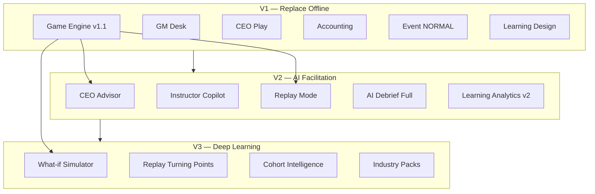

# Document 09 — Future Experience Design (Vision v2)

> **Supreme principles**: `00-v1-development-principles.md`  
> Executive summary — **Full design**: `10-web-only-education-experience.md`  
> Aligns with **Spec v1.1** (V1 scope) · V2/V3 = **optional** web-only differentiation from Excel  
> **V1 gate (Doc 10 §3)**: Excel 100% replacement + GM zero Excel · **Guardrails §4** · **Journey §1**

## Vision Statement

> 엑셀·보드게임은 **한 번 play하면 끝**이다.  
> BSP 웹 플랫폼은 **기록·재생·비교·코칭·분석**으로  
> "왜 그 결정이 그 결과를 만들었는가"를 **반복 학습**하게 한다.

**불변 원칙**

- AI는 **CEO 의사결정을 대체하지 않는다** (Advisor/Copilot/Debrief만)
- 게임 규칙·회계 엔진 (Spec v1.1)은 **시뮬레이션 truth**
- V1 = 오프라인 교육 **완전 대체** | V2/V3 = 교육 효과 **확장**

---

## 1. AI CEO Advisor

### 목적

CEO가 Step별로 제출 **전** 스스로 생각하도록 **리스크만** 비춰 주는 거울.

### Hard Constraints (Non-negotiable)

| ✅ 허용 | ❌ 금지 |
|---------|---------|
| 리스크·제약 설명 | "이렇게 하세요" |
| 과거 유사 팀 패턴 (익명) | 구체적 숫자·선택지 제시 |
| "현금·capacity·이벤트 exposure" 경고 | Decision auto-fill |
| 질문 **유도** (Learning Design 연결) | 최적해 계산 |

### UX (V2)

```
Step 4 Purchase — [ 💡 Advisor ]
┌─────────────────────────────────────┐
│ ⚠ 리스크 신호 (제출 전)              │
│ · 구매 후 현금 4,200만 → Step5 가동비 여력 좁음 │
│ · 환율 +12% 이벤트 → 수입 지역 exposure 40%   │
│ · 재고 120% 증가 → 반기末 carrying cost ↑     │
│                                     │
│ "어떤 trade-off를 감수했는지 팀에 설명해     │
│  보세요." (선택지 없음)              │
└─────────────────────────────────────┘
```

### Data Inputs

- Current `CeoStatusDTO` + Economy + active Events
- **Not** other teams' live decisions (anti-cheat)
- Historical anonymized aggregates (optional)

### Service

```
AdvisorService.analyze(companyId, step, draftPayload?)
  → RiskSignal[] { severity, message, learningObjectiveRef }
```

### Learning Link

- Maps to `06-learning-design-spec.md` per-step "고민 질문"
- Logged for Learning Analytics (§6) — **not** scored

---

## 2. AI Instructor Copilot

### 목적

GM이 10팀을 동시에 facilitation할 때 **주의·토론·목표 달성**을 보조.

### Capabilities

| Feature | Description |
|---------|-------------|
| **팀별 위험 신호** | LOW_CASH, CAPACITY_MISMATCH, SKIPPED_ZERO, EVENT_EXPOSED |
| **토론 질문 추천** | Learning Design + Scenario Library `discussionQuestions` + context |
| **교육 목표 달성** | Step별 "학습목표 체크리스트" — GM dashboard badge |

### UX (V2 — GM Desk sidebar)

```
┌─ Copilot ─────────────────────────┐
│ 🔴 Gamma — 현금 4,800, Step4 전   │
│    → 추천: "현금 부족 시 trade-off?" │
│ 🟡 Beta — 미제출 8분              │
│    → 추천: "병목 부서 개념 질문"   │
│ ✅ 학습목표 Step4: 6/10팀 재고·현금 언급 │
└───────────────────────────────────┘
```

### Hard Constraints

- Copilot **does not** advance step, fire event, or override
- Suggestions = GM clicks to **broadcast** or **dismiss**

### Service

```
CopilotService.scan(sessionId) → TeamAlert[], SuggestedQuestion[]
CopilotService.assessLearningGoals(sessionId, step) → GoalCoverage
```

### Learning Link

- `GoalCoverage`: NLP on optional CEO reflection text (V2) or GM observation toggle

---

## 3. Replay Mode

### 목적

반기·3년 전체 **의사결정 타임라인 재생** — 인과관계 시각화.

### Only-on-Web

엑셀은 셀 히스토리; 웹은 **event-sourced Decision + Journal + Snapshot**.

### UX

```
Replay — Alpha팀 — 2년차 상반기
[◀ Step1 ─ Step2 ─ Step3 ─●Step4 ─ Step5 ─ Step6 ─ Step7 ▶]

┌─ Decision ─────────┐  ┌─ Impact ──────────────┐
│ Purchase ASIA 100  │  │ Cash: 8200→6830      │
│                    │  │ Inventory: +280       │
└────────────────────┘  │ P/L preview: COGS↑  │
                          └───────────────────────┘
         [ Play ] 1x 2x  │  GM Event: FX +12% @ Step4
```

### Timeline Model

```json
{
  "replayId": "uuid",
  "companyId": "uuid",
  "periodId": "uuid",
  "frames": [
    {
      "step": "MATERIAL",
      "decisionId": "...",
      "journalEntryIds": [],
      "dashboardSnapshot": {},
      "statementDelta": { "cash": -1370 },
      "worldEvents": ["EVT-001@Step4"]
    }
  ]
}
```

### Modes

| Mode | Audience |
|------|----------|
| **Team Replay** | CEO 복기 |
| **Class Replay** | GM projector — compare two teams side-by-side |
| **Highlight** | AI auto-mark "turning points" (V3) |

### V1 vs V2

| | V1 | V2 |
|---|-----|-----|
| Replay | — | 반기 단위 play |
| V3 | | 3년 full + turning points |

---

## 4. What-if Simulator

### 목적

게임 **종료 후** counterfactual — "다른 선택이었다면?"

### Scope (Post-game only)

- **Does not** change official ranking or saved game state
- Fork `SimulationSandbox` from final snapshot

### Example Questions

| Question | Sandbox change |
|----------|----------------|
| 환율이 오르지 않았다면? | `exchangeRate` −12% |
| 차입을 줄였다면? | DecisionLoan.loanEarly −1000 |
| 설비를 더 투자했다? | +1 Small machine @ P1 Step2 |

### UX

```
What-if Lab — Alpha팀
Baseline: 실제 3년 결과 (순위 3)

Scenario A: [환율 -10% throughout]
  → simulated equity +820만  │  ROE +2.1%p

Scenario B: [차입 50% reduction]
  → simulated equity +410만  │  missed CAPEX opportunity

Compare chart [Baseline vs A vs B]
```

### Engine

```
WhatIfEngine.fork(companyId, endSnapshot)
WhatIfEngine.applyCounterfactual(fork, patches[])
WhatIfEngine.runRemainingPeriods() // fast-forward deterministic
  → WhatIfResult { metrics, narrative }
```

### Hard Constraints

- Re-run uses **same Rule Book v1.1** engine
- Label clearly: **"시뮬레이션 결과, 공식 순위 아님"**

### Version

| | V1 | V2 | V3 |
|---|-----|-----|-----|
| What-if | — | — | Full post-game |

---

## 5. AI Debrief

### 목적

교육 종료 후 **팀·개인** 맞춤 회고 — 수업 closure.

### Outputs (per team)

| Section | Content |
|---------|---------|
| **회사별 AI 피드백** | 3년 narrative arc |
| **팀 비교** | vs cohort anonymized |
| **잘한 점** | evidence from decisions |
| **개선점** | missed trade-offs |
| **다음 전략** | 3 actionable experiments |

### UX

```
Final Debrief — Alpha팀
┌─ Executive Summary ─────────────────────────┐
│ "현금 관리는 우수. Y2H1 FX 이벤트 대응 지연." │
├─ Evidence Timeline (link Replay) ───────────┤
├─ Peer Comparison (radar) ───────────────────┤
├─ Try Next Time ─────────────────────────────┤
│ 1. Step1 buffer 15% cash rule               │
│ 2. Diversify region mix before EVT-001      │
└─────────────────────────────────────────────┘
[ Export PDF ] [ Share to CEO portal ]
```

### Inputs

- All POSTED Decisions, FiscalSnapshots, Events, Ranking
- Learning Design objectives checklist
- **Not** replacing GM verbal debrief — **supplement**

### V1 vs V2

| | V1 | V2 |
|---|-----|-----|
| Debrief | Rule-based template + 1 AI paragraph (Step7) | Full AI Debrief |
| V3 | | + What-if suggestions integrated |

### Ranking (D-05)

Debrief scores **do not** affect official ranking.

---

## 6. Learning Analytics

### 목적

교육자·기관 — **수업 품질** 측정 (학습者 개인 평가 보조).

### Metrics

| Metric | Source | Use |
|--------|--------|-----|
| **Step별 의사결정 시간** | `submittedAt − stepStartedAt` | pacing, difficulty |
| **팀별 전략 유형** | cluster: conservative / balanced / aggressive | discussion |
| **리스크 성향** | loan/equity, inventory, CAPEX ratios | Advisor validation |
| **토론 참여도** | GM toggle / optional chat / reflection submit | engagement |
| **학습 성취도** | quiz + GM rubric + goal coverage | outcomes |

### Strategy Typology (example)

```
CONSERVATIVE: low debt, high deposit, low inventory
AGGRESSIVE: high leverage, high CAPEX early
BALANCED: mid metrics
EVENT_REACTIVE: decisions correlate with event timing
```

### Dashboard (Institution / GM)

```
Session Analytics — 경영 시뮬 3반
· Avg time Step4: 18min (▲ vs last cohort)
· 60% teams AGGRESSIVE in Y1 → cash stress Y1H2
· Learning Goal "BOM 이해": 72% (Copilot assessed)
· Discussion participation: 8.2/10 (GM scored)
```

### Privacy

- Cohort aggregates default
- Individual drill-down: GM + institution admin only
- GDPR-style: session end + retention policy (config)

### Version

| | V1 | V2 | V3 |
|---|-----|-----|-----|
| Analytics | Basic timing + submit rate | + strategy + goals | + institution cohort compare |

---

## 7. Experience Architecture



---

## 8. Product Roadmap — V1 / V2 / V3

### V1 — 출시 (Offline Complete Replacement)

**Goal**: 기존 엑셀+보드게임 교육을 **100% 대체** 가능.

| Domain | Scope |
|--------|-------|
| Game | 3년·6반기·7 Step, Spec v1.1 |
| CEO | Dashboard, 7 Decisions, Financial Statement, News |
| GM | Desk, Economy Live, Event Library (53), Scenario Editor, Ranking |
| AI | AI News (event), Step7 one-liner, NL Event **draft** (GM approve) |
| Education | Learning Design embedded in UI copy |
| Tech | Auth, WebSocket, Journal, Statements |

**Explicitly NOT V1**: Advisor, Copilot, Replay, What-if, Full Debrief, Analytics v2

**V1 Success**: one full 3-year class without Excel.

---

### V2 — AI Facilitation Layer

**Goal**: 강사·학습자에게 **웹 only** 코칭·복기·분석.

| Feature | Priority |
|---------|----------|
| AI CEO Advisor | P0 |
| AI Instructor Copilot | P0 |
| Replay Mode (반기) | P0 |
| AI Debrief (full) | P1 |
| Learning Analytics v2 | P1 |
| Event Best/Worst **apply** (optional GM) | P2 |
| Bid workflow (D-08 V2) | P2 |

**V2 Success**: GM reports 30% less facilitation load; CEO post-survey "인과 이해" ↑

---

### V3 — Counterfactual & Scale

**Goal**: **deep learning** + 기관·산업 확장.

| Feature | Priority |
|---------|----------|
| What-if Simulator | P0 |
| Replay 3-year + turning points | P1 |
| Learning Analytics institution | P1 |
| Industry packs (auto, battery, …) | P2 |
| AI competitor firms (PRD §13) | P2 |
| PROBABILISTIC events (D-15 advanced) | P3 |

**V3 Success**: alumni replay + what-if as assignment; multi-industry catalog

---

## 9. Roadmap Timeline (Indicative)

| Phase | Duration | Deliverable |
|-------|----------|-------------|
| V1 MVP | — | Spec JSON → Core engine → CEO/GM UI |
| V1 GA | — | Production class-ready |
| V2 Alpha | — | Advisor + Copilot internal |
| V2 GA | — | Replay + Debrief |
| V3 | — | What-if + Analytics institution |

*(Dates TBD by implementation start)*

---

## 10. Dependencies & Risks

| Risk | Mitigation |
|------|------------|
| Advisor gives "answers" | Hard constraint + prompt audit |
| What-if diverges from engine | Same Rule Book code path |
| GM ignores Copilot | Optional, not auto-pilot |
| Analytics privacy | Aggregate default |
| V1 scope creep | Vision features **explicitly deferred** |

---

## 11. Document Index

| Doc | Relationship |
|-----|--------------|
| Spec v1.1 | V1 truth |
| Learning Design | Advisor/Copilot content source |
| Scenario Library | Copilot questions, events |
| UX Wireframes | V1 screens; V2 additive |
| JSON Spec | Next after Vision approval |

---

## 12. Approval Gate

- [ ] Vision v2 (this document) approved  
- [ ] Then: JSON Specification  
- [ ] V1 implementation scoped to §8 V1 table only
