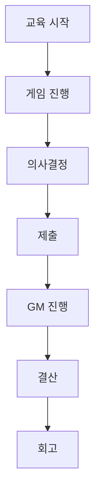
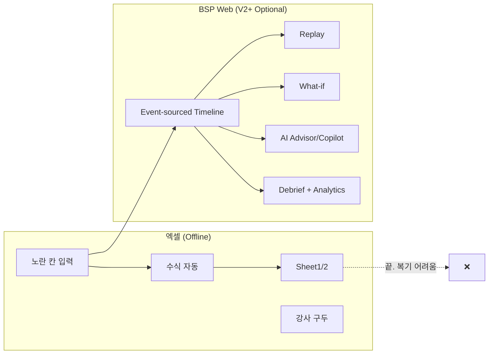
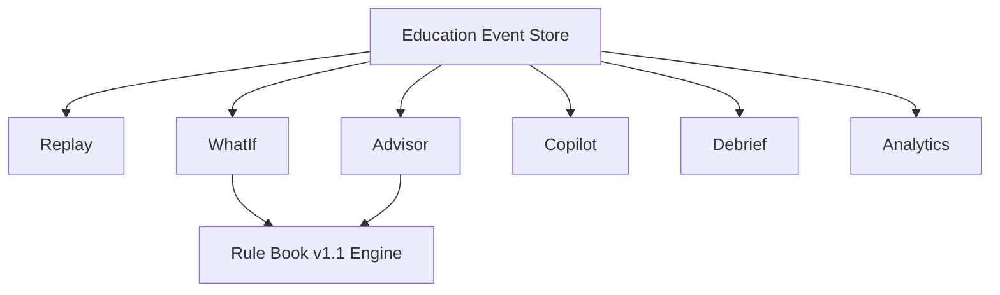

# 10. Web-Only Education Experience Design

> **Supreme principles**: `00-v1-development-principles.md`  
> **목표**: 기존 엑셀·보드게임 교육과 **본질적으로 다른** 웹 플랫폼 경험 설계  
> **Supreme principles**: `00-v1-development-principles.md`  
> Status: Design — **Approved** 2026-07-26  
> Related: `09-future-experience-design.md` (요약본), `06-learning-design-spec.md`

---

## 0. 핵심 철학

> **엑셀은 계산기이고, BSP는 교실이다.**

| | 엑셀 시뮬레이션 | BSP 웹 플랫폼 |
|---|----------------|---------------|
| **본질** | 개인 원장 (spreadsheet) | 다인 교육 환경 (classroom) |
| **기록** | 셀 덮어쓰기, 히스토리 약함 | Decision·Journal **불변 이벤트 로그** |
| **시간** | 1년 시트, 되돌리기 어려움 | 3년·6반기 **타임라인 재생** |
| **환경** | 강사가 구두·보드로 설명 | **실시간** 경제·이벤트·뉴스 |
| **피드백** | 결산 후 숫자 확인 | **AI Debrief + Analytics** |
| **가설** | "다르게 했으면?" 불가 | **What-if** counterfactual |
| **코칭** | 강사가 직접만 | **Advisor + Copilot** (결정 대체 X) |
| **학습 측정** | 퀴즈·구두 | **Learning Analytics** |

**불변 원칙**

1. AI는 CEO **의사결정을 대체하지 않는다**
2. 게임 규칙·회계는 **Spec v1.1** 단일 truth
3. V1 = 엑셀 교육 **완전 대체** + 강사 **엑셀 없이** 운영 | V2+ = **선택 기능** (엑셀 대체와 무관)

---

## 1. Education Journey Map (Experience Mapping)

교육 과정 전체에서 **각 기능이 등장하는 시점**, **사용자**, **교육 목적**을 하나의 Journey Map으로 정의한다.



### 1.1 단계별 기능 매핑

| 단계 | V1 (필수 — 엑셀 대체) | V2+ (선택 — 웹 Only) | 주 사용자 | 교육 목적 |
|------|----------------------|----------------------|-----------|-----------|
| **교육 시작** | 세션 생성 · 규칙 안내 · 팀 배정 · GM Desk 오픈 | AI Instructor Copilot — 세션 체크리스트 · 학습목표 프리뷰 | GM | 교육 프레임 설정; 역할·규칙·7 Step 순서 이해 |
| **게임 진행** | Live Economy 패널 · 이벤트 발동 · AI News · Live Ranking | Copilot — 위험 팀 스캔 · 토론 질문 추천 | GM (주), CEO (관찰) | 경영 **환경** 인식 — 외부 변수가 의사결정에 미치는 맥락 제공 |
| **의사결정** | Step 1~7 UI · 규칙 검증 · Draft 저장 · 학습 힌트(정적) | **AI CEO Advisor** — 리스크 신호 · 성찰 질문 | CEO | Value Chain 순서대로 **근거 있는** 입력 연습 |
| **제출** | Decision 불변 기록 · Journal append · 제출 타임스탬프 | Advisor — 제출 직전 최종 리스크 미러 (선택 열람) | CEO | 선택의 **책임** — 되돌리기 어렵다는 교육적 긴장감 |
| **GM 진행** | Step advance · 미제출 알림 · Broadcast · 이벤트 수동/자동 | **Copilot** — Broadcast용 질문 · 학습목표 커버리지 | GM | 동기화된 수업 리듬; **강사 개입**으로 토론 유도 |
| **결산** | Settlement · P/L·B/S · 순위 · Step7 한 줄 AI 코멘트 (V1) | **Replay** (반기) · **Full Debrief** (V2) · **Learning Analytics** | GM + CEO | 숫자 → **인과** 연결; "왜 이런 결과?" 첫 피드백 |
| **회고** | GM 토론 · Final Report · 팀 발표 (5분) | **Replay** (3년) · **AI Debrief** · **Analytics** export · **What-if** (V3, 과제) | GM · CEO · Institution | 자기 성찰 · 전략 개선 · 코호트 학습 효과 측정 |

### 1.2 Journey — CEO 시각 (V1 vs V2+)

```
[V1 필수 경로]
교육 시작 → GM 브리핑
  → 반기 loop:
      게임 진행(이벤트·뉴스 관찰)
        → Step1~7 의사결정·제출
        → GM advance
        → Step7 결산·순위·한 줄 코멘트
  → 게임 종료 → GM 회고·발표

[V2+ 선택 레이어 — featureFlag]
  의사결정 중: [Advisor] 리스크 (CEO)
  GM Desk: [Copilot] 알림·질문 (GM)
  반기 마감: [Replay] 인과 재생 (CEO/GM)
  게임 종료: [Debrief] + [Analytics] (CEO/GM/Institution)
  과제: [What-if] 대안 비교 (CEO, V3)
```

### 1.3 Journey — GM 시각

| 시점 | V1 GM 행동 | V2+ Copilot 보조 |
|------|------------|------------------|
| 세션 전 | 시나리오·이벤트 팩 선택 | 학습목표·Step별 질문 프리로드 |
| Step 중 | 미제출 팀 확인 · Broadcast | LOW_CASH 등 Alert · 질문 1-click Broadcast |
| 반기 end | Ranking 토론 · P/L 해석 | Replay 10분 클래스 compare |
| 게임 end | Final 발표 진행 | Debrief 검토·공유 · Analytics export |

**원칙**: V2+ 기능이 꺼져 있어도 V1 Journey는 **100% 완결** — 엑셀 교육과 동등 이상.

---

## 2. Learning Objective Mapping

각 AI·웹 Only 기능은 `06-learning-design-spec.md`의 Step·반기 학습목표와 **명시적으로** 연결한다.

### 2.1 기능 → 학습목표

| 기능 | 지원 학습목표 | 근거 (교육 질문) |
|------|---------------|------------------|
| **Replay** | 의사결정과 재무성과의 **인과관계** 이해 | "왜 현금이 줄었나?" "Step4와 Step6의 연결은?" |
| **AI CEO Advisor** | **리스크 인식** 능력 향상 | "지금 결정의 trade-off는?" "현금 buffer는 충분한가?" |
| **What-if** | **대안적 의사결정** 비교 | "차입을 줄였다면?" "구매 mix를 바꿨다면?" |
| **AI Debrief** | **자기 성찰** 및 전략 개선 | "3년 중 잘한 점·개선점은?" "다음엔 무엇을 바꿀 것인가?" |
| **Learning Analytics** | **교육 효과** 측정 | "학습목표 달성률은?" "토론·제출 패턴은?" |
| **AI Instructor Copilot** | GM **facilitation** 일관성 · 학습목표 **커버리지** | "어떤 팀이 위험?" "지금 어떤 질문을 던져야 하나?" |

### 2.2 Step × Advisor/Copilot 학습목표 (발췌)

| Step | Learning Design 목표 | Advisor 신호 | Copilot 질문 유형 |
|------|---------------------|--------------|-------------------|
| 1 LOAN | 유동성·레버리지 | `LEVERAGE_HIGH`, `LOW_CASH_BUFFER` | "차입 vs 자기자본 trade-off?" |
| 2 FACILITY | CAPEX·능력 | `CAPACITY_BOTTLENECK` | "설비 timing과 현금?" |
| 3 HIRING | 인력·실행 | capacity vs headcount | "인력과 생산 capacity?" |
| 4 MATERIAL | BOM·조달 | `EVENT_EXPOSURE`, inventory | "환율·재고 trade-off?" |
| 5 PRODUCTION | 변환·병목 | `CAPACITY_BOTTLENECK` | "생산량과 판매 계획?" |
| 6 SALES | 가치실현·시장 | `INVENTORY_TRAP` | "가격·물량·재고?" |
| 7 SETTLEMENT | P/L·B/S 해석 | (V1: 한 줄 only) | "한 줄 P/L 해석 공유?" |

### 2.3 Replay · Debrief · What-if 연계

```
Learning Objective (06-spec)
       ↓
Advisor/Copilot (Step 중 — 인식)
       ↓
Decision + Journal (행동)
       ↓
Replay (인과 증거 — 이해)
       ↓
Debrief (성찰 — 개선)
       ↓
What-if (가설 — 실험, V3)
       ↓
Analytics (측정 — 코호트)
```

---

## 3. V1 / V2+ Feature Gate

### 3.1 V1 출시 기준 (Hard Gate)

V1은 아래 **두 조건을 동시에** 만족해야 GA 가능하다.

| # | 조건 | 검증 방법 |
|---|------|-----------|
| G1 | **현재 엑셀 교육 100% 대체** | 7 Step · P/L·B/S · 3년 6반기 · GM 경제·이벤트 · 다팀 동기화 — 엑셀 `(게임용)회계기초과정 원장` 전 과정을 웹만으로 재현 |
| G2 | **강사가 별도 엑셀 없이 운영** | GM이 세션 생성 → 진행 → 결산 → 회고까지 **단일 GM Desk**만 사용; 보조 스프레드시트·수동 재계산 **0** |

**V1 성공 정의**: 한 반(10팀) 전체 교육을 **엑셀 파일 0개**로 완료.

### 3.2 V1 필수 범위 (In Scope)

| 영역 | V1 포함 |
|------|---------|
| CEO Play | Step 1~7 입력 · 검증 · 제출 · Draft |
| GM Desk | 세션·팀·Step advance · Economy · Event · Broadcast |
| 재무 | P/L · B/S · FiscalSnapshot (D-11) · Live Ranking |
| 게임 | Rule Book v1.1 전 규칙 · 53 Event Library |
| AI (최소) | AI News · Step7 **한 줄** settlement 코멘트 (정답·전략 없음) |
| 데이터 | Decision · Journal · Snapshot **기록** (Replay용 저장은 V1에서도 수행, **UI는 V2**) |

### 3.3 V2+ 선택 기능 (Out of V1 Gate — Optional)

> **V2 이후 기능은 모두 선택 기능.** V1 GA를 막지 않으며, `featureFlag`로 기관·세션별 ON/OFF.

| 기능 | Version | V1 | 비고 |
|------|---------|:--:|------|
| Replay Mode (반기) | V2 | ❌ | UI·compare |
| Replay (3년 + Turning Points) | V3 | ❌ | |
| What-if Simulator | V3 | ❌ | 게임 종료 후만 |
| AI CEO Advisor | V2 | ❌ | |
| AI Instructor Copilot | V2 | ❌ | |
| AI Debrief (full) | V2 | ❌ | V1 = Step7 one-liner만 |
| Learning Analytics (strategy·goals) | V2 | ❌ | V1 = submit timing만 (선택) |
| Learning Analytics (institution) | V3 | ❌ | |

### 3.4 V1에서 금지되는 Scope Creep

다음은 **V1 GA blocker가 아님** — V2 backlog로 고정:

- Replay 화면 · Class compare
- What-if sandbox
- Advisor/Copilot sidebar
- Full Debrief PDF · cohort radar
- Institution Analytics

**구현 참고**: Event Store는 V1부터 적재 → V2 Replay **데이터 마이그레이션 불필요**.

---

## 4. AI Guardrails

AI(Advisor · Copilot · Debrief · News · Replay 해설)는 교육 플랫폼의 **코치**이지 **플레이어**가 아니다.

### 4.1 절대 금지 (Hard Prohibitions)

| ID | 금지 행동 | 이유 |
|----|-----------|------|
| GR-01 | **참가자의 정답 제시** | 학습 = 스스로 근거를 세우는 과정 |
| GR-02 | **최적 전략 추천** | "이렇게 하세요" = 의사결정 대체 |
| GR-03 | **점수·순위 예측** | 결과 편향 · 게임성 훼손 |
| GR-04 | **승리 가능성 계산** | GR-03과 동일 |
| GR-05 | **자동 의사결정** | CEO 입력·제출 대체 불가 |
| GR-06 | **구체적 수치 제안** | "100개 구매하세요" · "차입 2억" 등 |
| GR-07 | **What-if 결과를 공식 순위에 반영** | 공정성 · 기록 무결성 |
| GR-08 | **GM 권한 대체** | Step advance · Event 발동 · Decision 수정 |

### 4.2 허용 (Allowed Outputs)

```
✅ 리스크 신호 (현금 buffer 좁음, 병목, 이벤트 exposure)
✅ 제약 리마인더 (Rule Book 규칙, validation 메시지)
✅ 학습 질문 · 성찰 프롬프트 ("trade-off는?")
✅ Learning Design 링크 (개념 참조)
✅ 증거 기반 서술 (Replay/Debrief — 과거 Decision 인용)
✅ GM용 토론 질문 추천 (Broadcast 전 GM 클릭 필요)
✅ 집계·익명 Analytics (개인 정답 노출 없음)
```

**한 줄 원칙**: **AI는 질문과 리스크만 제공한다.**

### 4.3 역할별 Guardrail

| 역할 | AI | 금지 예 | 허용 예 |
|------|-----|---------|---------|
| CEO Advisor | Draft 분석 | "생산 20개 추천" | "병목: 기계 capacity 20" |
| Instructor Copilot | 팀 스캔 | "Gamma는 차입 줄여야 함" | "Gamma LOW_CASH — '유동성' 질문 Broadcast?" |
| Debrief | 게임 종료 서술 | "3위→1위 하려면 X" | "P2 Step4 재고↑ → P3 현금↓ (Replay 링크)" |
| Replay 해설 | Frame narrative | "다음엔 Y를 선택" | "환율↑ + ASIA 구매 → 원재료비 +18%" |
| What-if | 시뮬 결과 | 공식 순위 UPDATE | "시뮬 순위 2위 (비공식)" + ⚠ 배너 |

### 4.4 구현·운영 통제

| Layer | Mechanism |
|-------|-----------|
| Prompt | System prompt에 GR-01~08 명시; user override 불가 |
| Output filter | Regex + schema — numeric recommendation strip |
| UI | `disclaimer: "의사결정은 팀이 내립니다"` 고정 표시 |
| Audit | `AdvisorInteraction` · `CopilotAction` 로그 — 분기별 prompt audit |
| Human | GM Debrief publish 전 검토 (V2, optional edit) |

### 4.5 위반 시 Fallback

```
LLM output violates guardrail
  → discard LLM layer
  → serve rules-only signals from Learning Design catalog
  → log incident for review
```

---

## 5. Replay Mode — 상세 설계

> **핵심 차별화 기능** (V2). 반기 Timeline 한 화면에서 Decision → 경제 이벤트 → 재무 변화 → 순위 변화 → AI 해설이 **연결**되어 보여야 한다.  
> **목표**: 참가자가 Replay만 보고 **"왜 이런 결과가 나왔는지" 5분 안에** 이해.

### 5.1 엑셀 한계

- 「연습」시트: **현재 값만** 존재; 과거 Decision 복원 어려움
- Undo/버전 없음; "그때 왜 그렇게 입력했지?" **교육 증거 없음**
- 팀 간 비교: 파일 분리, 동기화 없음

### 5.2 웹 Only 가치

**의사결정 → 재무 결과** 인과를 **한 타임라인**에서 재생 — 교육의 핵심 루프 완성.

### 5.3 사용자 · 버전

| Audience | Mode | Version |
|----------|------|---------|
| CEO | Team Replay (반기) | **V2** |
| GM | Class Replay (2팀 compare) | **V2** |
| GM/CEO | 3년 Full + Turning Points | **V3** |

V1: Event Store **적재만** — Replay UI 없음.

### 5.4 5분 이해 원칙 (UX Goal)

| # | 원칙 | 구현 |
|---|------|------|
| R1 | **한 화면** — 스크롤 최소 | 좌: Timeline · 우: 연동 Impact 패널 (고정) |
| R2 | **한 프레임 = 한 인과 단위** | Decision → Event → Financial → Rank → Explain |
| R3 | **5분 = 반기 7 Step** | 기본 Play: Step 단위 jump; 1x ≈ 40s/step |
| R4 | **숫자는 delta 중심** | Before → After + 색상 (↑↓) |
| R5 | **AI 해설 = 2문장 이하** | Guardrail GR-01~06 준수; evidence ID 링크 |

### 5.5 통합 Replay 화면 (Single Screen)

```
┌─ Replay — Alpha팀 — 2년차 상반기 (P4) ──────────── [Class Compare] ─┐
│ ◀  ① LOAN ─ ② FAC ─ ③ HIR ─ ●④ MAT ─ ⑤ PRD ─ ⑥ SAL ─ ⑦ SET  ▶    │
│      [ ▶ Play ]  [ 1x | 2x ]     Est. full review: ~5:00              │
├───────────────────────────────┬───────────────────────────────────────┤
│ TIMELINE (selected: Step 4)   │ IMPACT STACK (linked, scroll sync)    │
│                               │                                       │
│ ┌─ ① Decision ─────────────┐ │ ┌─ ③ Financial Change ─────────────┐ │
│ │ Step 4 · 원재료 구매      │ │ │ Cash      8,200 → 6,830  (−17%) │ │
│ │ ASIA 100 · EU 50         │ │ │ 재료재고   120 → 400    (+280)   │ │
│ │ 제출 14:32 · CEO Kim     │ │ │ 원재료비(P/L)        +1,370       │ │
│ │ [View Decision JSON]     │ │ │ [P/L preview] [B/S preview]      │ │
│ └──────────────────────────┘ │ └──────────────────────────────────┘ │
│            ↓                  │ ┌─ ④ Ranking Change ───────────────┐ │
│ ┌─ ② Economic Event ───────┐ │ │ Operating  3위 → 4위  (▼1)       │ │
│ │ 🌍 EVT-001 환율 +12%     │ │ │ Cash rank  2위 → 3위  (▼1)       │ │
│ │ 적용: Step4 구매 단가     │ │ │ vs cohort avg: cash −8%          │ │
│ │ GM 발동 14:00            │ │ └──────────────────────────────────┘ │
│ └──────────────────────────┘ │ ┌─ ⑤ AI 해설 ──────────────────────┐ │
│            ↓                  │ │ "환율 상승 구간에 ASIA 대량 구매  │ │
│ (repeat for Steps 5~7…)      │ │  → 원재료비↑·현금↓. EU mix는      │ │
│                               │ │  상대적으로 exposure 낮음."       │ │
│                               │ │ 📎 Evidence: dec-P4-S4, EVT-001  │ │
│                               │ │ [Learning: BOM · FX]             │ │
│                               │ └──────────────────────────────────┘ │
├───────────────────────────────┴───────────────────────────────────────┤
│ MINI STRIP: Cash ●───●───●──▼──●──●──●  (반기 전체 cash trajectory)   │
└───────────────────────────────────────────────────────────────────────┘
```

**프레임 내 수직 흐름 (각 Step)**

```
Decision
   ↓
경제 이벤트 (해당 Step에 active한 World Event)
   ↓
재무 변화 (Journal → Cash · 재고 · P/L line · B/S)
   ↓
순위 변화 (Operating · Cash · Total delta)
   ↓
AI 해설 (rules-first narrative + Learning link)
```

우측 Impact Stack은 Timeline 선택 Step과 **동기 스크롤** — 한 눈에 인과 체인.

### 5.6 Class Replay (GM) — 5분 compare

```
┌─ Step 4 Compare ─────────────────────────────────────────────┐
│        Alpha                    Beta                           │
│ Decision: ASIA 100, EU 50      Decision: ASIA 60, DOM 90    │
│ Event:    EVT-001 (+12%)       Event:    EVT-001 (+12%)     │
│ Cash Δ:   −1,370               Cash Δ:   −890                 │
│ Rank Δ:   ▼1                   Rank Δ:   ─                    │
├───────────────────────────────────────────────────────────────┤
│ GM Prompt: "같은 환경 · 다른 조달 — 왜 Beta는 순위 유지?"      │
│ [Broadcast question]  [Next: Step 5]                           │
└───────────────────────────────────────────────────────────────┘
```

### 5.7 5분 Guided Tour (CEO onboarding)

첫 Replay 진입 시 **자동 5-stop tour**:

| Stop | Focus | Duration |
|------|-------|----------|
| 1 | Step 4 Decision 카드 | 30s |
| 2 | Event overlay | 30s |
| 3 | Cash delta | 60s |
| 4 | Ranking delta | 60s |
| 5 | AI 해설 + Learning link | 90s |

Skip 가능; GM은 반기 마감 후 "5분 Replay" 루틴 권장.

### 5.8 데이터 모델

```typescript
ReplaySession {
  id: string
  companyId: string
  scope: 'period' | 'year' | 'full'
  periodIds: string[]
  frames: ReplayFrame[]
  estimatedReviewMinutes: number   // default 5 for period scope
}

ReplayFrame {
  sequence: number
  periodId: string
  step: GameStep
  timestamp: datetime
  // ① Decision
  decision: DecisionSnapshot
  // ② Economic Event
  worldEvents: WorldEventRef[]
  // ③ Financial
  journalEntries: JournalLine[]
  dashboardBefore: CeoStatusDTO
  dashboardAfter: CeoStatusDTO
  statementDelta: { pl?: Partial<PL>; bs?: Partial<BS> }
  // ④ Ranking
  rankingBefore: RankingSnapshot
  rankingAfter: RankingSnapshot
  // ⑤ AI Explain
  aiExplanation: {
    text: string              // max 2 sentences
    evidenceIds: string[]
    learningObjectiveId: string
    guardrailChecked: boolean
  }
  turningPoint?: boolean       // V3
}
```

**Event sourcing**: Replay = **read model** — 재계산 없이 재생.

### 5.9 Turning Points (V3)

AI/heuristic marks frames where:

- Cash crossed threshold (e.g. < 20% initial)
- First negative operating margin
- Event fired + decision within same step
- Ranking delta > 2 positions

GM debrief: "여기서 갈림" — Timeline에 ◆ 마커.

### 5.10 API (설계)

```
GET  /api/v1/replay/company/:id/period/:periodId
GET  /api/v1/replay/company/:id/full
GET  /api/v1/replay/session/:sessionId/compare?teams=A,B
GET  /api/v1/replay/frame/:frameId/explanation   // rules + optional LLM rephrase
```

### 5.11 교육 시나리오

| When | GM action | 목표 |
|------|-----------|------|
| 반기 마감 후 | "Replay Step4→6" **5~10분** | 핵심 인과 1~2개 |
| 게임 종료 | Full replay + 팀 compare | 3년 arc |
| 과제 | CEO solo replay + 1-page reflection | 자기주도 |

---

## 6. What-if Simulator — 상세 설계

> **V3** · **게임 종료 후에만** 사용. 공식 순위·기록에 **절대 영향 없음**.

### 6.1 엑셀 한계

- Counterfactual **불가** — 수동 시트 변경 + 전체 재계산
- 공식 순위와 혼동 위험
- 3년 × 6반기 × 42 decision = **수동 불가능**

### 6.2 웹 Only 가치

게임 **종료 후** 안전 sandbox에서 **단일 변수** 가설 실험 — MBA case method 디지털화.

### 6.3 Hard Constraints

| ID | 규칙 |
|----|------|
| WI-01 | **게임 종료 후만** — `GameState === ENDED` |
| WI-02 | **한 시나리오 = 하나의 Decision 유형만** 변경 |
| WI-03 | 변경 가능 Step: **1~5만** (차입·설비·구매·생산·판매) |
| WI-04 | Step 6~7 · GM Event · Economy patch — **V3 초기 제외** |
| WI-05 | 결과는 **시뮬레이션** — 공식 Ranking DB **미기록** |
| WI-06 | UI 상단 **고정 경고**: "공식 순위에 반영되지 않습니다" |

### 6.4 변경 가능 Decision 유형 (Single Patch)

| 유형 | Step | 예시 Patch |
|------|------|------------|
| **차입** | 1 LOAN | `loanEarly: 2 → 1` @ P2 |
| **설비투자** | 2 FACILITY | `machinePurchase: skip → buy` @ P3 |
| **구매** | 4 MATERIAL | `ASIA qty: 100 → 60` @ P4 |
| **생산** | 5 PRODUCTION | `productA: 18 → 25` @ P4 |
| **판매** | 6 SALES | `priceEU: 120 → 110` @ P4 |

**한 시나리오에서 위 5개 중 정확히 1개만** 선택 — UI에서 나머지 필드 **disabled**.

### 6.5 비교 뷰 (Baseline vs Changed)

```
┌─ What-if Lab ──────────────────────────────────────────────────────────┐
│ ⚠ 시뮬레이션 결과 — 공식 순위·기록에 반영되지 않습니다                    │
│ Baseline: Alpha팀 · 공식 최종 순위 3위 · Game ended 2026-07-20          │
├─────────────────────────────────────────────────────────────────────────┤
│ [ Step 4 · 구매 ]  ASIA 100 → 60  @ P4 only     [ Run Simulation ]     │
├──────────────────────────────┬──────────────────────────────────────────┤
│         Baseline (실제)      │         Scenario A (시뮬)                 │
├──────────────────────────────┼──────────────────────────────────────────┤
│ 📊 재무제표 (최종)            │ 📊 재무제표 (시뮬)                        │
│ P/L 매출 12.4억 · OP 8%      │ P/L 매출 12.1억 · OP 7.2%                │
│ B/S 자기자본 4.2억           │ B/S 자기자본 4.35억 (+150)               │
├──────────────────────────────┼──────────────────────────────────────────┤
│ 📈 KPI                       │ 📈 KPI                                   │
│ ROE 14.2% · Inventory turn 4 │ ROE 14.8% · Inventory turn 3.6          │
│ Debt/Equity 0.82             │ Debt/Equity 0.79                         │
├──────────────────────────────┼──────────────────────────────────────────┤
│ 🏆 순위 (공식)               │ 🏆 순위 (시뮬 only)                       │
│ Total 3위 · Op 3위           │ Total **2위** · Op 3위                    │
├──────────────────────────────┼──────────────────────────────────────────┤
│ 💵 현금 (최종)               │ 💵 현금 (시뮬)                            │
│ 2,840만                      │ 3,210만 (+370)                           │
└──────────────────────────────┴──────────────────────────────────────────┘
│ [ Tab: P/L detail ] [ Tab: B/S detail ] [ Export PDF ]  [ Save scenario ]│
└─────────────────────────────────────────────────────────────────────────┘
```

**비교 4관점** (사용자 요구):

1. **재무제표** — P/L · B/S (최종 period)
2. **KPI** — ROE · Inventory turn · Debt/Equity 등
3. **순위** — Baseline = 공식 / Changed = 시뮬 (라벨 구분)
4. **현금** — 최종 현금 · 반기별 cash strip (optional expand)

### 6.6 Engine Architecture

```
WhatIfSandbox
  precondition: GameEndSnapshot (all companies frozen)
  branchId: uuid
  singlePatch: {
    step: 1|2|4|5|6
    periodId: string
    fieldOverrides: Record<string, value>   // ONE decision type only
  }
  engine: SAME Rule Book v1.1 (DecisionOrchestrator + SettlementPipeline)
  output: WhatIfResult {
    baseline: MetricsBundle
    scenario: MetricsBundle
    delta: MetricsDelta
    officialRankingUnchanged: true          // always
  }
  persistence: sandbox DB only — NOT production Game/Ranking tables
```

### 6.7 vs Replay

| | Replay | What-if |
|---|--------|---------|
| Data | **Actual** history | **Hypothetical** branch |
| When | 반기/게임 중·후 (V2) | **Post-game only** |
| Changes | None (read-only) | **One** decision type |
| Ranking | Shows **official** | **Never** affects official |

### 6.8 버전

| Scope | Version |
|-------|---------|
| — | V1, V2 (없음) |
| Single decision what-if (§6.4) | **V3** |
| Economy/Event patch | V3+ (backlog) |
| Full 3-year multi-patch | **Out of scope** — WI-02 유지 |

### 6.9 교육 시나리오

| Assignment | Description |
|------------|-------------|
| "구매 what-if" | P4 구매만 변경, 결과 1페이지 |
| "차입 what-if" | P1 차입 변경, 3년 cascade 관찰 |
| GM demo | "만약 판매가격 −10%?" — ⚠ 시뮬 배너 강조 |

---

## 7. Excel vs Web — Experience Comparison

> 엑셀 대비 웹 Only 차별 요약. V1은 왼쪽(엑셀) 열 **100% 대체**; V2+는 오른쪽 **선택** 기능.



| 교육 질문 | 엑셀 | 웹 Only Feature | Version |
|-----------|------|-----------------|---------|
| "왜 현금이 줄었나?" | 셀 추적 | **Replay** | V2 |
| "다르게 했으면?" | 불가 | **What-if** | V3 |
| "지금 리스크는?" | 강사 순회 | **AI CEO Advisor** | V2 |
| "어떤 팀이 위험?" | 눈으로 확인 | **AI Instructor Copilot** | V2 |
| "3년 후 뭐가 부족?" | 구두 회고 | **AI Debrief** | V2 |
| "수업이 효과 있었나?" | 설문 | **Learning Analytics** | V2+ |

---

## 8. AI CEO Advisor

### 8.1 엑셀 한계

- H열 OK/다시입력 = **규칙 검증** only, not **risk coaching**
- 강사가 10팀 순회해야 "현금 부족" 알림
- 학습 질문은 교안·구두

### 8.2 웹 Only 가치

제출 **직전** 개인화 **리스크 거울** — 24/7 TA, **정답은 주지 않음**.

### 8.3 Hard Constraints

> 전체 AI 금지·허용 목록: **§4 AI Guardrails** (GR-01~08).

```
ALLOWED:  risk signals, constraint reminders, learning question nudges
FORBIDDEN: recommended values, "buy X units", optimal strategy, auto-fill
         (see GR-01~06)
```

### 8.4 UX

```
Step 5 Production — [ 💡 Advisor ] (optional expand)

┌─ Risk Signals ──────────────────────────────┐
│ 🟡 현금 여력: Step6 물류비 후 800만 예상     │
│ 🟡 병목: 생산 max 20 ← 기계 (인력 30 가능)   │
│ 🟠 Event EVT-012: 원자재 +18% 적용 중       │
├─────────────────────────────────────────────┤
│ Reflect (not advice):                       │
│ "생산 18개가 Step6 판매 계획과 맞나요?"      │
│                                             │
│ [Learning: BOM · capacity] (link)         │
└─────────────────────────────────────────────┘
```

### 8.5 Signal Catalog

| Signal ID | Trigger | Message pattern |
|-----------|---------|-----------------|
| `LOW_CASH_BUFFER` | cashAfter < 15% initial | "현금 buffer 좁음" |
| `CAPACITY_BOTTLENECK` | min cap << others | "병목: {dept}" |
| `EVENT_EXPOSURE` | active event + step | "{event} 영향 구간" |
| `INVENTORY_TRAP` | inventory ↑, sales ↓ trend | "재고 carrying" |
| `LEVERAGE_HIGH` | debt/equity > threshold | "레버리지 주의" |

Rules-first (V2); optional LLM **rephrase** only (no new numbers).

### 8.6 Service

```
AdvisorService.analyze(
  companyId, step, draftPayload?, economy, events
) → {
  signals: RiskSignal[]
  reflectionPrompt: string      // from Learning Design
  learningObjectiveId: string
  disclaimer: "의사결정은 팀이 내립니다"
}
```

### 8.7 Version

| | V1 | V2 |
|---|-----|-----|
| Advisor | — | **Rules + Learning Design prompts** |
| V3 | | + LLM personalized narrative (still no choices) |

### 8.8 Analytics link

`AdvisorSignalShown` + `DecisionSubmitted` → did team acknowledge risk? (Learning Analytics)

---

## 9. AI Instructor Copilot

### 9.1 엑셀 한계

- 강사: 10파일 열어 확인, **실시간 위험 팀** 파악 어려움
- 토론 질문: 강사 경험 의존
- 학습목표 달성: **정량 측정 없음**

### 9.2 웹 Only 가치

GM Desk **실시간 co-pilot** — facilitation 부담 ↓, 교육 일관성 ↑.

### 9.3 UX (GM Desk sidebar)

```
┌─ Copilot ──────────────────────────────────────┐
│ 🔴 ALERTS (2)                                  │
│ · Gamma — LOW_CASH, Step4 미제출 12min         │
│ · Delta — SKIPPED_ZERO last step               │
├────────────────────────────────────────────────┤
│ 💬 Suggested Questions (Step 4)                │
│ · "재고와 현금 균형?" [Broadcast to all]       │
│ · "환율↑ — 수입 vs 국내?" [Broadcast]           │
├────────────────────────────────────────────────┤
│ 📚 Learning Goals — Step 4                     │
│ ████████░░ 8/10 teams submitted                │
│ ⚠ 4/10 discussed BOM (GM toggle observed)      │
├────────────────────────────────────────────────┤
│ [Dismiss all] [Open Scenario Library EVT-009]  │
└────────────────────────────────────────────────┘
```

### 9.4 Capabilities

| Module | Input | Output |
|--------|-------|--------|
| **Team Scanner** | All CompanyStepStatus + CeoStatus | TeamAlert[] |
| **Question Recommender** | step + Learning Design + active Events | SuggestedQuestion[] |
| **Goal Assessor** | submissions + optional GM rubric toggles | GoalCoverage % |

### 9.5 Hard Constraints

- **Never** auto-advance step, fire event, override decision
- Broadcast = GM **explicit click**
- No "Team X should do Y" — questions only

### 9.6 Question Sources (priority)

1. `06-learning-design-spec.md` — GM questions for step
2. `07-scenario-library.md` — active event `discussionQuestions`
3. Template fallback by alert type

### 9.7 Version

| | V1 | V2 |
|---|-----|-----|
| Copilot | — | Full sidebar |
| V3 | | + NLP on CEO reflection submissions |

---

## 10. AI Debrief

### 10.1 엑셀 한계

- 게임 end = Sheet1/2 **최종 숫자** only
- Narrative feedback = 강사 구두, **기록·공유·비교** 어려움
- 3년 arc 설명 = 수동

### 10.2 웹 Only 가치

**Evidence-based** 3년 회고 — Replay 링크, peer compare, next strategy.

### 10.3 Output Schema

```json
{
  "teamId": "...",
  "executiveSummary": "2-3 sentences",
  "strengths": [{ "title": "", "evidence": "P2 Step4 ...", "replayFrameId": "..." }],
  "weaknesses": [{ "title": "", "evidence": "..." }],
  "risks": ["..."],
  "improvements": ["..."],
  "tryNextTime": ["3 actionable strategies"],
  "peerComparison": { "roe": "p60", "cash": "p40", ... },
  "eventResponseScore": "narrative only, not ranking",
  "whatIfSuggestions": ["V3: link to sandbox presets"]
}
```

### 10.4 UX

```
┌─ AI Debrief — Alpha팀 ────────────────────────────────────────┐
│ "현금 관리 우수. Y2H1 FX 이벤트 대응에서 조달 mix 전환 지연."  │
├───────────────────────────────────────────────────────────────┤
│ ✅ 잘한 점          │ ⚠ 개선점           │ 🎯 다음 전략      │
│ · 현금 buffer      │ · FX exposure      │ · 15% cash rule  │
│ · 생산 capacity    │ · 재고 과다 P3     │ · Region mix     │
├───────────────────────────────────────────────────────────────┤
│ [📼 Evidence Timeline → Replay]  [📊 vs Cohort radar]          │
│ [ Export PDF ]  [ Share to CEO ]                             │
└───────────────────────────────────────────────────────────────┘
```

### 10.5 Generation Pipeline

```
GameEnd
  → aggregate Decisions, Snapshots, Events, Ranking
  → rule-based sections (strengths/weaknesses from metrics)
  → LLM narrative (executiveSummary, tryNextTime) — grounded in evidence IDs
  → GM review optional (edit before share)
  → publish to CEO portal
```

### 10.6 Version

| | V1 | V2 | V3 |
|---|-----|-----|-----|
| Debrief | Step7 one-liner AI | **Full Debrief** | + What-if links |

**D-05**: Debrief **never** changes official ranking.

---

## 11. Learning Analytics

### 11.1 엑셀 한계

- 제출 시간, 전략 유형, 토론 참여 → **데이터 없음**
- 코호트 비교 = 불가
- "수업 개선" = 강사 감

### 11.2 웹 Only 가치

**교육 품질 flywheel** — Session → Analytics → 다음 cohort 개선.

### 11.3 Metric Framework

```
┌─────────────────────────────────────────────────────────┐
│ ENGAGEMENT          │ LEARNING              │ OUTCOMES   │
│ · time per step     │ · goal coverage       │ · quiz     │
│ · submit rate       │ · reflection quality  │ · rubric   │
│ · discussion score  │ · advisor ack rate    │ · survey   │
├─────────────────────┴───────────────────────┴────────────┤
│ STRATEGY ARCHETYPE (derived)                             │
│ CONSERVATIVE | BALANCED | AGGRESSIVE | EVENT_REACTIVE    │
└─────────────────────────────────────────────────────────┘
```

### 11.4 Derived Metrics

| Metric | Formula / Source |
|--------|------------------|
| `stepDuration` | `submittedAt - stepStartedAt` |
| `strategyType` | cluster(debtRatio, capexRatio, inventoryTurn) |
| `riskAppetite` | avg leverage, deposit ratio |
| `eventResponsiveness` | decision change within N min of event |
| `learningGoalCoverage` | Copilot GM toggles + quiz |
| `improvementDelta` | operating score P(n) - P(n-1) |

### 11.5 Dashboards

**GM Session Analytics**

```
Session: 경영 시뮬 2026-A
· Avg Step4 duration: 18min (↑ vs last +3min) → consider more time
· Strategy mix: 40% AGGRESSIVE → cash stress in P1H2 (expected)
· Goal "BOM": 72% coverage
· Top improvement MVP: Team Gamma (+15% operating)
```

**Institution (V3)**

```
Cohort 2026 vs 2025
· Learning goal attainment +8%
· Avg debrief satisfaction 4.2/5
```

### 11.6 Privacy

| Level | Access |
|-------|--------|
| Aggregate | Institution |
| Team | GM |
| Individual | GM + self (CEO own data only) |
| Retention | Configurable; default 1 year |

### 11.7 Version

| | V1 | V2 | V3 |
|---|-----|-----|-----|
| Analytics | timing + submit rate | + strategy + goals | institution cohort |

---

## 12. Unified Data Layer (Web Only)

All six features read from **Education Event Store**:

```
Decision (posted)
JournalEntry (append-only)
FiscalSnapshot (per period)
SimulationEvent (world)
CompanyStepStatus (timing)
AdvisorInteraction (V2)
CopilotAction (V2)
ReflectionSubmission (V2/V3)
```



**엑셀에는 Event Store가 없다** — 이것이 모든 web-only feature의 기반.

---

## 13. User Journeys (Web Only)

### Journey A — CEO 학습 arc

```
[V1] Play Step → Submit → Wait → Settlement → GM 회고
[V2+] + Advisor risks → +Replay (반기) → +Debrief → [V3] What-if homework
```

### Journey B — GM facilitation (V2+ optional layer)

```
[V1] Desk → Step advance → Broadcast → Settlement → Final 발표
[V2+] + Copilot alerts → +Class Replay → +Debrief review → Analytics export
```

### Journey C — Institution (V3)

```
Multi-session Analytics → curriculum tuning
  → Scenario pack adjustment (Library)
```

---

## 14. V1 / V2 / V3 Roadmap

> **Gate 정의는 §3 V1 / V2+ Feature Gate가 authoritative.** 본 절은 구현 순서·번들 요약.

### Design principle

```
V1 = Excel 100% retired + GM zero Excel (§3 G1, G2) — web-only features NOT required
V2 = Optional "Classroom Intelligence" — featureFlag ON per session
V3 = Optional "Learning Lab" — What-if + deep Replay + Institution
```

### V1 — 엑셀 완전 대체 (Required GA)

| Capability | Excel parity | Web delta |
|------------|--------------|-----------|
| 7 Step decisions | ✅ 노란 칸 | Service validation |
| P/L, B/S | ✅ Sheet1/2 | Real-time, period selector (D-11) |
| 3년 6반기 | ❌ (1년) | ✅ |
| GM economy | ❌ 구두 | ✅ Live panel |
| Events | ❌ | ✅ 53 library + AI draft |
| Multi-user | ❌ | ✅ 10 teams sync |
| AI News | ❌ | ✅ |
| Event Store | ❌ | ✅ 적재 (Replay V2 대비) |
| Step7 AI | — | ✅ **한 줄** only (§4 Guardrails) |

**V1 explicitly excludes (all optional V2+)**: Replay UI, What-if, Advisor, Copilot, Full Debrief, Analytics v2

**Success (§3)**: Full class, **zero Excel files**, GM **single Desk only**.

---

### V2 — 선택: Classroom Intelligence

| Feature | Priority | Excel impossible because |
|---------|----------|---------------------------|
| **Replay Mode** (반기, §5) | P0 | No event log |
| **AI CEO Advisor** (§4, §8) | P0 | No per-draft risk engine |
| **AI Instructor Copilot** | P0 | No multi-team live scan |
| **AI Debrief** (full) | P1 | No 3yr narrative + evidence |
| **Learning Analytics** v2 | P1 | No behavioral data |

**Activation**: `featureFlag.classroomIntelligence = true` (default **false** at V1 GA)

**Success metrics**

- GM: facilitation time −30%
- CEO survey: "인과 이해" ≥ 4/5
- 80% teams use Replay at least once per half (when enabled)

---

### V3 — 선택: Learning Lab

| Feature | Priority | Excel impossible because |
|---------|----------|---------------------------|
| **What-if Simulator** (§6) | P0 | No branch re-simulation |
| Replay 3-year + turning points | P1 | Manual recalc infeasible |
| Analytics institution cohort | P1 | No cross-session store |
| Debrief → What-if links | P2 | Integrated counterfactual |
| Industry scenario packs | P2 | — |

**Activation**: `featureFlag.learningLab = true`

**Success metrics**

- What-if assigned as post-course homework
- Alumni access Replay + Debrief (read-only)

---

### Roadmap visual

```
2026 ──────────────────────────────────────────────────────►

V1 GA (required)     V2 (optional)        V3 (optional)
│                    │                    │
├─ Game v1.1         ├─ Replay §5         ├─ What-if §6
├─ GM Desk           ├─ Advisor §8        ├─ 3yr Replay
├─ CEO Play          ├─ Copilot           └─ Institution
├─ Event Store       ├─ Debrief
└─ Zero Excel        └─ Analytics
   §3 G1+G2 gate        featureFlag
```

---

## 15. Feature × Version Matrix

| Feature | V1 (required) | V2 (optional) | V3 (optional) |
|---------|:-------------:|:-------------:|:-------------:|
| Game + GM Desk (Excel parity) | ✅ | ✅ | ✅ |
| Event Store (data only) | ✅ | ✅ | ✅ |
| Replay Mode | — | 반기 (§5) | 3년+turning |
| What-if Simulator | — | — | ✅ (§6) |
| AI CEO Advisor | — | ✅ | +LLM rephrase |
| AI Instructor Copilot | — | ✅ | +reflection NLP |
| AI Debrief | one-liner | full | +what-if |
| Learning Analytics | timing only | strategy+goals | institution |

---

## 16. Risks & Mitigations

| Risk | Mitigation |
|------|------------|
| Advisor → "정답 제공" | **§4 Guardrails** GR-01~06; rules-first; audit |
| What-if ≠ production engine | Shared Rule Book code path; WI-05 |
| What-if → official ranking leak | Separate sandbox DB; UI ⚠ banner |
| Replay storage cost | Snapshot compression; period scope |
| Analytics privacy | Aggregate default; retention policy |
| V1 scope creep | **§3** gates; V2+ behind featureFlag |
| Over-reliance on AI vs GM | Copilot suggests; GM broadcasts |
| Replay > 5 min cognitive load | §5.4 R1~R5; guided tour |

---

## 17. Document Index

| Doc | Role |
|-----|------|
| `01-game-rule-book.md` v1.1 | Simulation truth |
| `06-learning-design-spec.md` | Advisor/Copilot · learning objectives |
| `07-scenario-library.md` | Event + discussion |
| `09-future-experience-design.md` | Executive summary |
| **This doc (10)** | Journey · V1 gate · Guardrails · Replay/What-if design |

---

## 18. Approval

### V1 승인 체크리스트 (Doc 10)

- [x] **§1** Education Journey Map — 단계·역할·목적
- [x] **§2** Learning Objective Mapping — 기능↔학습목표
- [x] **§3** V1 Gate — G1 엑셀 100% 대체 · G2 GM 엑셀 없이 운영
- [x] **§4** AI Guardrails — GR-01~08
- [x] **§5** Replay — 5분 단일 화면 인과 설계
- [x] **§6** What-if — 게임 종료 후 · 단일 Decision · 4관점 비교

**Approved**: 2026-07-26

### Next steps (post-approval)

- [ ] **Document 11** Acceptance Criteria approved
- [ ] JSON Specification (**V1 scope first**, §3 In Scope only)
- [ ] V2/V3: `featureFlag` in implementation — **never V1 GA blocker**
