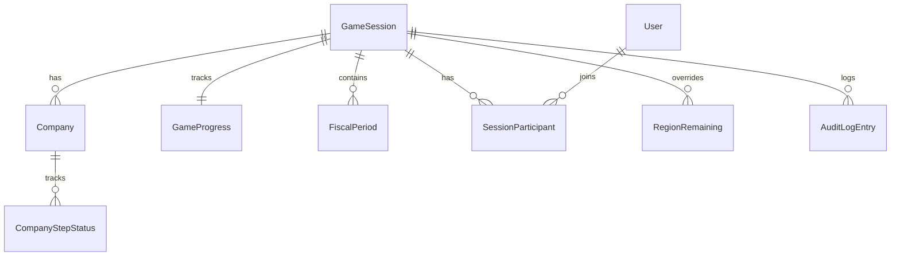

# 01. Core Domain Schema (V1)

> **Status**: **Approved** 2026-07-26 (V1 Canonical)  
> **Review**: [`09-architecture-review-report.md`](../../architecture/09-architecture-review-report.md)  
> **Principles**: `00-v1-development-principles.md`  
> **Machine-readable**: `schemas/common.json`, `schemas/core-domain.json`  
> **Next**: Approval → [02 Decision Schema](./02-decision-schema.md)

---

## 1. Purpose

Core Domain Schema defines **identity, session, game calendar, company, and cross-cutting enums** that all other JSON Spec documents reference.

| Principle | Application |
|-----------|-------------|
| P3 Rule Book SoT | `GameConstants`, `RegionMaster` mirror §1.5 |
| P5 Event Store | Entities are append-friendly; `AuditLogEntry`, `DomainEventEnvelope` |
| P8 V2 extensibility | `extensions`, `FeatureFlags` on `SessionSettings` |

**V1 implements** all entities in this document. **V2 fields** exist in schema but are gated by `featureFlags`.

---

## 2. Schema Files

| File | `$id` | Contents |
|------|-------|----------|
| `schemas/common.json` | `https://bsp.education/schemas/v1/common.json` | Primitives, enums, `FeatureFlags` |
| `schemas/core-domain.json` | `https://bsp.education/schemas/v1/core-domain.json` | Session, Company, Progress, Region, Audit |

### 2.1 Versioning

```json
{
  "schemaVersion": "1.0.0"
}
```

- Bundle **1.0.0** = V1 JSON Spec GA
- Breaking changes → increment major; additive → minor

### 2.2 Money & Units

| Type | JSON | Rule |
|------|------|------|
| `MoneyManwon` | integer | All amounts in **만원** (Rule Book §1.5) |
| `loanEarly` / `loanMid` | integer | Input **천만원** → stored as `×1000` 만원 in Decision payload (see Doc 02) |
| Rates | number | Percent (10 = 10%/year) |

---

## 3. Entity Catalog

### 3.1 Identity

#### `User`

| Field | Type | Required | Notes |
|-------|------|:--------:|-------|
| `id` | uuid | ✓ | |
| `email` | string | | INSTRUCTOR login |
| `platformRole` | `ADMIN` \| `INSTRUCTOR` \| `USER` | ✓ | Global identity (M-04) |
| `displayName` | string | ✓ | |
| `createdAt` | date-time | ✓ | |

#### `SessionParticipant`

Links user ↔ session ↔ company (CEO).

| Field | Type | Required |
|-------|------|:--------:|
| `sessionId` | uuid | ✓ |
| `userId` | uuid | ✓ |
| `companyId` | uuid \| null | ✓ |
| `role` | SessionParticipantRole | ✓ | `INSTRUCTOR` \| `CEO` \| `OBSERVER`(V2) |

---

### 3.2 Game Session

#### `GameSession`

| Field | Type | Required | Notes |
|-------|------|:--------:|-------|
| `organizationId` | uuid | ✓ | V1: default org `000…001` (M-01) |
| `courseId` | uuid \| null | | V2 cohort |
| `joinCode` | string | ✓ | 6–8 alphanum |
| `instructorId` | uuid | ✓ | GM owner |
| `scenarioId` | uuid | ✓ | Initial economy/event preset |
| `settings.featureFlags` | FeatureFlags | | **All false in V1 GA** |
| `schemaVersion` | 1.0.0 | ✓ | |

> **`sessionPhase` SSOT**: `GameProgress` only (M-02). `GameSession` has `startedAt` / `finishedAt` lifecycle timestamps only.

#### `SessionSettings.featureFlags` (V2+ only)

```json
{
  "replay": false,
  "whatIf": false,
  "advisor": false,
  "copilot": false,
  "analyticsV2": false,
  "debriefFull": false,
  "purchaseBidWorkflow": false
}
```

V1 server **MUST NOT** branch core logic on flags except optional UI routes.

---

### 3.3 Company & Calendar

#### `Company`

| Field | Type | Required | Notes |
|-------|------|:--------:|-------|
| `sessionId` | uuid | ✓ | |
| `teamName` | string | ✓ | Unique per session |
| `ceoUserId` | uuid | ✓ | |
| `statusVersion` | integer | ✓ | Optimistic concurrency |

#### `FiscalPeriod`

| periodIndex | year | half | label |
|-------------|------|------|-------|
| 1 | 1 | H1 | P1 |
| 2 | 1 | H2 | P2 |
| 3 | 2 | H1 | P3 |
| 4 | 2 | H2 | P4 |
| 5 | 3 | H1 | P5 |
| 6 | 3 | H2 | P6 |

| Field | Type | Required |
|-------|------|:--------:|
| `status` | `OPEN` \| `CLOSING` \| `CLOSED` | ✓ |

#### `GameProgress` (1:1 Session)

| Field | Type | Required | Notes |
|-------|------|:--------:|-------|
| `stepPhase` | StepPhase | ✓ | Includes HALF_YEAR_END, GAME_END |
| `step1SubPhase` | `1A` \| `1B` \| null | | D-01; LOAN only |
| `closingStatus` | ClosingStatus \| null | | Settlement pipeline |
| `currentGameStep` | GameStep | | Derived when STEP1..7 |

**StepPhase ↔ GameStep mapping**

| stepPhase | GameStep |
|-----------|----------|
| STEP1_FINANCE | LOAN |
| STEP2_INVESTMENT | FACILITY |
| STEP3_HR | HIRING |
| STEP4_PURCHASE | MATERIAL |
| STEP5_PRODUCTION | PRODUCTION |
| STEP6_SALES | SALES |
| STEP7_SETTLEMENT | SETTLEMENT |

#### `CompanyStepStatus`

GM Desk grid cell — per `(companyId, periodId, step)`.

| status | Meaning |
|--------|---------|
| `NOT_STARTED` | No draft |
| `IN_PROGRESS` | Draft / partial (Step1 1A) |
| `SUBMITTED` | Decision POSTED |
| `SKIPPED_ZERO` | GM D-10 zero |
| `COPIED_FROM_PREVIOUS` | GM D-10 copy last half |

---

### 3.4 Region Master Data

#### `RegionMaster` (catalog)

Seven regions from Rule Book §1.5 — seeded at deploy.

| code | displayName (ko) |
|------|------------------|
| EUROPE | 유럽 |
| ASIA | 아시아 |
| MIDDLE_EAST | 중동 |
| AFRICA | 아프리카 |
| OCEANIA | 오세아니아 |
| NORTH_AMERICA | 북미 |
| SOUTH_AMERICA | 남미 |

#### `RegionRemaining` (D-07)

GM-editable session override for `materialRemaining` / `saleRemaining`.

---

### 3.5 Scenario (reference)

#### `Scenario` + `ScenarioAction`

- Preset economy + scheduled events for session creation
- `ScenarioAction.actionType`: `ECONOMY_PRESET` | `SCHEDULE_EVENT` | `BROADCAST`
- Full event payload → Doc 04 Event Schema

---

### 3.6 Event Store & Audit

> **M-05**: Two layers — do not conflate.

| Layer | Entity | Purpose |
|-------|--------|---------|
| **Education Event Store** | `DomainEventRecord`, Decision, Journal, FiscalSnapshot | Replay, Analytics, ordering |
| **GM Audit** | `AuditLogEntry` | Compliance, GM action trace |

#### `DomainEventRecord` (durable)

Monotonic `(sessionId, sequence)` — see `common.json#/$defs/DomainEventRecord`.

#### `AuditLogEntry`

Append-only. Required for all GM mutations (Principle 5, Doc 11 NFR-S03).

#### `DomainEventEnvelope`

WebSocket view of `DomainEventRecord` — includes `sequence`, extended `eventType` list (M-03).

| eventType | When |
|-----------|------|
| `session.phaseChanged` | PREPARE/RUNNING/PAUSED/FINISHED |
| `step.changed` | GM advance |
| `decision.posted` | CEO POST success |
| `half.closed` | Settlement complete |
| `game.finished` | P6 close |
| `economy.patched` | GM economy |
| `event.fired` | GM event |

---

### 3.7 `GameConstants`

Server-read-only object exposing Rule Book §1.5 constants to clients **for display labels only** — not for client-side calculation (Principle 4).

---

## 4. Relationships (logical)



---

## 5. Persistence Notes (preview for DB Schema phase)

| Entity | Unique constraint |
|--------|-------------------|
| `GameSession.joinCode` | unique while active |
| `GameSession.organizationId` | FK → organization (V1 seed) |
| `Company` | `(sessionId, teamName)` |
| `FiscalPeriod` | `(sessionId, periodIndex)` |
| `GameProgress` | `sessionId` PK |
| `CompanyStepStatus` | `(companyId, periodId, step)` |
| `RegionRemaining` | `(sessionId, regionCode)` |

**Not in Core Domain** (later docs): `Decision`, `JournalEntry`, `FiscalSnapshot`, `EconomicState`, `SimulationEvent`.

---

## 6. V1 vs V2 Schema Fields

| Field / Entity | V1 persist | V2+ |
|----------------|:----------:|-----|
| `SessionSettings.featureFlags` | ✓ (all false) | toggle |
| `extensions` | ✓ empty | optional data |
| `AdvisorInteraction` | — | Doc 07 API |
| `ReplaySession` | — | Doc 07 API |

Event Store records for Decisions/Journals **V1 required** even when Replay UI off.

---

## 7. Review Checklist

- [ ] Enums align with `05-game-state-machine-spec.md`
- [ ] Period calendar P1–P6 correct
- [ ] D-01 `step1SubPhase`, D-07 `RegionRemaining`, D-10 step status kinds
- [ ] `FeatureFlags` defaults false — Principle 2
- [ ] Money types integer 만원 throughout
- [ ] `extensions` present on all extensible entities

---

## 8. Architecture Review

See [`docs/architecture/09-architecture-review-report.md`](../../architecture/09-architecture-review-report.md).

| Result | Count |
|--------|------:|
| Critical | **0** |
| Major (M-01~M-06) | 6 — **M-01~M-05 patched in schema** |
| Minor | 8 — Doc 01b / Phase 1b |

---

## 9. Approval

- [x] Architecture Review accepted
- [x] Core Domain Schema approved — **2026-07-26**
- [x] Proceed to **02 Decision Schema**
