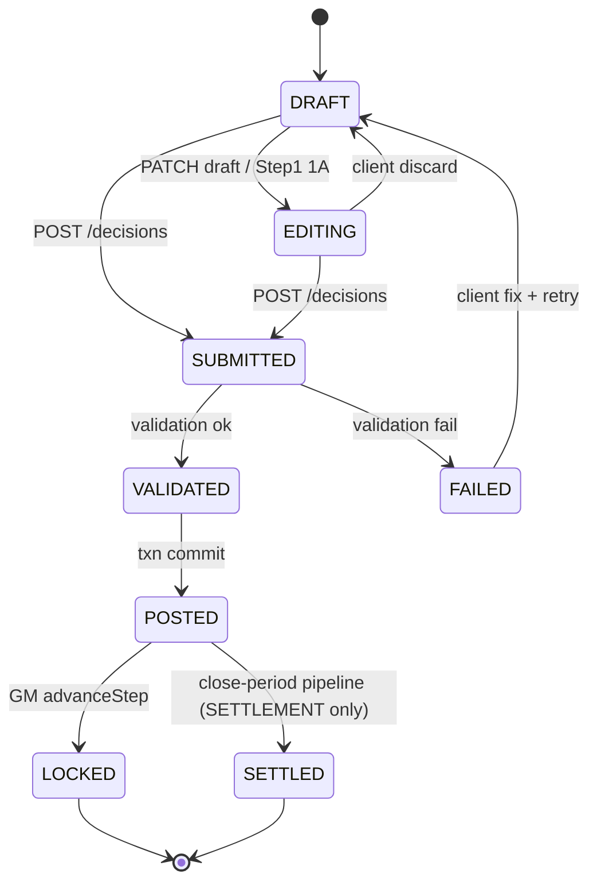
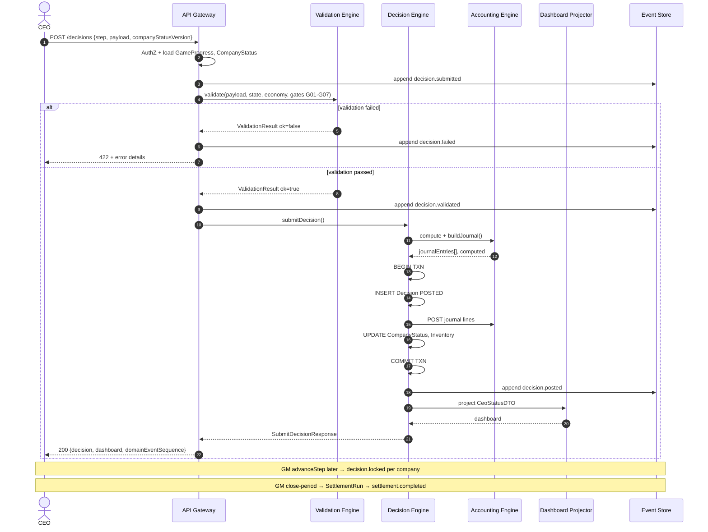

# 02. Decision Schema (V1)

> **Status**: Review  
> **Principles**: `00-v1-development-principles.md`  
> **Truth**: `01-game-rule-book.md` v1.1 · `04-decision-engine-spec.md`  
> **Machine-readable**: `schemas/decision.json`  
> **Depends on**: [01 Core Domain Schema](./01-core-domain-schema.md) ✅  
> **Next**: [03 Economy Schema](./03-economy-schema.md) (after approval)

---

## 0. Scope

| In V1 | Out V1 |
|-------|--------|
| Step 1~6 CEO POST | Step 7 CEO POST (none) |
| Step 7 `SettlementRun` (system) | Advisor payload |
| GM zero / copy-last-half (D-10) | V2 bid workflow (M06) |

**API base**: `POST /api/v1/play/companies/{companyId}/decisions`  
**Settlement**: `POST /api/v1/gm/sessions/{sessionId}/progress/close-period` → triggers `SettlementRun` per company

---

## 1. Decision Object

### 1.1 Root Entity

```json
{
  "id": "550e8400-e29b-41d4-a716-446655440000",
  "companyId": "...",
  "periodId": "...",
  "sessionId": "...",
  "step": "LOAN",
  "status": "POSTED",
  "source": "CEO",
  "payload": { },
  "validation": { "ok": true, "rules": [] },
  "computed": { },
  "journalEntryIds": ["..."],
  "idempotencyKey": "co1-p1-LOAN",
  "companyStatusVersion": 12,
  "submittedAt": "2026-07-26T11:00:00Z",
  "submittedBy": "user-uuid",
  "postedAt": "2026-07-26T11:00:00.1Z",
  "lockedAt": null,
  "settledAt": null,
  "schemaVersion": "1.0.0"
}
```

| Field | Owner | Notes |
|-------|-------|-------|
| `payload` | CEO (1~6) / system (7) | Immutable after POSTED |
| `computed` | Server only | From Accounting + Economy |
| `journalEntryIds` | Accounting Engine | Append-only link |
| `companyStatusVersion` | Optimistic lock | Must match `Company.statusVersion` on POST |

**Unique constraint**: `(companyId, periodId, step)` WHERE `status IN ('POSTED','LOCKED','SETTLED')`.

---

### 1.2 Step 1 — LOAN (자금 조달)

**GameStep**: `LOAN` · **Excel**: D25~D27, D126 · **D-01** 2-phase UI

#### Payload (`LoanPayload`)

```json
{
  "loanEarly": 2,
  "loanMid": 0,
  "deposit": 1,
  "loanRepayment": 0,
  "step1UiPhase": "COMPLETE"
}
```

| Field | Type | Unit | Required | Description |
|-------|------|------|:--------:|-------------|
| `loanEarly` | integer | 천만원 | ✓ | 연초 차입 |
| `loanMid` | integer | 천만원 | ✓ | 연중 차입 |
| `deposit` | integer | 천만원 | ✓ | 예금 가입 |
| `loanRepayment` | integer | 만원 | ✓ | 상환 (0 allowed) |
| `step1UiPhase` | enum | — | | `1A` \| `1B` \| `COMPLETE` — client hint only |

#### Computed (`LoanComputed`)

```json
{
  "loanEarlyAmtManwon": 2000,
  "loanMidAmtManwon": 0,
  "depositAmtManwon": 1000,
  "loanRepaymentAmtManwon": 0,
  "cashDeltaManwon": 1000,
  "cashAfterManwon": 11000,
  "debtAfterManwon": 2000,
  "depositAfterManwon": 1000
}
```

#### Journal template (Accounting Engine)

| # | Dr | Cr | Amount |
|---|----|----|--------|
| 1 | Cash | Long-term Debt | loanEarly+loanMid |
| 2 | Deposits | Cash | deposit |
| 3 | Long-term Debt | Cash | loanRepayment |

---

### 1.3 Step 2 — FACILITY (설비 투자)

#### Payload (`FacilityPayload`)

```json
{
  "landPlotsPurchased": 1,
  "machineBigPurchased": 1,
  "machineSmallPurchased": 0
}
```

| Field | Type | Required | Description |
|-------|------|:--------:|-------------|
| `landPlotsPurchased` | int ≥0 | ✓ | **이번 반기** 신규 필지 |
| `machineBigPurchased` | int ≥0 | ✓ | Big 기계 대수 |
| `machineSmallPurchased` | int ≥0 | ✓ | Small 기계 대수 |

#### Computed

```json
{
  "landCostManwon": 3000,
  "machineCostManwon": 600,
  "totalCapexManwon": 3600,
  "capacityMachine": 30,
  "maxMaterials": 120,
  "cashAfterManwon": 6400
}
```

---

### 1.4 Step 3 — HIRING (인력 채용)

#### Payload (`HiringPayload`) — Year 1

```json
{
  "headPurchase": 2,
  "headProduction": 3,
  "headSales": 2,
  "transfers": [],
  "resignations": { "purchase": 0, "production": 0, "sales": 0 }
}
```

#### Payload — Year ≥ 2 (D-02)

```json
{
  "headPurchase": 2,
  "headProduction": 3,
  "headSales": 2,
  "transfers": [
    { "from": "PURCHASE", "to": "PRODUCTION", "headcount": 30 }
  ],
  "resignations": { "purchase": 0, "production": 0, "sales": 1 }
}
```

| Field | Required Y1 | Required Y2+ |
|-------|:-----------:|:------------:|
| `headPurchase/Production/Sales` | ✓ | ✓ |
| `transfers` | must be `[]` | optional |
| `resignations` | optional (default 0) | optional |

**No payroll journal at Step 3** (D-12) — `payrollForecastHalfManwon` in computed only.

---

### 1.5 Step 4 — MATERIAL (원재료 구매)

#### Payload (`PurchasePayload`) — V1 instant (D-08)

```json
{
  "branchesNew": [
    { "regionCode": "ASIA", "displayName": "Asia Hub" }
  ],
  "lines": [
    {
      "regionCode": "ASIA",
      "materials": { "A": 100, "B": 80, "C": 50, "D": 50 }
    }
  ]
}
```

| Field | Required | Notes |
|-------|:--------:|-------|
| `branchesNew[]` | | M05 branch setup fee |
| `lines[].regionCode` | ✓ (if lines non-empty) | |
| `lines[].materials.A~D` | ✓ | integer ≥0 |

**Pricing**: server `effectiveUnitPriceManwon` — Economy Engine (Doc 03); **not in payload V1**.

---

### 1.6 Step 5 — PRODUCTION (생산)

#### Payload (`ProductionPayload`)

```json
{
  "productionQty": 18,
  "machineBigRun": 0,
  "machineSmallRun": 2
}
```

---

### 1.7 Step 6 — SALES (판매)

#### Payload (`SalesPayload`)

```json
{
  "branchesNew": [],
  "lines": [
    { "regionCode": "ASIA", "unitPriceManwon": 150, "qty": 8 },
    { "regionCode": "EUROPE", "unitPriceManwon": 195, "qty": 5 }
  ]
}
```

---

### 1.8 Step 7 — SETTLEMENT (결산)

**CEO payload: none.** CEO screen = read-only P/L·B/S + one-liner AI.

System entity **`SettlementRun`** (per company, triggered by GM `close-period`):

```json
{
  "companyId": "...",
  "periodId": "...",
  "triggeredBy": "instructor-uuid",
  "pipelineVersion": "1.0.0",
  "gmMiscIncomeManwon": 0
}
```

Produces `Decision` row: `step=SETTLEMENT`, `source=SYSTEM_SETTLEMENT`, `status=SETTLED`, `payload=null`.

Pipeline steps: payroll accrual → depreciation → interest → tax → snapshot (D-12, D-11).

---

## 2. Validation Rules

> **Engine**: Validation Engine only (Principle 6).  
> **Format**: Required · Min · Max · Dependency · Rule Book ID · Error Code

### 2.1 Cross-cutting Gate Rules (all steps)

| Field / Check | Required | Min | Max | Dependency | Rule ID | Error Code |
|---------------|:--------:|-----|-----|------------|---------|------------|
| `sessionPhase` | ✓ | — | — | `RUNNING` | G01 | `ERR_SESSION_NOT_RUNNING` |
| `stepPhase` match | ✓ | — | — | payload.step = current | G02 | `ERR_STEP_GATE` |
| `sessionPhase` | ✓ | — | — | ≠ `PAUSED` | G03 | `ERR_SESSION_PAUSED` |
| `companyId` | ✓ | — | — | token scope | G04 | `ERR_FORBIDDEN_COMPANY` |
| duplicate POST | ✓ | — | — | no POSTED same step | G05 | `ERR_DECISION_DUPLICATE` |
| `companyStatusVersion` | ✓ | — | — | match Company row | G06 | `ERR_STALE_VERSION` |
| SETTLEMENT CEO POST | ✓ | — | — | **forbidden** | G07 | `ERR_SETTLEMENT_NO_INPUT` |

---

### 2.2 Step 1 — LOAN

| Field | Required | Min | Max | Dependency | Rule ID | Error Code |
|-------|:--------:|-----|-----|------------|---------|------------|
| `loanEarly` | ✓ | 0 | — | integer | L04 | `ERR_LOAN_NEGATIVE` |
| `loanEarly` | ✓ | — | — | ×1000 ≤ equityBefore | L01 | `ERR_LOAN_EQUITY_LIMIT` |
| `loanEarly` | ✓ | — | — | integer (천만원 unit) | L05 | `ERR_LOAN_UNIT` |
| `loanMid` | ✓ | 0 | 10 | ×1000≤10000만 | L02 | `ERR_LOAN_MID_LIMIT` |
| `loanMid` | ✓ | 0 | — | integer | L04 | `ERR_LOAN_NEGATIVE` |
| `deposit` | ✓ | 0 | — | integer | L04 | `ERR_LOAN_NEGATIVE` |
| `loanRepayment` | ✓ | 0 | — | ≤ debtBefore+newLoans | L06 | `ERR_LOAN_REPAYMENT` |
| (computed) cashAfter | ✓ | 0 | — | — | L03 | `ERR_CASH_NEGATIVE` |

---

### 2.3 Step 2 — FACILITY

| Field | Required | Min | Max | Dependency | Rule ID | Error Code |
|-------|:--------:|-----|-----|------------|---------|------------|
| `landPlotsPurchased` | ✓ | 0 | 4 | cumulative ≤4 | F01 | `ERR_LAND_MAX` |
| `machineBigPurchased` | ✓ | 0 | — | ≤ landTotal×2 | F02 | `ERR_MACHINE_BIG_LIMIT` |
| `machineSmallPurchased` | ✓ | 0 | — | ≤ landTotal×4 | F03 | `ERR_MACHINE_SMALL_LIMIT` |
| machine mix | ✓ | — | — | per-plot F02/F03 | F04 | `ERR_MACHINE_PLOT_RULE` |
| (computed) totalCapex | ✓ | — | — | ≤ cashBefore | F05 | `ERR_CAPEX_CASH` |
| `landPlotsPurchased` | ✓ | 0 | — | ≥0 delta cumulative | F06 | `ERR_LAND_DELTA` |

---

### 2.4 Step 3 — HIRING

| Field | Required | Min | Max | Dependency | Rule ID | Error Code |
|-------|:--------:|-----|-----|------------|---------|------------|
| `headPurchase` | ✓ | 0 | — | integer | H01 | `ERR_HEAD_NEGATIVE` |
| `headProduction` | ✓ | 0 | — | integer | H01 | `ERR_HEAD_NEGATIVE` |
| `headSales` | ✓ | 0 | — | integer | H01 | `ERR_HEAD_NEGATIVE` |
| `transfers[]` | | — | — | valid 30-unit cross-dept | H02 | `ERR_TRANSFER_INVALID` |
| `resignations.*` | | 0 | currentHead | ≤ existing | H03 | `ERR_RESIGN_EXCEEDS` |
| `transfers/resignations` | Y1: empty | — | — | period.year ≥ 2 | H04 | `ERR_RESTRUCTURE_YEAR` |

---

### 2.5 Step 4 — MATERIAL

| Field | Required | Min | Max | Dependency | Rule ID | Error Code |
|-------|:--------:|-----|-----|------------|---------|------------|
| `lines[].materials.*` | per line | 0 | — | integer | M02a | `ERR_MAT_QTY_NEGATIVE` |
| `lines[].materials sum` | | 0 | regionLimit | RegionRemaining | M02 | `ERR_MAT_REGION_LIMIT` |
| Σ all units | | 0 | headPurchase×30 | | M03 | `ERR_MAT_CAPACITY` |
| (computed) totalCost | | — | — | ≤ cashBefore | M04 | `ERR_MAT_CASH` |
| `branchesNew[]` | | — | — | fee + not duplicate | M05 | `ERR_BRANCH_INVALID` |
| effectiveUnitPrice | server | region.min | — | Economy | M01 | `ERR_MAT_PRICE_FLOOR` |

---

### 2.6 Step 5 — PRODUCTION

| Field | Required | Min | Max | Dependency | Rule ID | Error Code |
|-------|:--------:|-----|-----|------------|---------|------------|
| `productionQty` | ✓ | 0 | maxProduction | P01 | `ERR_PROD_MAX` |
| `productionQty` | ✓ | 0 | — | integer | P04 | `ERR_PROD_NEGATIVE` |
| `machineBigRun` | ✓ | 0 | ownedBig | P02 | `ERR_MACHINE_RUN_BIG` |
| `machineSmallRun` | ✓ | 0 | ownedSmall | P03 | `ERR_MACHINE_RUN_SMALL` |

`maxProduction = min(material/4, machineCap, headProduction×10)`.

---

### 2.7 Step 6 — SALES

| Field | Required | Min | Max | Dependency | Rule ID | Error Code |
|-------|:--------:|-----|-----|------------|---------|------------|
| `lines[].unitPriceManwon` | ✓ | 0 | region.maxSalePrice | S01 | `ERR_SALE_PRICE` |
| `lines[].qty` | ✓ | 0 | region.saleLimit | S02 | `ERR_SALE_REGION_QTY` |
| Σ qty | | 0 | headSales×10 | S03 | `ERR_SALE_CAPACITY` |
| Σ qty | | 0 | finishedGoods | S04 | `ERR_SALE_INVENTORY` |
| (computed) cashAfter | | 0 | — | S05 | `ERR_SALE_CASH` |

---

### 2.8 Step 7 — SETTLEMENT

| Check | Rule ID | Error Code |
|-------|---------|------------|
| CEO POST forbidden | G07 | `ERR_SETTLEMENT_NO_INPUT` |
| All steps 1~6 POSTED or GM-skipped | ST01 | `ERR_SETTLEMENT_INCOMPLETE` |
| Period status OPEN → CLOSING | ST02 | `ERR_PERIOD_NOT_CLOSABLE` |

---

## 3. State Transition

### 3.1 Canonical States

| Status | Description | Persisted |
|--------|-------------|:---------:|
| `DRAFT` | Client localStorage only | optional PATCH |
| `EDITING` | Server draft / Step1 phase 1A saved | ✓ optional |
| `SUBMITTED` | POST received, validation pending | transient |
| `VALIDATED` | All rules passed | transient |
| `POSTED` | Decision + Journal committed | ✓ |
| `LOCKED` | GM advanced step | ✓ |
| `SETTLED` | Settlement pipeline done (Step 7) | ✓ |
| `FAILED` | Validation failed (not persisted as POSTED) | audit only |

### 3.2 Allowed Transitions



| From | To | Actor | Trigger |
|------|-----|-------|---------|
| `DRAFT` | `EDITING` | CEO | `PATCH .../decisions/draft` (optional V1) |
| `*` | `SUBMITTED` | CEO | `POST .../decisions` |
| `SUBMITTED` | `VALIDATED` | System | ValidationEngine |
| `VALIDATED` | `POSTED` | System | DecisionOrchestrator txn |
| `SUBMITTED` | `FAILED` | System | 422 response |
| `POSTED` | `LOCKED` | GM | `advanceStep` |
| `POSTED` | `SETTLED` | System | `SettlementRun` success |
| — | `POSTED` | GM/System | D-10 zero / copy-last-half |

### 3.3 Forbidden Transitions

| From | To | Reason | HTTP |
|------|-----|--------|------|
| `POSTED` | `DRAFT` | Immutable | — |
| `POSTED` | `POSTED` | Idempotency | 409 |
| `LOCKED` | `EDITING` | Step closed | 403 |
| `SETTLED` | any edit | Period closed | 403 |
| any | `POSTED` | Wrong step / PAUSED | 403 / 423 |
| CEO | `SETTLEMENT` POST | No input | 403 G07 |
| `FAILED` | `POSTED` | Must re-POST | — |

---

## 4. Server Processing Flow

```
HTTP POST /play/companies/{companyId}/decisions
  │
  ├─1 AuthN/Z ─────────────────── JWT CEO + company scope (G04)
  │
  ├─2 Load context ────────────── GameProgress, CompanyStatus, EconomyState
  │
  ├─3 Gate check ──────────────── G01~G07 (403/423/409)
  │
  ├─4 Validation Engine ───────── L/F/H/M/P/S + G rules → VALIDATED | FAILED
  │     └─ on FAILED → 422 + DecisionRejected event (no txn)
  │
  ├─5 BEGIN TRANSACTION
  │     ├─5a Decision INSERT status=POSTED
  │     ├─5b AccountingEngine.buildJournal(step, computed)
  │     ├─5c Journal INSERT (append-only)
  │     ├─5d InventoryTxn + CompanyStatus UPDATE (version++)
  │     ├─5e CompanyStepStatus → SUBMITTED
  │     └─5f domain_event INSERT sequence++
  │
  ├─6 COMMIT
  │
  ├─7 Dashboard projection ──── CeoStatusDTO rebuild (read model)
  │
  ├─8 Event bus / WS ─────────── DomainEventEnvelope
  │
  └─9 Response 200 ──────────── SubmitDecisionResponse
```

**Ordering invariant**: Validation **before** txn; Journal **inside** txn; Domain event **after** commit (outbox pattern acceptable).

**Preview endpoint** (optional V1): `POST .../decisions/preview` → validation + computed, **no save**.

---

## 5. Event Emission

| Event name | domain_event.eventType | When | Payload keys |
|------------|------------------------|------|--------------|
| **DecisionSubmitted** | `decision.submitted` | POST accepted, before validation | decisionId, step, companyId |
| **DecisionValidated** | `decision.validated` | All rules pass | decisionId, ruleIds[] |
| **DecisionRejected** | `decision.failed` | Any rule fails | decisionId, failedRules[] |
| **DecisionPosted** | `decision.posted` | Txn commit success | decisionId, journalEntryIds[], computed |
| **DecisionLocked** | `decision.locked` | GM advanceStep | decisionId, step, periodId |
| **DecisionSettled** | `settlement.completed` | SettlementRun done | companyId, periodId, fiscalSnapshotId |

### 5.1 Emission Rules

- `DecisionSubmitted`: always on POST entry (audit latency)
- `DecisionValidated` + `DecisionRejected`: **mutually exclusive**
- `DecisionPosted`: only if status reaches POSTED (not on preview)
- `DecisionLocked`: batch emit for all companies on `advanceStep`
- `DecisionSettled`: one per company per period close

---

## 6. Error Handling

### 6.1 HTTP Status Map

| HTTP | When | error.code prefix |
|------|------|-------------------|
| **422** | Validation failed | `ERR_*` from §2 |
| **403** | Wrong role, company, step gate | `ERR_FORBIDDEN_*`, `ERR_STEP_GATE` |
| **409** | Duplicate POST, stale version | `ERR_DECISION_DUPLICATE`, `ERR_STALE_VERSION` |
| **423** | Session PAUSED | `ERR_SESSION_PAUSED` |
| **500** | Unhandled / txn rollback | `ERR_INTERNAL` |

### 6.2 Response Bodies

**422 Unprocessable Entity**

```json
{
  "error": {
    "code": "ERR_LOAN_EQUITY_LIMIT",
    "message": "자기자본 이하만 차입(연초) 가능합니다",
    "ruleId": "L01",
    "field": "loanEarly",
    "details": [
      { "ruleId": "L01", "errorCode": "ERR_LOAN_EQUITY_LIMIT", "field": "loanEarly", "params": { "equityBeforeManwon": 10000, "requestedManwon": 12000 } }
    ]
  },
  "traceId": "01J...",
  "validation": {
    "ok": false,
    "rules": [
      { "ruleId": "L01", "errorCode": "ERR_LOAN_EQUITY_LIMIT", "passed": false, "field": "loanEarly", "message": "..." }
    ]
  }
}
```

**403 Forbidden**

```json
{
  "error": {
    "code": "ERR_STEP_GATE",
    "message": "현재 Step에서는 제출할 수 없습니다",
    "ruleId": "G02",
    "field": "step",
    "details": [{ "expected": "LOAN", "actual": "FACILITY" }]
  },
  "traceId": "01J..."
}
```

**409 Conflict**

```json
{
  "error": {
    "code": "ERR_DECISION_DUPLICATE",
    "message": "이미 제출된 Decision입니다",
    "ruleId": "G05",
    "details": [{ "existingDecisionId": "uuid", "status": "POSTED" }]
  },
  "traceId": "01J..."
}
```

**423 Locked (Session Paused)**

```json
{
  "error": {
    "code": "ERR_SESSION_PAUSED",
    "message": "세션이 일시정지 상태입니다",
    "ruleId": "G03"
  },
  "traceId": "01J..."
}
```

**500 Internal Server Error**

```json
{
  "error": {
    "code": "ERR_INTERNAL",
    "message": "처리 중 오류가 발생했습니다. GM에게 문의하세요."
  },
  "traceId": "01J..."
}
```

---

## 7. Acceptance Mapping

### 7.1 Doc 11 QA ↔ Rule ID

| QA ID | Rule / Gate | Error Code |
|-------|-------------|------------|
| QA-S1-06 | L01 | ERR_LOAN_EQUITY_LIMIT |
| QA-S1-07 | L02 | ERR_LOAN_MID_LIMIT |
| QA-S1-08 | L03 | ERR_CASH_NEGATIVE |
| QA-S1-09 | L06 | ERR_LOAN_REPAYMENT |
| QA-S1-10 | G05 | ERR_DECISION_DUPLICATE |
| QA-S1-11 | G02 | ERR_STEP_GATE |
| QA-S1-12 | G03 | ERR_SESSION_PAUSED |
| QA-S2-06 | F01 | ERR_LAND_MAX |
| QA-S2-07 | F02 | ERR_MACHINE_BIG_LIMIT |
| QA-S2-08 | F03 | ERR_MACHINE_SMALL_LIMIT |
| QA-S2-09 | F05 | ERR_CAPEX_CASH |
| QA-S2-11 | F06 | ERR_LAND_DELTA |
| QA-S3-06 | H04 | ERR_RESTRUCTURE_YEAR |
| QA-S3-07 | H03 | ERR_RESIGN_EXCEEDS |
| QA-S3-08 | H01 | ERR_HEAD_NEGATIVE |
| QA-S4-06 | M02 | ERR_MAT_REGION_LIMIT |
| QA-S4-07 | M03 | ERR_MAT_CAPACITY |
| QA-S4-08 | M04 | ERR_MAT_CASH |
| QA-S5-06 | P01 | ERR_PROD_MAX |
| QA-S5-07 | P02 | ERR_MACHINE_RUN_BIG |
| QA-S5-08 | P03 | ERR_MACHINE_RUN_SMALL |
| QA-S5-09 | P04 | ERR_PROD_NEGATIVE |
| QA-S6-06 | S01 | ERR_SALE_PRICE |
| QA-S6-07 | S04 | ERR_SALE_INVENTORY |
| QA-S6-08 | S03 | ERR_SALE_CAPACITY |
| QA-S6-09 | S02 | ERR_SALE_REGION_QTY |
| QA-S7-08 | G07 | ERR_SETTLEMENT_NO_INPUT |
| QA-S7-07 | ST01 + D-10 | ERR_SETTLEMENT_INCOMPLETE |

### 7.2 Doc 11 Screen AC ↔ Step

| AC Section | Step | API |
|------------|------|-----|
| §1.2 S1-* | LOAN | POST decisions |
| §1.3 S2-* | FACILITY | POST |
| §1.4 S3-* | HIRING | POST |
| §1.5 P4-* | MATERIAL | POST |
| §1.6 P5-* | PRODUCTION | POST |
| §1.7 P6-* | SALES | POST |
| §1.8 S7-* | SETTLEMENT | GET only + GM close |

---

## 8. Sequence Diagram



---

## 9. Implementation Notes

### 9.1 Idempotency

```
idempotencyKey = "{companyId}:{periodId}:{step}"  // server-enforced
```

Client header `Idempotency-Key` optional; server key is authoritative.

### 9.2 GM D-10 System Decisions

| Action | source | payload |
|--------|--------|---------|
| zero | `GM_ZERO` | step-specific zero defaults |
| copy-last-half | `GM_COPY_LAST_HALF` | clone prior period POSTED payload |

Same pipeline §4; `submittedBy` = GM user id.

### 9.3 DB Tables (preview)

| Table | Key |
|-------|-----|
| `decision` | id PK; UNIQUE(company_id, period_id, step) WHERE posted |
| `decision_validation` | decision_id (1:1, JSONB rules) |
| `settlement_run` | id; company_id + period_id UNIQUE |

Full DDL in Phase 1b after JSON Spec complete.

---

## 10. Approval

- [x] §1 Decision payloads (Step 1~7)
- [x] §2 Validation rules + error codes
- [x] §3 State transitions
- [x] §4~§6 Processing, events, errors
- [x] §7 Acceptance mapping
- [x] §8 Sequence diagram

**Approved**: 2026-07-26 → [03 Economy Schema](./03-economy-schema.md)
