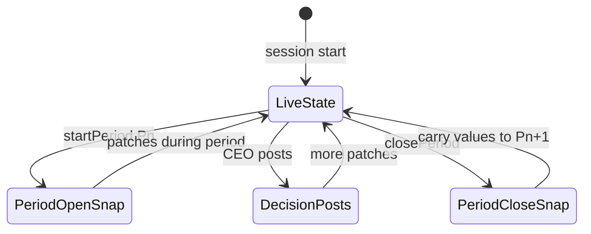
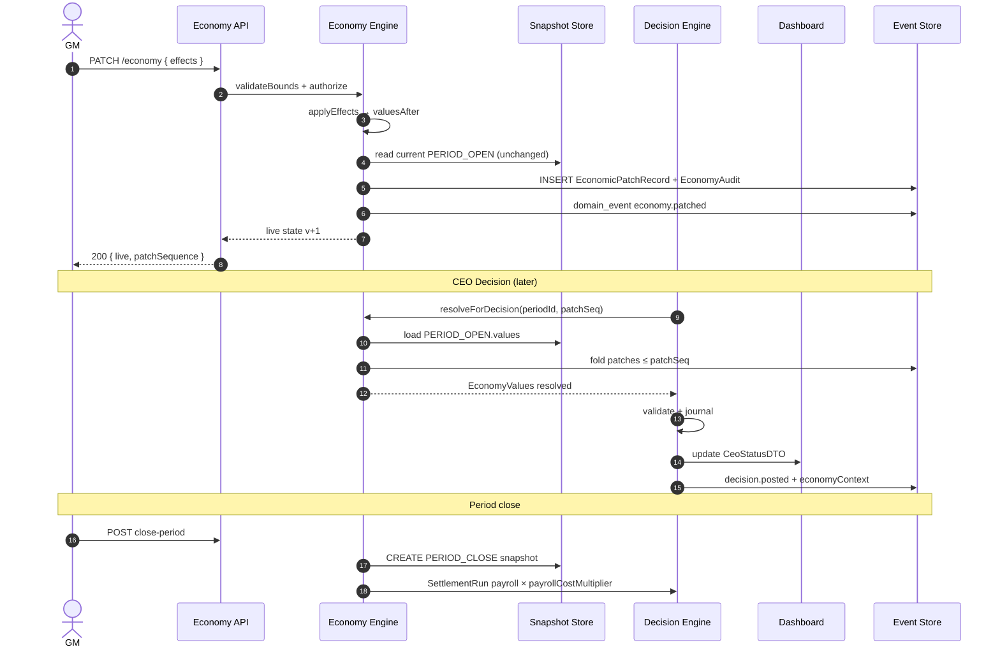

# 03. Economy Schema (V1)

> **Status**: Review  
> **Implementation First Rule**: §0 below — Backend / Frontend / QA 즉시 사용 가능  
> **Truth**: `03-economy-engine-spec.md` · `01-game-rule-book.md` §1.5  
> **Machine-readable**: `schemas/economy.json`  
> **Depends on**: [01 Core Domain](./01-core-domain-schema.md) ✅ · [02 Decision](./02-decision-schema.md) ✅  
> **Next**: [04 Event Schema](./04-event-schema.md) (after approval)

---

## 0. Implementation First Rule (본 문서 적용)

| # | Check | 본 문서 § |
|---|-------|-----------|
| 1 | Backend 추가 질문 없음 | §1~§6 API path/body, §3 flow, formulas |
| 2 | Frontend 화면↔API | §6 API + §1.14 UI Map |
| 3 | QA 테스트 즉시 | §7 Trace + §8 QA cases |
| 4 | Rule Book 1:1 | §1.13 Rule Book column |
| 5 | Acceptance trace | §7 Doc 11 mapping |

---

## 1. Economy Variables

### 1.1 Variable Catalog (canonical keys)

| Key | 한글 | Default | Min | Max | Unit | Patch 권한 | 적용 시점 (G-02) | Event 연계 |
|-----|------|---------|-----|-----|------|------------|------------------|:----------:|
| `exchangeRate` | 환율 | 1300 | 800 | 2000 | KRW/USD | GM, Event | NEXT_DECISION_POST | ● |
| `interestRateLoan` | 차입금리 | 10 | 0 | 30 | %/년 | GM, Event | NEXT_DECISION_POST | ● |
| `interestRateDeposit` | 예금금리 | 5 | 0 | 20 | %/년 | GM, Event | NEXT_DECISION_POST | ● |
| `rawMaterialIndex` | 원자재 가격 | 100 | 50 | 200 | index (100=base) | GM, Event | NEXT_DECISION_POST | ● |
| `marketDemandIndex` | 시장 수요 | 100 | 50 | 150 | index | GM, Event | NEXT_DECISION_POST | ● |
| `marketSupplyIndex` | 시장 공급 | 100 | 50 | 150 | index | GM, Event | NEXT_DECISION_POST | ● |
| `logisticsCostMultiplier` | 물류비 | 1.0 | 0.5 | 3.0 | × | GM, Event | NEXT_DECISION_POST | ● |
| `tariffRate` | 관세 | 0 | 0 | 100 | % | GM, Event | NEXT_DECISION_POST | ● |
| `corporateTaxRate` | 법인세 | 22 | 0 | 40 | % | GM | NEXT_DECISION_POST | ○ |
| `carbonTaxRatePerUnit` | 탄소세 | 0 | 0 | 50 | 만원/단位 | GM, Event | NEXT_DECISION_POST | ● |
| `payrollCostMultiplier` | 인건비 배수 | 1.0 | 0.8 | 1.5 | × | GM, Event | **SETTLEMENT** | ● |
| `techInnovationIndex` | 기술혁신 | 100 | 80 | 130 | index | GM, Event | NEXT_DECISION_POST | ● |
| `esgPressureIndex` | ESG | 100 | 70 | 110 | index | GM, Event | NEXT_DECISION_POST | ● |
| `businessCycleIndex` | 경기지수 | 100 | 70 | 130 | index | GM, Event | NEXT_DECISION_POST | ● |

**Patch 권한**: `GM` = Instructor+Admin · `Event` = Event Engine NORMAL fire (D-15) · CEO **변경 불가**.

**Bounds violation** → `422 ERR_ECONOMY_OUT_OF_BOUNDS`.

---

### 1.2 Variable Detail — Formulas & Steps

#### `exchangeRate` (환율)

| Item | Value |
|------|-------|
| **Rule Book** | G25 import regions · 엑셀 C열 수입 단가 |
| **Steps** | MATERIAL ● · SALES ○ (export) · SETTLEMENT ● |
| **Formula** | `importPrice = regionBase × (rawMaterialIndex/100) × (exchangeRate/1300) × (1+tariffRate/100)` when `region.importWeighted=true` |
| **Base FX** | `1300` (Rule Book default) |

```typescript
// MATERIAL line
effectiveUnitPriceManwon = Math.round(
  region.materialUnitPriceManwon
  * (ctx.rawMaterialIndex / 100)
  * (region.importWeighted ? ctx.exchangeRate / 1300 : 1)
  * (1 + ctx.tariffRate / 100)
);
```

---

#### `interestRateLoan` / `interestRateDeposit` (금리)

| Item | Value |
|------|-------|
| **Rule Book** | G25 차입 10% · G27 예금 5% |
| **Steps** | LOAN ○ (hint) · SETTLEMENT ● |
| **Formula** | `interestExpense = avgDebtBalanceManwon × (interestRateLoan/100) × 0.5` |
| | `interestIncome = depositBalanceManwon × (interestRateDeposit/100) × 0.5` |
| **0.5** | 반기 = 6개월 (Rule Book §1.4) |

---

#### `rawMaterialIndex` (원자재 가격)

| Item | Value |
|------|-------|
| **Rule Book** | 재료구입 C열 · §1.5 |
| **Steps** | MATERIAL ● · PRODUCTION ● (COGS layer) · SETTLEMENT ● |
| **Formula** | See `exchangeRate` chain; domestic: `× (rawMaterialIndex/100)` only |

---

#### `marketDemandIndex` (시장 수요)

| Item | Value |
|------|-------|
| **Rule Book** | 판매 G열 가능량 |
| **Steps** | SALES ● · SETTLEMENT ● (점유율) |
| **Formula** | `regionSaleLimit = floor(region.saleLimit × (marketDemandIndex/100) × regionState.demandMultiplier × (esgPressureIndex/100))` |

---

#### `marketSupplyIndex` (시장 공급)

| Item | Value |
|------|-------|
| **Steps** | MATERIAL ● · SALES ○ |
| **Formula** | `regionMaterialLimit = floor(region.materialLimit × (marketSupplyIndex/100) × regionRemaining)` |

---

#### `logisticsCostMultiplier` (물류비)

| Item | Value |
|------|-------|
| **Rule Book** | 재료 5만/단위 · 판매 10만/단위 §1.5 |
| **Steps** | MATERIAL ● · SALES ● |
| **Formula** | `matLogistics = totalMatUnits × 5 × logisticsCostMultiplier` |
| | `salesLogistics = soldQty × 10 × logisticsCostMultiplier` |

---

#### `tariffRate` (관세)

| Item | Value |
|------|-------|
| **Steps** | MATERIAL ● (import) · SETTLEMENT ○ |
| **Formula** | Applied in `effectiveUnitPrice` (see exchangeRate) |
| **Event** | EVT-043 등 TRADE category primary |

---

#### `corporateTaxRate` (법인세)

| Item | Value |
|------|-------|
| **Rule Book** | Sheet1 · default 22% |
| **Steps** | SETTLEMENT ● only |
| **Formula** | `taxManwon = max(0, pretaxIncomeManwon) × (corporateTaxRate/100)` |

---

#### `carbonTaxRatePerUnit` (탄소세)

| Item | Value |
|------|-------|
| **Steps** | PRODUCTION ● · SETTLEMENT ● |
| **Formula** | `carbonTaxManwon = productionQty × carbonTaxRatePerUnit` |
| **Event** | EVT-027~030 ESG/TAX |

---

#### `payrollCostMultiplier` (인건비)

| Item | Value |
|------|-------|
| **Rule Book** | D-12 Settlement 일괄 accrual · EVT-052 ×1.15 |
| **Steps** | Step3 forecast ○ · **SETTLEMENT ●** |
| **Formula** | `payrollManwon = basePayrollManwon × payrollCostMultiplier` |
| **basePayroll** | Server constant from headcount × dept rates (Excel payroll rows — **not** GM-editable V1) |

```typescript
// SETTLEMENT only (D-12)
basePayrollManwon =
  headPurchase * PAYROLL_PURCHASE +
  headProduction * PAYROLL_PRODUCTION +
  headSales * PAYROLL_SALES;
payrollManwon = Math.round(basePayrollManwon * ctx.payrollCostMultiplier);
```

`PAYROLL_*` = Rule Book derived constants (Doc 05 Accounting).

---

#### `techInnovationIndex` (기술혁신)

| Item | Value |
|------|-------|
| **Steps** | PRODUCTION ● · SETTLEMENT ○ |
| **Formula** | `effectiveMachineCap = floor(machineCap × (techInnovationIndex/100))` |
| **Event** | EVT-703 TECH category |
| **Education** | capacity↑ or unit cost↓ — V1: **capacity multiplier** |

---

#### `esgPressureIndex` (ESG)

| Item | Value |
|------|-------|
| **Steps** | SALES ● · SETTLEMENT ○ |
| **Formula** | Multiplier on `marketDemandIndex` at SALES (see demand formula) |
| **Event** | EVT-027 boycott — fire `esgPressureIndex: 85` |
| **100** | neutral · **<100** = demand penalty |

---

#### `businessCycleIndex` (경기 / 기타 composite)

| Item | Value |
|------|-------|
| **Steps** | ALL ○ (Dashboard) · SETTLEMENT ○ |
| **Formula** | V1: **display + preset only**; optional `compositeHint = 0.4×demand + 0.3×supply + 0.3×rawMat` |
| **GM Preset** | 호황/침체 bundles (§1.12) |

---

### 1.3 Step × Variable Matrix

| Variable | ① LOAN | ② FAC | ③ HIR | ④ MAT | ⑤ PRD | ⑥ SAL | ⑦ SET |
|----------|:------:|:-----:|:-----:|:-----:|:-----:|:-----:|:-----:|
| exchangeRate | ○ | | | ● | ○ | ○ | ● |
| interestRateLoan | ○ | | | | | | ● |
| interestRateDeposit | ○ | | | | | | ● |
| rawMaterialIndex | | | | ● | ● | | ● |
| marketDemandIndex | | | | | | ● | ● |
| marketSupplyIndex | | | | ● | | ○ | |
| logisticsCostMultiplier | | | | ● | | ● | |
| tariffRate | | | | ● | | | ○ |
| corporateTaxRate | | | | | | | ● |
| carbonTaxRatePerUnit | | | | | ● | | ● |
| payrollCostMultiplier | | | ○ | | | | ● |
| techInnovationIndex | | | | | ● | | |
| esgPressureIndex | | | | | | ● | |
| businessCycleIndex | ○ | ○ | ○ | ○ | ○ | ○ | ○ |

● = `EconomyEngine.resolve()` used in calculation · ○ = UI chip only

---

### 1.4 Decision Resolve Contract

Every Decision POST stores in `computed`:

```json
{
  "economyContext": {
    "periodSnapshotId": "uuid",
    "patchSequenceApplied": 7,
    "valuesResolved": { "...": "EconomyValues at POST time" }
  }
}
```

**Rule**: `resolveForDecision(sessionId, periodId, atPatchSequence)` =  
`snapshot(PERIOD_OPEN).values` + fold `EconomicPatchRecord` where `sequence ≤ patchSequenceApplied`.

---

## 2. Economy Snapshot

### 2.1 Types

| snapshotType | When | Purpose |
|--------------|------|---------|
| `PERIOD_OPEN` | GM `startNextHalf` / game start P1 | **Decision calculation anchor** |
| `PERIOD_CLOSE` | GM `close-period` complete | Settlement label · Replay · Analytics |

### 2.2 `EconomicSnapshot` JSON

```json
{
  "id": "snap-uuid",
  "sessionId": "session-uuid",
  "periodId": "period-p3-uuid",
  "snapshotType": "PERIOD_OPEN",
  "values": {
    "exchangeRate": 1300,
    "interestRateLoan": 10,
    "interestRateDeposit": 5,
    "rawMaterialIndex": 108,
    "marketDemandIndex": 100,
    "marketSupplyIndex": 100,
    "logisticsCostMultiplier": 1.0,
    "tariffRate": 0,
    "corporateTaxRate": 22,
    "carbonTaxRatePerUnit": 0,
    "payrollCostMultiplier": 1.0,
    "techInnovationIndex": 100,
    "esgPressureIndex": 100,
    "businessCycleIndex": 100
  },
  "liveStateVersion": 12,
  "createdAt": "2026-07-26T09:00:00Z"
}
```

### 2.3 Invariants

| ID | Rule |
|----|------|
| SN-01 | Exactly **one** `PERIOD_OPEN` per `(sessionId, periodId)` |
| SN-02 | Exactly **one** `PERIOD_CLOSE` per `(sessionId, periodId)` after settlement |
| SN-03 | `PERIOD_OPEN.values` = copy of `EconomicLiveState.values` at period start |
| SN-04 | Decision **never** reads live state without snapshot + patch fold |

### 2.4 `MarketRegionState` (per session, optional period scope)

Derived on read from Economy + Event `marketImpact`:

```json
{
  "regionCode": "ASIA",
  "demandMultiplier": 1.0,
  "saleLimitMultiplier": 1.0,
  "materialLimitMultiplier": 1.0,
  "priceCapMultiplier": 1.0
}
```

---

## 3. Economy Update Rule

### 3.1 Flow (canonical)

```
GM/Event PATCH
  ↓ validate bounds + role
  ↓ append EconomicPatchRecord (sequence++)
  ↓ update EconomicLiveState.values
  ↓ insert EconomyAuditEntry
  ↓ emit economy.patched (domain_event)
  ↓ CEO badge pendingBadgeForCeo=true (G-02)

[Period start — separate trigger]
  ↓ EconomicSnapshot PERIOD_OPEN

CEO Decision POST
  ↓ resolve(snapshot + patches up to now)
  ↓ Validation + Accounting (Doc 02)
  ↓ store economyContext on Decision

GM close-period
  ↓ Settlement uses resolve at close sequence
  ↓ EconomicSnapshot PERIOD_CLOSE
  ↓ FiscalSnapshot (Doc 05)

Dashboard GET
  ↓ project hints from live state + last resolve
```

### 3.2 G-02 Non-Retroactivity

| Action | Prior POSTED decisions |
|--------|------------------------|
| GM PATCH mid-step | **Unchanged** — journal immutable |
| Next POST | Uses new resolved values |
| CEO UI | Badge: "경제 환경이 변경되었습니다" |

### 3.3 Period Lifecycle



---

## 4. Event Interaction

### 4.1 Chain

```
SimulationEvent (NORMAL fired)
  ↓ EventEngine.mapEffects()
  ↓ EconomyPatchEffect[] (same schema as GM)
  ↓ EconomicPatchRecord source=EVENT_FIRE
  ↓ EconomicLiveState update
  ↓ (next Decision POST)
  ↓ Decision.computed uses new values
  ↓ Journal amounts
  ↓ FiscalSnapshot / Dashboard
```

### 4.2 Effect Mode → Value

| mode | Application |
|------|-------------|
| `ABSOLUTE` | `values[key] = effect.value` |
| `DELTA` | `values[key] += effect.value` |
| `PERCENT` | `values[key] *= (1 + effect.value/100)` |
| `MULTIPLY` | `values[key] *= effect.value` |

### 4.3 Example — EVT-001 FX +12%

```json
{
  "effects": [
    { "key": "exchangeRate", "mode": "PERCENT", "value": 12, "unit": "pct" }
  ],
  "relatedSteps": ["MATERIAL", "SALES"]
}
```

**Trace**: Step4 POST after fire → `effectiveUnitPrice` ↑ → `ERR_MAT_CASH` or cash ↓ on Dashboard.

### 4.4 Example — EVT-052 Payroll +15%

```json
{
  "effects": [
    { "key": "payrollCostMultiplier", "mode": "MULTIPLY", "value": 1.15, "unit": "multiplier" }
  ],
  "relatedSteps": ["SETTLEMENT"]
}
```

### 4.5 V1 Event Rule (D-15)

- Only **NORMAL** scenario effects **persist** to Economy
- BEST/WORST: Event Schema Doc 04 — review UI only

---

## 5. Audit

### 5.1 `EconomyAuditEntry`

| Field | Required | Description |
|-------|:--------:|-------------|
| `actorUserId` | ✓ | GM user |
| `actorRole` | ✓ | INSTRUCTOR / ADMIN |
| `action` | ✓ | `ECONOMY_PATCH` \| `ECONOMY_PREVIEW` \| `SNAPSHOT_CREATE` |
| `changes[]` | ✓ | `{ key, before, after }` per variable touched |
| `economicPatchId` | | Link to patch record |
| `occurredAt` | ✓ | ISO UTC |

### 5.2 Example

```json
{
  "id": "audit-uuid",
  "sessionId": "session-uuid",
  "economicPatchId": "patch-uuid",
  "actorUserId": "instructor-uuid",
  "actorRole": "INSTRUCTOR",
  "action": "ECONOMY_PATCH",
  "changes": [
    { "key": "rawMaterialIndex", "before": 100, "after": 120 },
    { "key": "tariffRate", "before": 0, "after": 25 }
  ],
  "occurredAt": "2026-07-26T10:15:00Z"
}
```

### 5.3 Requirements

| ID | Rule |
|----|------|
| AU-01 | Every PATCH persists audit — no silent update |
| AU-02 | Preview (`ECONOMY_PREVIEW`) logged without live state change |
| AU-03 | Event-sourced patches include `simulationEventId` |
| AU-04 | Cross-ref `AuditLogEntry` (Core Domain) optional duplicate for GM Desk |

---

## 6. API

**Base**: `/api/v1` · Auth: GM routes = INSTRUCTOR · CEO read = CEO token

### 6.1 GET Economy (GM)

```
GET /api/v1/gm/sessions/{sessionId}/economy
```

**Response 200**

```json
{
  "live": {
    "sessionId": "...",
    "values": { "...": "EconomyValues" },
    "version": 15,
    "updatedAt": "...",
    "pendingBadgeForCeo": true
  },
  "currentPeriodSnapshot": {
    "periodId": "...",
    "snapshotType": "PERIOD_OPEN",
    "values": { }
  },
  "patchHistory": [
    {
      "sequence": 15,
      "source": "EVENT_FIRE",
      "effects": [ { "key": "tariffRate", "mode": "ABSOLUTE", "value": 25 } ],
      "occurredAt": "..."
    }
  ],
  "marketRegions": [ { "regionCode": "ASIA", "demandMultiplier": 1.0 } ]
}
```

**Frontend (GM Desk Live Panel)**: bind sliders to `live.values`; show `patchHistory[0]` as last change.

---

### 6.2 PATCH Economy (GM)

```
PATCH /api/v1/gm/sessions/{sessionId}/economy
Content-Type: application/json
```

**Request** (absolute partial set):

```json
{
  "patch": {
    "rawMaterialIndex": 120,
    "marketDemandIndex": 95
  },
  "reason": "2년차 상반기 원자재 inflation 시나리오"
}
```

**Request** (effect array — Event-compatible):

```json
{
  "effects": [
    { "key": "logisticsCostMultiplier", "mode": "MULTIPLY", "value": 1.2, "unit": "multiplier" }
  ],
  "reason": "물류 파업"
}
```

**Response 200**: same as GET `live` + `patchSequence` + `auditId`

**Errors**: `422 ERR_ECONOMY_OUT_OF_BOUNDS` · `403` not instructor · `423` session not RUNNING

---

### 6.3 POST Preview Economy (GM)

```
POST /api/v1/gm/sessions/{sessionId}/economy/preview
```

**Request**

```json
{
  "effects": [
    { "key": "rawMaterialIndex", "mode": "PERCENT", "value": 20, "unit": "pct" }
  ],
  "sampleContext": {
    "step": "MATERIAL",
    "regionCode": "ASIA",
    "sampleQty": 100
  }
}
```

**Response 200**

```json
{
  "valuesBefore": { "rawMaterialIndex": 100 },
  "valuesAfter": { "rawMaterialIndex": 120 },
  "sampleImpact": {
    "step": "MATERIAL",
    "regionCode": "ASIA",
    "unitPriceBeforeManwon": 12,
    "unitPriceAfterManwon": 14,
    "lineCostDeltaManwon": 200,
    "message": "ASIA A×100 기준 원재료비 +200만"
  },
  "auditId": "preview-audit-uuid"
}
```

**No live state change** — AU-02.

---

### 6.4 GET Environment (CEO read-only)

```
GET /api/v1/play/environment
```

**Response 200**

```json
{
  "topDeltas": [
    { "key": "rawMaterialIndex", "label": "원자재", "value": 120, "deltaVsPeriodOpen": 20 },
    { "key": "exchangeRate", "label": "환율", "value": 1456, "deltaVsPeriodOpen": 12 }
  ],
  "environmentChangedBadge": true,
  "periodSnapshotId": "...",
  "hints": {
    "MATERIAL": "원재료 단가 상승 구간",
    "SALES": "수요 index 95"
  }
}
```

**Frontend (CEO Tab 3 소식 + Step chips)**: `environmentChangedBadge` → show G-02 banner.

---

### 6.5 WebSocket

| Event | Payload |
|-------|---------|
| `economy.patched` | `{ sessionId, sequence, diff[], pendingBadgeForCeo: true }` |

---

## 7. Acceptance & QA Trace

### 7.1 Doc 11 ↔ Economy

| Doc 11 AC / QA | Economy rule | Test |
|----------------|--------------|------|
| P4-03 effectiveUnitPrice | §1.2 exchange+rawMat+tariff | QA-S4-04, QA-S4-05 |
| P4 — Event tariff | §4.3 | QA-S4-12 |
| GM-03 Live Economy | §6.2 PATCH | Manual GM-03 |
| GM-V02 audit + badge | §3 G-02, §5 | QA patch → badge |
| §2.4 Economy Engine | §3 flow | Integration |
| QA-S6-11 demand patch | G-02 next POST | Step6 after PATCH |
| QA-E2E-04 Event+purchase | §4 chain | E2E |

### 7.2 QA Test Cases (Economy-specific)

| ID | Type | Steps | Expected |
|----|------|-------|----------|
| QA-ECO-01 | normal | GET economy at session start | all defaults §1.1 |
| QA-ECO-02 | normal | PATCH rawMaterialIndex=120 | audit + sequence++ |
| QA-ECO-03 | normal | POST Material after QA-ECO-02 | unit price ×1.2 vs baseline |
| QA-ECO-04 | boundary | PATCH exchangeRate=500 | 422 ERR_ECONOMY_OUT_OF_BOUNDS |
| QA-ECO-05 | G-02 | POST Material → PATCH → POST Material | 1st unchanged, 2nd reflects patch |
| QA-ECO-06 | snapshot | startPeriod P2 | PERIOD_OPEN created |
| QA-ECO-07 | preview | POST preview only | live unchanged, audit PREVIEW |
| QA-ECO-08 | event | Fire EVT tariff 25% | patch source=EVENT_FIRE |
| QA-ECO-09 | settlement | EVT-052 payroll ×1.15 | SETTLEMENT payroll ↑15% |
| QA-ECO-10 | CEO | GET /play/environment | badge after GM patch |

---

## 8. Sequence Diagram



---

## 9. GM Presets (V1 — 8 Education Scenarios)

> **Implementation**: `src/bsp/domain/economy/presets.ts` · GM one-button apply

| Preset ID | Label | 추천 연도 | 주요 변수 |
|-----------|-------|-----------|-----------|
| `PRESET_HIGH_INTEREST` | 고금리 시대 | 2 | loan 18%, deposit 8% |
| `PRESET_LOW_INTEREST` | 저금리 시대 | 1 | loan 4%, deposit 2% |
| `PRESET_RAW_MATERIAL_SPIKE` | 원자재 가격 폭등 | 2 | rawMat 150, FX 1450 |
| `PRESET_SUPPLY_CHAIN_COLLAPSE` | 공급망 붕괴 | 2 | supply 70, logistics ×2 |
| `PRESET_AI_INNOVATION` | AI 혁신 | 3 | tech 125, demand 110 |
| `PRESET_CARBON_TAX` | 탄소세 강화 | 2 | carbon 15, ESG 115 |
| `PRESET_GLOBAL_RECESSION` | 글로벌 경기침체 | 2 | cycle 75, demand 85 |
| `PRESET_SUPER_BOOM` | 초호황 | 3 | demand 130, cycle 125 |

Each preset includes: **description**, **learningObjective**, **recommendedYear**, **effects** (partial `EconomyValues`), **linkableEventIds**.

```
GET  /api/v1/gm/economy/presets
POST /api/v1/gm/sessions/{sessionId}/economy/presets/{presetId}/apply
```

---

## 10. Error Codes (Economy)

| Code | HTTP | When |
|------|------|------|
| `ERR_ECONOMY_OUT_OF_BOUNDS` | 422 | value outside §1.1 min/max |
| `ERR_ECONOMY_SESSION_NOT_RUNNING` | 423 | PATCH while not RUNNING |
| `ERR_ECONOMY_FORBIDDEN` | 403 | CEO attempts PATCH |
| `ERR_ECONOMY_INVALID_KEY` | 422 | unknown variable key |
| `ERR_SNAPSHOT_DUPLICATE` | 409 | PERIOD_OPEN exists |

---

## 11. Approval

- [ ] §1 Variables + formulas + Rule Book link
- [ ] §2 Snapshot invariants
- [ ] §3 Update flow + G-02
- [ ] §4 Event chain
- [ ] §5 Audit
- [ ] §6 API (GET/PATCH/Preview + CEO environment)
- [ ] §7 QA trace
- [ ] §8 Sequence diagram

**Approved** → [04 Event Schema](./04-event-schema.md)

**Reviewer**: _______________ **Date**: _______________
