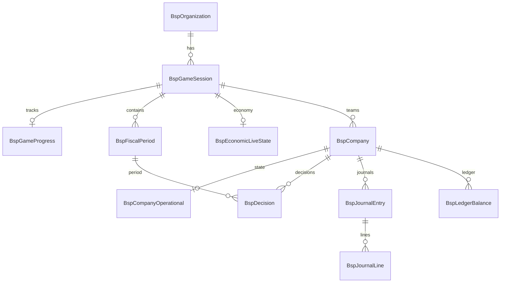

# Development Sprint 1 — Deliverables

> **Goal**: Step 1 (LOAN) + Step 2 (FACILITY) MVP end-to-end  
> **Date**: 2026-07-26  
> **Play URL**: `/play`

---

## 1. Project Structure

```
src/bsp/
├── domain/
│   ├── types.ts                 # DTOs, constants, EconomyValues
│   ├── economy/presets.ts       # 8 GM economy presets
│   ├── validation/step-validators.ts  # L01-L06, F01-F06
│   └── accounting/journals.ts   # Journal + ledger + B/S P/L
├── application/
│   └── bsp-service.ts           # Use cases (create, validate, submit)
└── infrastructure/
    └── prisma/client.ts

app/
├── play/page.tsx                # Step 1 & 2 UI
└── api/v1/
    ├── demo/setup/route.ts
    ├── play/companies/[companyId]/
    │   ├── decisions/route.ts
    │   ├── dashboard/route.ts
    │   └── financials/route.ts
    └── gm/
        ├── economy/presets/route.ts
        └── sessions/[sessionId]/economy/presets/[presetId]/apply/route.ts

prisma/
├── bsp.schema.prisma
├── bsp.seed.ts
└── migrations/bsp/20260726120000_init/migration.sql

tests/bsp/sprint1.test.ts
docker-compose.yml
```

---

## 2. API List

| Method | Path | Description |
|--------|------|-------------|
| POST | `/api/v1/demo/setup` | Demo session + company 생성 |
| GET | `/api/v1/demo/setup` | Demo session 정보 |
| POST | `/api/v1/play/companies/{companyId}/decisions` | Validate-only or Submit (LOAN/FACILITY) |
| GET | `/api/v1/play/companies/{companyId}/dashboard` | CEO Dashboard DTO |
| GET | `/api/v1/play/companies/{companyId}/financials` | B/S + P/L (Sprint 1: investment only) |
| GET | `/api/v1/gm/economy/presets` | 8 economy presets catalog |
| POST | `/api/v1/gm/sessions/{sessionId}/economy/presets/{presetId}/apply` | GM one-button preset apply |

### Decision POST body

```json
{
  "step": "LOAN",
  "payload": { "loanEarly": 2, "loanMid": 0, "deposit": 1, "loanRepayment": 0 },
  "companyStatusVersion": 0,
  "validateOnly": false
}
```

---

## 3. ERD



---

## 4. Migration

File: `prisma/migrations/bsp/20260726120000_init/migration.sql`

Run:

```bash
docker compose up -d
cp .env.example .env
npm run bsp:generate
npm run bsp:migrate
npm run bsp:seed
npm run dev
```

---

## 5. E2E Test Scenario (Verified)

`npm test` — 7 domain tests pass.

API E2E (memory store, default without `BSP_DATABASE_URL`):

```
POST /api/v1/demo/setup          → company created
POST decisions LOAN (2,0,1,0)    → cash=11,000 debt=2,000
POST decisions FACILITY (1,1,0) → cash=7,400 capacity=30
GET  financials                  → assets=12,000 debt=2,000
```

---

## 6. Economy Presets (8)

| ID | Label |
|----|-------|
| PRESET_HIGH_INTEREST | 고금리 시대 |
| PRESET_LOW_INTEREST | 저금리 시대 |
| PRESET_RAW_MATERIAL_SPIKE | 원자재 가격 폭등 |
| PRESET_SUPPLY_CHAIN_COLLAPSE | 공급망 붕괴 |
| PRESET_AI_INNOVATION | AI 혁신 |
| PRESET_CARBON_TAX | 탄소세 강화 |
| PRESET_GLOBAL_RECESSION | 글로벌 경기침체 |
| PRESET_SUPER_BOOM | 초호황 |

---

## 7. Screenshots

Run `npm run dev` → open `http://localhost:3000/play`

1. **Dashboard** — right panel: cash, debt, equity, capacity
2. **Step 1 Finance** — loan/deposit inputs + Validation + Submit
3. **Step 2 Facility** — land/machine + Capacity Preview + Submit
4. **Completed** — B/S panel after both steps

*(Capture screenshots locally after DB is running.)*

---

## 8. Out of Scope (Sprint 1)

- Step 3~7 (HIRING, MATERIAL, PRODUCTION, SALES, SETTLEMENT)
- Auth / multi-tenant
- GM Desk full UI (preset API only)
