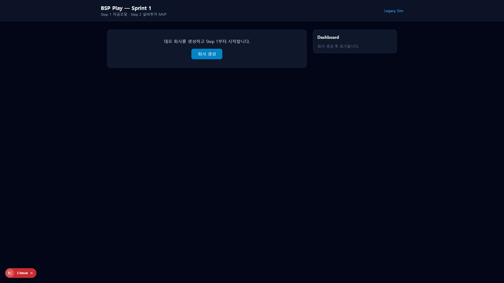
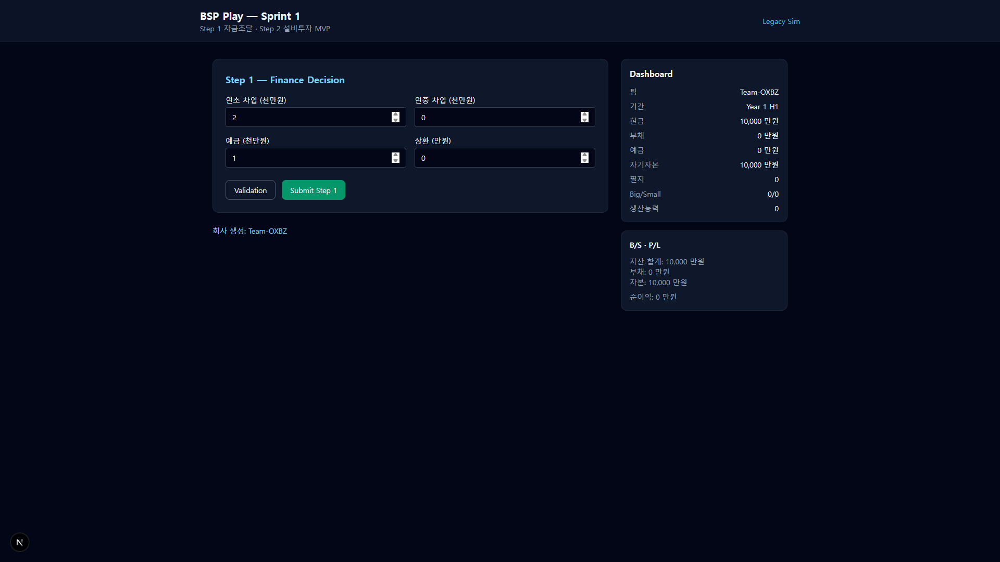
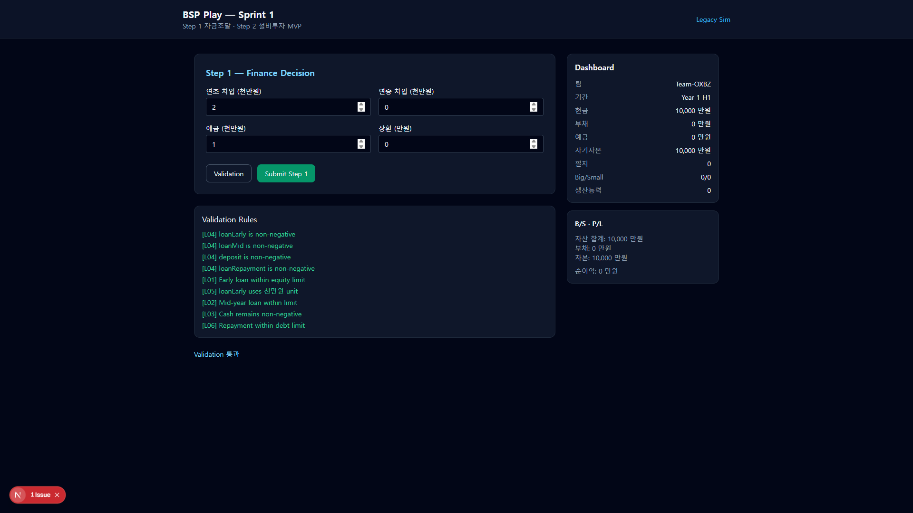
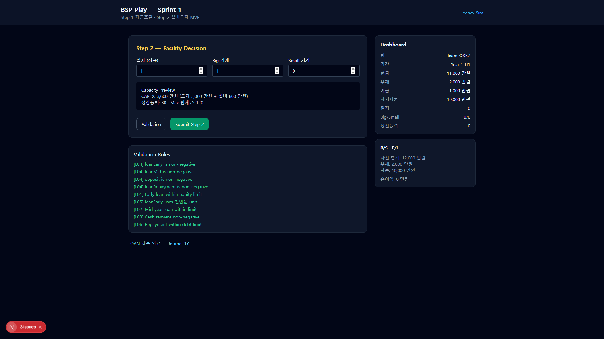
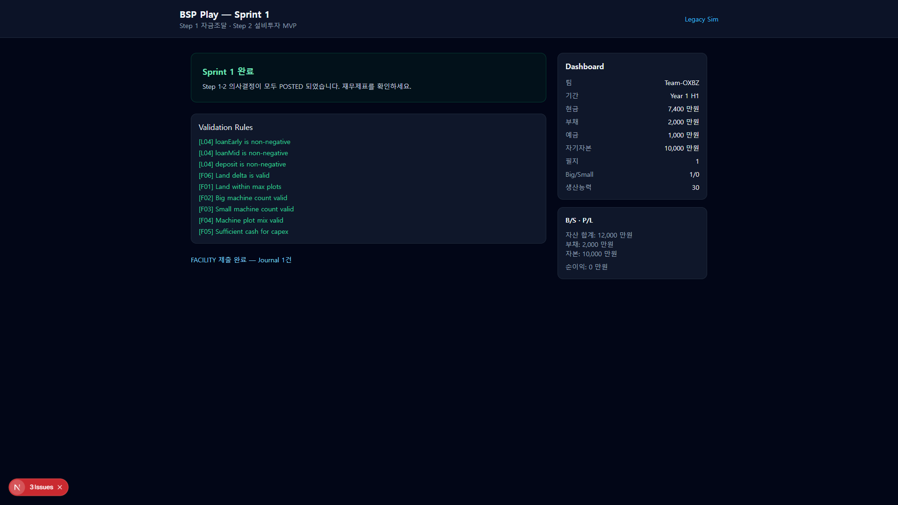
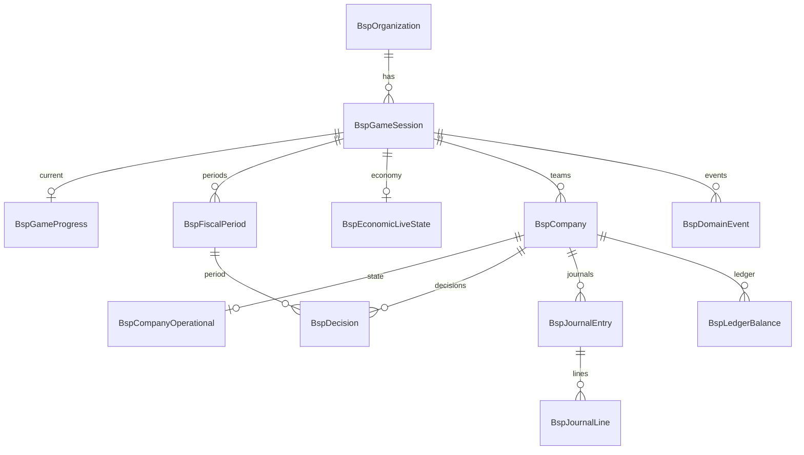

# Sprint 1 Review

> **Date**: 2026-07-26  
> **Scope**: Step 1 (LOAN) + Step 2 (FACILITY) MVP  
> **Demo URL**: `/play`  
> **Screenshots**: `docs/sprint1-review/*.png`

---

## 1. Demo Walkthrough

### 시나리오 매핑 (요청 vs 실제)

| 요청 단계 | Sprint 1 실제 | 비고 |
|-----------|---------------|------|
| 게임 생성 | ⚠️ **부분** | GM 게임 생성 UI 없음. `회사 생성` 버튼 → Demo API가 Session+Company 자동 생성 |
| CEO 로그인 | ❌ **미구현** | Auth 없음. `/play` 직접 접속 = CEO 역할 가정 |
| Dashboard | ✅ | 우측 패널 실시간 갱신 |
| Step1 입력 | ✅ | loanEarly/Mid, deposit, repayment |
| Validation | ✅ | L01~L06 규칙 목록 표시 |
| 제출 | ✅ | Journal 1건 생성, stepPhase → STEP2 |
| Dashboard 변화 | ✅ | cash 10,000→11,000, debt 0→2,000, deposit 0→1,000 |
| Step2 설비투자 | ✅ | land/big/small + Capacity Preview |
| 제출 | ✅ | Journal 1건, capacity 30 |
| P/L 생성 | ⚠️ **단순화** | 구조만 존재, 매출·비용 0 (Step3~6 미구현) |
| B/S 생성 | ⚠️ **단순화** | 요약 패널 (전체 B/S 화면 없음) |

---

### Step-by-Step (실제 화면)

#### ① 진입 / 데모 회사 생성

`/play` 접속 → **회사 생성** 클릭 → `POST /api/v1/demo/setup` 으로 Demo Session + Team 자동 생성.



- GM이 Join Code로 세션을 만들고 팀을 배정하는 흐름은 **Sprint 2 대상**
- 현재는 교육 데모용 원클릭 진입

---

#### ② CEO 로그인 (Gap)

**화면 없음.** Sprint 1은 인증·역할 분리 없이 Play URL = CEO 세션으로 간주.

→ Sprint 2 P0: Join Code + Team 선택 또는 간단 CEO 세션 바인딩

---

#### ③ Dashboard (초기)

회사 생성 직후 — Year 1 H1, cash **10,000**만, equity **10,000**만.



| 항목 | 값 |
|------|-----|
| 현금 | 10,000 만원 |
| 부채 | 0 |
| 예금 | 0 |
| 자기자본 | 10,000 |
| 생산능력 | 0 |

---

#### ④ Step 1 — 자금조달 입력

기본값: `loanEarly=2`, `loanMid=0`, `deposit=1`, `loanRepayment=0` (천만원 단위)

엑셀 D25/D26/D27/D126 대응.

---

#### ⑤ Validation

**Validation** 클릭 → L01~L06 전规则 pass, "Validation 통과" 메시지.



교육 관점: Rule ID(L01, L04 등)가 영문 — **한글 메시지 보강 필요** (Sprint 2 P1)

---

#### ⑥ Step 1 제출

**Submit Step 1** → Journal 1건 POSTED → Step 2 화면으로 전환.


**Dashboard 변화:**

| 항목 | Before | After |
|------|--------|-------|
| 현금 | 10,000 | **11,000** |
| 부채 | 0 | **2,000** |
| 예금 | 0 | **1,000** |
| B/S 자산 | 10,000 | **12,000** |

---

#### ⑦ Step 2 — 설비투자

`land=1`, `big=1`, `small=0` → CAPEX **3,600**만, capacity **30**, maxMaterials **120**.



Capacity Preview는 엑셀 G29 계산식과 일치.

---

#### ⑧ Step 2 제출 + Sprint 완료

**Submit Step 2** → Journal 1건 → "Sprint 1 완료" 배너.



**최종 Dashboard:**

| 항목 | 값 |
|------|-----|
| 현금 | **7,400** |
| 부채 | 2,000 |
| 예금 | 1,000 |
| 필지 | 1 |
| Big/Small | 1/0 |
| 생산능력 | 30 |

---

#### ⑨ P/L · B/S

**B/S (요약):** 자산 12,000 = 현금 7,400 + 예금 1,000 + 토지 3,000 + 기계 600  
**부채 2,000 + 자본 10,000** — 대차 균형 ✓

**P/L:** revenue/COGS/영업이익 모두 **0** (Step 3~6·Settlement 미구현으로 정상)

→ Sprint 2에서 SCR-CEO-F01 수준의 **전체 재무제표 화면** 필요

---

## 2. Technical Review

### 2.1 프로젝트 디렉터리 구조

```
project/
├── app/
│   ├── play/page.tsx              # CEO Play UI (Step1/2)
│   └── api/v1/
│       ├── demo/setup/            # Demo bootstrap
│       ├── play/companies/[id]/   # decisions, dashboard, financials
│       └── gm/                    # economy presets
├── src/bsp/
│   ├── domain/
│   │   ├── types.ts               # DTO, constants, EconomyValues
│   │   ├── validation/            # L01-L06, F01-F06
│   │   ├── accounting/            # Journal, ledger, B/S stub
│   │   └── economy/presets.ts     # 8 GM presets
│   ├── application/
│   │   ├── bsp-service.ts         # Store selector (memory | prisma)
│   │   └── bsp-service.prisma.ts  # PostgreSQL use cases
│   └── infrastructure/
│       ├── memory/                # Dev/demo in-memory store
│       └── prisma/                # Prisma client
├── prisma/
│   ├── bsp.schema.prisma
│   ├── bsp.seed.ts
│   └── migrations/bsp/20260726120000_init/
├── tests/bsp/sprint1.test.ts
└── docs/sprint1-review/           # Demo screenshots
```

**레이어 분리:** Domain ← Application ← Infrastructure ← API ← UI ✓

---

### 2.2 ERD



**Aggregate Roots (설계 의도):**
- `GameSession` — GM 경계 (phase, economy, progress)
- `Company` — CEO 경계 (operational, decisions, ledger)

---

### 2.3 Database Migration

파일: `prisma/migrations/bsp/20260726120000_init/migration.sql`

| Table | Purpose |
|-------|---------|
| BspGameSession | GM 세션 |
| BspGameProgress | 현재 stepPhase |
| BspFiscalPeriod | P1~P6 반기 |
| BspCompany | 팀 |
| BspCompanyOperational | 운영 상태 스냅샷 |
| BspDecision | Step별 POSTED payload |
| BspJournalEntry / Line | 회계 분개 |
| BspLedgerBalance | 계정별 잔액 |
| BspEconomicLiveState | Economy 변수 |
| BspDomainEvent | Event store |

**Note:** `BSP_DATABASE_URL` 미설정 시 인메모리 fallback (데모용). Production은 PostgreSQL 필수.

---

### 2.4 API 목록

| Method | Path | Sprint 1 |
|--------|------|:--------:|
| POST | `/api/v1/demo/setup` | ✅ |
| GET | `/api/v1/demo/setup` | ✅ |
| POST | `/api/v1/play/companies/{id}/decisions` | ✅ LOAN/FACILITY |
| GET | `/api/v1/play/companies/{id}/dashboard` | ✅ |
| GET | `/api/v1/play/companies/{id}/financials` | ✅ (stub P/L) |
| GET | `/api/v1/gm/economy/presets` | ✅ |
| POST | `/api/v1/gm/sessions/{id}/economy/presets/{presetId}/apply` | ✅ API only |

---

### 2.5 주요 Domain 객체 관계

```
GameSession
  └── GameProgress (stepPhase: STEP1_FINANCE → STEP2_INVESTMENT)
  └── FiscalPeriod (P1)
  └── Company
        └── CompanyOperational (cash, debt, land, machines…)
        └── Decision[LOAN|FACILITY] (payload, validation, computed)
        └── JournalEntry → JournalLine[]
        └── LedgerBalance[accountCode → balanceManwon]
```

**Decision 흐름:**
```
Payload → validateLoan/Facility → buildJournal → applyLedger → updateOperational → advanceStepPhase
```

---

## 3. Code Review (자체 점검)

### 3.1 중복 코드

| 위치 | 내용 | 심각도 |
|------|------|--------|
| `bsp-service.prisma.ts` ↔ `memory-bsp-store.ts` | submitDecision, validate, dashboard 로직 ~70% 중복 | **High** |
| `step-validators.ts` | L04 4회 반복 pass/fail 패턴 | Low |
| `app/play/page.tsx` | Loan/Facility submit·validate 거의 동일 fetch 블록 | Medium |

**권장:** Repository interface + 단일 `DecisionService`로 통합 (Sprint 2 P1)

---

### 3.2 복잡도가 높은 클래스/파일

| 파일 | LOC | 이슈 |
|------|-----|------|
| `bsp-service.prisma.ts` | ~400 | submitDecision 트랜잭션 블록 과대 |
| `app/play/page.tsx` | ~300 | UI + API + state + preview 혼재 |
| `step-validators.ts` | ~260 | validateLoan/Facility 구조 유사 |

---

### 3.3 향후 리팩토링 대상

1. **Repository Pattern** — `ICompanyRepository`, `ISessionRepository` 추상화
2. **Decision Handler Registry** — `step → handler` map으로 LOAN/FACILITY/HIRING… 확장
3. **Play UI 분리** — `StepFinanceForm`, `StepFacilityForm`, `DashboardPanel`, `ValidationPanel`
4. **Ledger normal balance** — 부채/자본 credit-normal 처리 일원화 (현재 B/S에서 abs 보정)
5. **DTO 공유** — `app/play/page.tsx` inline type → `domain/types.ts` 재사용

---

### 3.4 테스트 커버리지

| 영역 | 테스트 | 커버리지 |
|------|--------|----------|
| Validation L01, L02, F05 | ✅ 7 tests | Domain ~80% |
| Journal balance | ✅ | Accounting ~60% |
| E2E domain flow | ✅ | 1 scenario |
| API routes | ❌ | 0% |
| Prisma integration | ❌ | 0% |
| UI/E2E (Playwright) | ❌ | 0% |
| Gate rules G01~G07 | ❌ | 0% |

**추정 전체 커버리지: ~25%** (Domain 핵심 경로만)

---

### 3.5 성능 이슈 가능성

| 항목 | 평가 |
|------|------|
| 인메모리 store | 데모 OK. 다중 인스턴스 배포 시 상태 불일치 — PostgreSQL 전환 필수 |
| Next.js dev HMR | globalThis store로 해결 ✓ |
| submitDecision transaction | Step1/2 단건 POST — 문제 없음 |
| Dashboard polling | 없음 (submit 후 refresh) — Step 3+ 동시 접속 시 optimistic lock(G06) 충분 |
| N+1 query | Prisma include 적절 — 현재 규모 OK |

---

## 4. UI/UX Review (교육 관점)

### 4.1 교육생이 이해하기 쉬운가?

| 항목 | 평가 | 코멘트 |
|------|------|--------|
| Step 순서 | ⭐⭐⭐⭐ | Step 1→2 흐름 명확 |
| 단위 표시 | ⭐⭐⭐ | 천만원/만원 혼재 — 엑셀과 동일하나 초보자 혼란 |
| Validation 피드백 | ⭐⭐⭐ | Rule ID 영문 — 교육용 한글 필요 |
| Dashboard | ⭐⭐⭐⭐ | 핵심 KPI 한눈에 |
| B/S·P/L | ⭐⭐ | 요약 4줄 — 학습 목표(의사결정→재무제표)에 부족 |

---

### 4.2 입력 흐름이 자연스러운가?

- ✅ Step 완료 후 다음 Step 자동 노출
- ⚠️ Step1 **2-Phase UI**(D-01: 1A 연초 → 1B 연중) 미구현 — 한 화면에 4필드
- ⚠️ GM advance 없이 submit=step 종료 — 엑셀/Rule Book과 차이
- ❌ Step indicator (1/7) 없음

---

### 4.3 현재 부족한 UX

1. **로그인·팀 선택·Join Code** — 누구인지 맥락 없음
2. **Step Progress Stepper** (Doc 10 Journey Map)
3. **Journal / 분개 확인 화면** — "Journal 1건" 텍스트만
4. **전체 B/S·P/L 화면** (SCR-CEO-F01)
5. **에러 UX** — 422 시 Rule ID만, 해결 가이드 없음
6. **Step1 Phase wizard** (D-01)
7. **GM Desk** — Preset 적용 UI 없음 (API만)

---

### 4.4 강사가 설명하기 어려운 부분

| 항목 | 이유 |
|------|------|
| "회사 생성" = 게임 시작? | GM 세션 vs CEO 팀 개념 혼재 |
| Validation 영문 메시지 | Rule Book 한글 Rule ID 매핑 필요 |
| P/L이 0인 이유 | Step3~6 없어서 — 교육생 혼란 가능 |
| Submit = GM advance? | Rule Book은 GM 동기 진행 — 현재 자동 advance |
| Legacy Sim 링크 | 구 BSP와 무관한 4-round sim — 혼란 유발 |

---

## 5. Gap Analysis (엑셀 vs Sprint 1)

| 영역 | 엑셀 / Rule Book | Sprint 1 | 상태 |
|------|------------------|----------|------|
| **기간** | 3년 6반기 | P1만 (Year 1 H1) | 🔶 단순화 |
| **Step 1 LOAN** | D25~27, D126 | loanEarly/Mid/deposit/repayment | ✅ 구현 |
| **Step 1 2-Phase UI** | D-01: 1A→1B wizard | 단일 폼 | 🔶 단순화 |
| **Step 1 Validation** | L01~L06 | L01~L06 | ✅ 구현 |
| **Step 2 FACILITY** | D28~29 | land/big/small | ✅ 구현 |
| **Step 2 Validation** | F01~F06 | F01~F06 | ✅ 구현 |
| **Step 3 HIRING** | D32~34 | — | ❌ 미구현 |
| **Step 4 MATERIAL** | 지역·재료 | — | ❌ 미구현 |
| **Step 5 PRODUCTION** | 생산·가동 | — | ❌ 미구현 |
| **Step 6 SALES** | 판매·단가 | — | ❌ 미구현 |
| **Step 7 SETTLEMENT** | 이자·감가·법인세 | — | ❌ 미구현 |
| **GM advanceStep** | Step마다 GM 동기 | Submit 시 자동 | 🔶 단순화 |
| **GM Session PREPARE→RUNNING** | GM Desk | Demo auto RUNNING | 🔶 단순화 |
| **Join Code / 팀 배정** | GM 운영 | Demo API | 🔶 단순화 |
| **CEO Auth** | V1 scope | 없음 | ❌ 미구현 |
| **Journal 분개 표시** | Sheet1 | DB 저장, UI 없음 | 🔶 단순화 |
| **P/L** | Sheet1 | stub (0) | 🔶 단순화 |
| **B/S** | Sheet2 | 요약 패널 | 🔶 단순화 |
| **C/F** | — | — | ❌ 미구현 |
| **Economy 변수 적용** | G-02 NEXT_DECISION | Preset API, Step1/2 미연동 | 🔶 향후 |
| **Event** | D-15 | — | ❌ 미구현 |
| **Ranking** | Doc 11 | — | ❌ 미구현 |
| **7개 지역** | §1.5 | — | ❌ 미구현 |
| **만원 단위** | §1.5 | ✅ | ✅ 구현 |
| **상수 (토지 3000, Big 600…)** | §1.5 | ✅ GAME_CONSTANTS | ✅ 구현 |
| **미제출 zero (D-10)** | GM modal | — | ❌ 미구현 |
| **반기 마감 / P2~P6** | 6반기 loop | — | ❌ 미구현 |

**범례:** ✅ 구현 완료 · 🔶 단순화 · ❌ 미구현 · 📅 향후

---

## 6. Sprint 2 Backlog (범위 확정 제안)

### P0 — 반드시 구현 (V1 Gate 핵심)

| # | 항목 | 설명 | 난이도 | 예상 |
|---|------|------|--------|------|
| P0-1 | **PostgreSQL Production Path** | Memory 제거/옵션화, migrate CI, seed | M | 2일 |
| P0-2 | **Step 3 HIRING** | payload, H01~H04, computed, dashboard | M | 3일 |
| P0-3 | **Step 4 MATERIAL** | 지역·재료·M01~M05, Economy 연동 | H | 5일 |
| P0-4 | **Step 5 PRODUCTION** | P01~P04, COGS layer | M | 3일 |
| P0-5 | **Step 6 SALES** | S01~S05, revenue journal | M | 3일 |
| P0-6 | **Step 7 SETTLEMENT** | 이자·감가·법인세·system POST | H | 5일 |
| P0-7 | **GM advanceStep API** | Submit≠advance 분리, Rule Book 준수 | M | 2일 |
| P0-8 | **Join Code + Team Entry** | CEO 세션 진입 (간단 auth) | M | 3일 |
| P0-9 | **Repository 리팩토링** | Prisma/Memory 중복 제거 | M | 2일 |
| P0-10 | **API Integration Tests** | decisions E2E per step | M | 3일 |

**P0 소계: ~31 dev-days (1 dev ≈ 6~7주, 2 dev ≈ 3~4주)**

---

### P1 — 교육 품질 향상

| # | 항목 | 설명 | 난이도 | 예상 |
|---|------|------|--------|------|
| P1-1 | **Step Progress Stepper** | 7-Step Journey Map UI | L | 2일 |
| P1-2 | **Step1 2-Phase Wizard** | D-01: 1A→1B | M | 2일 |
| P1-3 | **Validation 한글 메시지** | Rule ID → 교육용 문구 | L | 1일 |
| P1-4 | **Journal Viewer** | 분개 Dr/Cr 테이블 | M | 2일 |
| P1-5 | **Financial Statement Screen** | SCR-CEO-F01 B/S·P/L·period selector | M | 4일 |
| P1-6 | **GM Desk (minimal)** | Session start, advance, preset apply UI | H | 5일 |
| P1-7 | **Economy → Decision 연동** | G-02 NEXT_DECISION_POST | M | 2일 |
| P1-8 | **Playwright E2E** | Full half-year scenario | M | 3일 |

**P1 소계: ~21 dev-days**

---

### P2 — 고급 기능

| # | 항목 | 설명 | 난이도 | 예상 |
|---|------|------|--------|------|
| P2-1 | **Event Schema + Engine** | Doc 04, D-15 NORMAL fire | H | 7일 |
| P2-2 | **Live Ranking** | D-05, D-14 | M | 4일 |
| P2-3 | **What-if / Replay** | Doc 10 guardrails | H | 7일 |
| P2-4 | **Region Remaining (D-07)** | GM Desk 편집 | M | 3일 |
| P2-5 | **Multi-tenant Auth** | organizationId scope | H | 5일 |
| P2-6 | **Cash Flow Statement** | C/F | M | 3일 |

**P2 소계: ~29 dev-days**

---

## Sprint 2 범위 확정 제안

### 권장 Sprint 2 Goal

> **"1반기(P1) 7-Step 전체가 동작하고, GM이 세션을 운영하며, CEO가 Join Code로 진입해 결산까지 완료"**

### Sprint 2 포함 (확정 권장)

- P0 전체 (Step 3~7 + GM advance + Join Code + PostgreSQL + Repository + API tests)
- P1-1, P1-3, P1-4, P1-5 (Stepper, 한글 Validation, Journal, 재무제표)

### Sprint 2 제외 (Sprint 3 이후)

- Event Engine (P2-1) — **Event Schema 문서 후 Sprint 3**
- Ranking, What-if, Multi-tenant

### Sprint 2 예상 일정

| 구성 | 기간 |
|------|------|
| 1 Full-stack dev | **8~9주** |
| 2 dev (BE+FE 병렬) | **4~5주** |

---

## Review 결론

| 항목 | 판정 |
|------|------|
| Sprint 1 MVP (Step1/2 E2E) | **✅ Pass** — Domain·API·UI 데모 가능 |
| Rule Book 정합성 (Step1/2) | **✅ Pass** — L/F rules, constants, journal |
| V1 Gate (Excel 100% 대체) | **❌ Not yet** — Step 3~7, GM flow, Auth 필요 |
| Sprint 2 착수 readiness | **✅ Ready** — Repository refactor + P0 backlog 확정 후 시작 |

**다음 액션:** Sprint 2 범위 확정 → P0-9(Repository) 선행 2일 → Step 3 HIRING 구현 시작.
