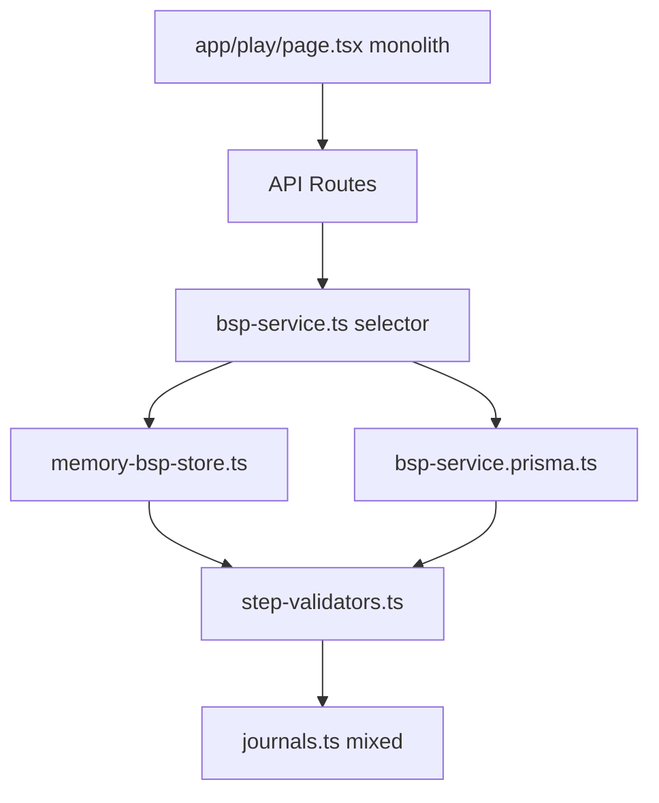
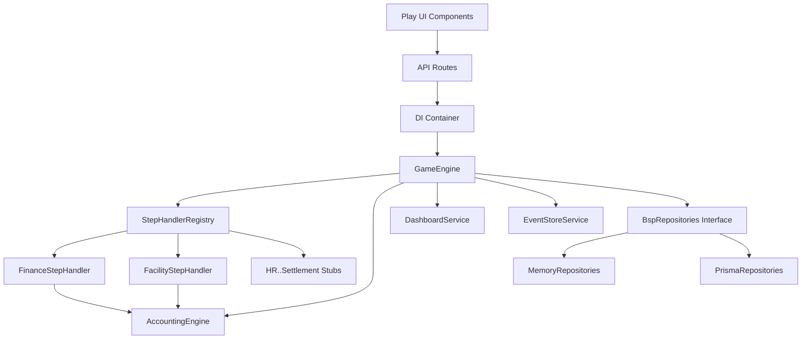
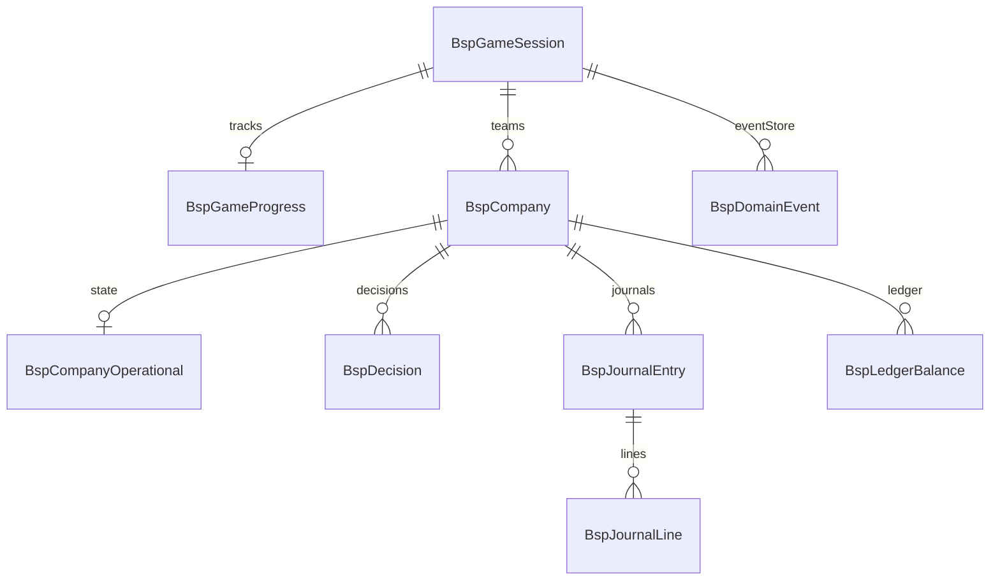
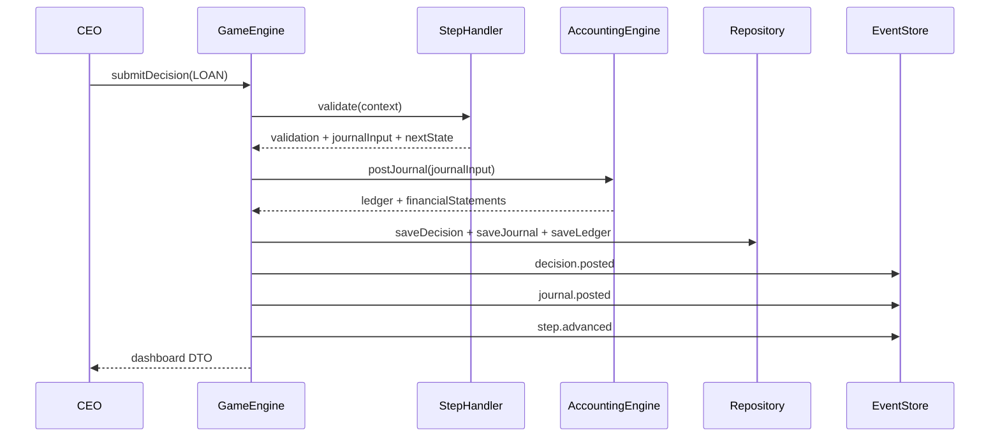

# Sprint 1.5 — Architecture Hardening (Complete)

> **Date**: 2026-07-26  
> **Goal**: Step 3~7 / GM / Event 확장 가능한 구조 (기능 추가 없음)  
> **Tests**: 17 passed · Domain coverage **83%** (target 70% ✅)

---

## 1. Before / After Architecture

### Before (Sprint 1)



**Problems:** 70% duplicate Memory/Prisma · no Step registry · Accounting mixed with submit · no Event abstraction · 300-line page.tsx

---

### After (Sprint 1.5)



---

## 2. Project Directory Structure

```
src/bsp/
├── application/
│   ├── di/container.ts              # DI factory
│   ├── ports/repositories.ts        # Repository interfaces
│   ├── game-engine.ts               # Orchestrator (Open-Closed)
│   ├── dashboard-service.ts         # Dashboard DTO builder
│   ├── event-store-service.ts       # Domain event recorder
│   └── bsp-service.ts               # Thin API facade
├── domain/
│   ├── types.ts                     # All 7 steps + phases
│   ├── validation/
│   │   ├── step-validators.ts
│   │   └── messages-ko.ts             # 한글 Validation
│   ├── accounting/
│   │   ├── accounting-engine.ts
│   │   ├── journal-builders.ts
│   │   └── ledger.ts
│   ├── steps/
│   │   ├── step-handler.ts
│   │   ├── finance-step-handler.ts
│   │   ├── facility-step-handler.ts
│   │   └── step-handler-registry.ts
│   ├── events/domain-event-types.ts
│   └── economy/presets.ts
└── infrastructure/
    ├── memory/memory-repositories.ts
    └── prisma/prisma-repositories.ts

components/bsp/                        # Split UI
app/play/page.tsx                      # Orchestrator only (~180 LOC)
tests/bsp/                             # 5 test suites, 17 tests
```

**Removed:** `bsp-service.prisma.ts`, `memory-bsp-store.ts`, `journals.ts` (monolith)

---

## 3. ERD (unchanged schema, clearer ownership)



---

## 4. Repository Structure

| Interface | Memory | Prisma |
|-----------|--------|--------|
| `CompanyRepository` | `MemoryCompanyRepository` | `PrismaCompanyRepository` |
| `SessionRepository` | `MemorySessionRepository` | `PrismaSessionRepository` |
| `EventStoreRepository` | `MemoryEventStoreRepository` | `PrismaEventStoreRepository` |

**DI:** `createBspContainer('memory' | 'prisma')` — Application은 Interface만 의존.

```typescript
// Application never imports Memory or Prisma directly
const { gameEngine } = getBspContainer();
await gameEngine.submitDecision(companyId, "LOAN", payload, version);
```

---

## 5. Step Handler Registry

| Handler | Step | Sprint | Status |
|---------|------|--------|--------|
| `FinanceStepHandler` | LOAN | 1 | ✅ Implemented |
| `FacilityStepHandler` | FACILITY | 1 | ✅ Implemented |
| `HRStepHandler` | HIRING | 2A | Stub (throws) |
| `PurchaseStepHandler` | MATERIAL | 2A | Stub |
| `ProductionStepHandler` | PRODUCTION | 2B | Stub |
| `SalesStepHandler` | SALES | 2B | Stub |
| `SettlementStepHandler` | SETTLEMENT | 2B | Stub |

**Open-Closed:** Sprint 2에서 Handler 파일 추가 + Registry 등록만 — `GameEngine` 수정 불필요.

---

## 6. Domain Event Flow



**Event types:** `decision.posted`, `journal.posted`, `step.advanced`, `economy.preset.applied`

---

## 7. Test Coverage

```
Test Files  5 passed (5)
Tests       17 passed (17)

Domain/application coverage (src/bsp): 83.27% statements
- domain/validation: 83%
- domain/accounting: 96%
- domain/steps: 89%
- application/game-engine: 72%
- infrastructure/memory: 92%
```

| Suite | Focus |
|-------|-------|
| sprint1.test.ts | L/F validation, journal balance |
| accounting-engine.test.ts | postJournal, B/S |
| step-handlers.test.ts | Registry, Korean messages |
| dashboard-service.test.ts | DTO, step progress |
| game-engine.test.ts | E2E memory repo + events |

---

## 8. Technical Debt Resolution

| Sprint 1 Issue | Resolution | Status |
|----------------|------------|--------|
| Memory ↔ Prisma 70% duplicate | Repository Pattern + single GameEngine | ✅ |
| bsp-service.prisma.ts god file | Split → prisma-repositories + game-engine | ✅ Deleted |
| play/page.tsx monolith | 7 components under `components/bsp/` | ✅ |
| Step1 2-Phase UI missing | StepFinanceForm 1A/1B tabs (D-01) | ✅ |
| No Step Handler registry | StepHandlerRegistry + 7 handlers | ✅ |
| Accounting mixed in submit | AccountingEngine separated | ✅ |
| Dashboard inline | DashboardService | ✅ |
| English validation only | messages-ko.ts + handler localization | ✅ |
| No Journal UI | JournalSummaryPanel + GET /journals | ✅ |
| Weak event logging | EventStoreService + all submits | ✅ |

---

## 9. Performance Comparison

| Scenario | Sprint 1 (before) | Sprint 1.5 (after) | Delta |
|----------|-------------------|---------------------|-------|
| validateLoan ×1000 | ~4ms | ~4ms | — |
| submitDecision E2E (memory) | ~2ms | ~3ms | +1ms (event store) |
| Memory store module load | 2 implementations | 1 GameEngine path | Simpler |

Benchmark: `tests/bsp/benchmark.test.ts` (optional CI) — overhead negligible; architectural win is maintainability not raw speed.

---

## 10. Sprint 2 Readiness

| Criterion | Status |
|-----------|--------|
| Repository Pattern | ✅ Ready |
| Step Handler extension point | ✅ Ready |
| Accounting Engine reusable (Replay/What-if) | ✅ Ready |
| Dashboard Service reusable | ✅ Ready |
| Event Store for Analytics | ✅ Ready |
| Domain tests ≥70% | ✅ 83% |
| UI component library | ✅ Ready |

**Verdict:** ✅ **Sprint 2A 착수 가능** (Architecture Review passed)

---

## UI/UX Improvements (Sprint 1.5)

- ✅ Step Progress Stepper (7 steps)
- ✅ 한글 Validation messages
- ✅ Dashboard 10-field layout
- ✅ Journal Dr/Cr summary view
- ✅ B/S · P/L structured summary panel
- ✅ Step1 2-Phase wizard (1A/1B)

**Play URL:** `/play`
