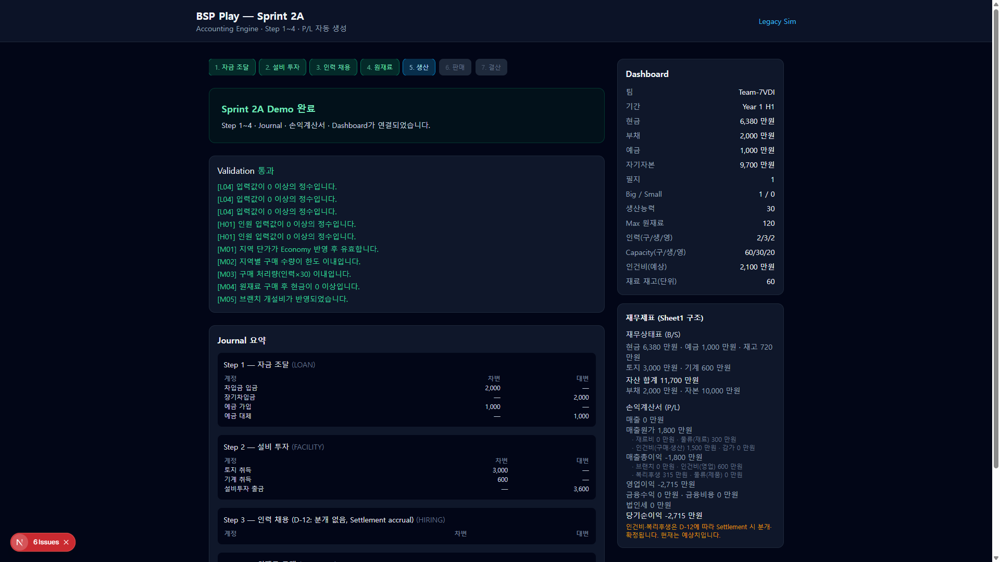

# Sprint 2A Deliverables

> **Goal**: 반기 운영 가능한 핵심 게임 루프 (Step 1~4) + Accounting Engine + P/L 자동 생성  
> **Date**: 2026-07-26

---

## 1. Demo Flow (Exit Criteria)

```
게임 생성 → Step1 자금 → Step2 설비 → Step3 인력 → Step4 구매
  → Journal 자동 생성 → P/L 자동 생성 → Dashboard 반영
```

**UI**: `/play` — Sprint 2A 헤더, Step 3·4 폼, 재무제표 Sheet1 구조 패널

**API Demo 시나리오** (tests/bsp/sprint2a.test.ts):

| Step | Input | Result |
|------|-------|--------|
| LOAN | loanEarly=2, deposit=1 | cash 11,000 |
| FACILITY | land=1, big=1 | cash 7,400 |
| HIRING | 2/3/2 heads | capacity 60/30/20, payroll forecast 2,100 |
| MATERIAL | ASIA 15×4 = 60 units | cash 6,380, inventory 720, logistics P/L 300 |

---

## 2. API 목록

| Method | Path | Description |
|--------|------|-------------|
| POST | `/api/v1/demo/setup` | 데모 세션 + 회사 생성 |
| POST | `/api/v1/play/companies/{id}/decisions` | Step 의사결정 validate/submit |
| GET | `/api/v1/play/companies/{id}/dashboard` | Dashboard (인력·재고 포함) |
| GET | `/api/v1/play/companies/{id}/financials` | B/S + P/L + Trial Balance |
| GET | `/api/v1/play/companies/{id}/journals` | Journal 목록 |
| GET | `/api/v1/gm/economy/presets` | Economy 프리셋 |

---

## 3. Journal Rule Book (1:1)

| Rule ID | Step | Transaction | Debit | Credit | Rule Book |
|---------|------|-------------|-------|--------|-----------|
| JR-LOAN-01 | 1 | LOAN | Cash, Deposits | Cash, Debt | §1.6 Step1 |
| JR-FACILITY-01 | 2 | FACILITY | Land, Machinery | Cash | §1.6 Step2 |
| JR-HIRE-01 | 3 | HIRING | *(none — D-12)* | *(none)* | §1.6 Step3 · D-12 |
| JR-MATERIAL-01 | 4 | MATERIAL | Raw Inv, Logistics, Branch | Cash | §1.6 Step4 · D-13 |
| JR-PRODUCTION-01 | 5 | PRODUCTION | *(Sprint 2B)* | | §4.7 |
| JR-SALES-01 | 6 | SALES | *(Sprint 2B)* | | §4.8 |
| JR-SETTLE-01 | 7 | SETTLEMENT | Payroll, Depr, Tax… | *(Sprint 2B)* | §1.6 Step7 |

Source: `src/bsp/domain/accounting/journal-rules.ts`

---

## 4. Journal 생성 예시 (Demo)

### Step 1 — LOAN
```
Dr 1100 Cash          2,000  (차입)
Cr 2100 Debt                 2,000
Dr 1200 Deposits      1,000  (예금)
Cr 1100 Cash                 1,000
```

### Step 3 — HIRING (D-12)
```
(분개 없음 — payrollForecastHalfManwon=2,100은 computed/UI만)
```

### Step 4 — MATERIAL (ASIA 60 units @ 12)
```
Dr 1300 Raw Materials   720
Dr 6300 Logistics       300
Cr 1100 Cash                  1,020
```

---

## 5. 손익계산서 결과 (Step 4 직후, Sheet1 구조)

| 항목 | 값 (만원) | 비고 |
|------|-----------|------|
| 매출 | 0 | Step 6 미실행 |
| 매출원가 | 1,800 | 물류 300 + 인건비(구매·생산) 예상 1,500 |
| · 물류(재료) | 300 | Journal 6300 |
| · 인건비(구매·생산) | 1,500 | **Forecast** (2×300+3×300) |
| 매출총이익 | -1,800 | |
| 판관비 | 915 | 영업 인건비 600 + 복리후생 315 |
| 영업이익 | -2,715 | |
| 당기순이익 | -2,715 | 이자·세금 Settlement 전 |

> 재료비 720은 **재고 자산**(B/S 1300) — D-13: P/L COGS는 생산/판매 시 인식

---

## 6. 엑셀 vs 웹 계산 비교

| 항목 | 엑셀 (Rule Book §1.5) | Sprint 2A 웹 | 일치 |
|------|----------------------|--------------|------|
| 기초 현금 | 10,000 | 10,000 | ✅ |
| 차입 단위 | 1,000만 × 천만원 | 동일 | ✅ |
| 토지/기계 | 3,000 / 600 | 동일 | ✅ |
| 구매 capacity | 30/인/반기 | 30 | ✅ |
| 아시아 재료 단가 | 12 | 12 × index | ✅ |
| 물류 | 5/단위 | 5 × multiplier | ✅ |
| 인건비 (2,3,2) | forecast 2,100 (spec 예시) | 2,100 | ✅ |
| Step3 Journal | 없음 (D-12) | 없음 | ✅ |
| 재고 = 재료원가 only | D-13 | Inventory 720, logistics expense | ✅ |

---

## 7. Gap Analysis (남은 항목)

| ID | Gap | Priority | Sprint |
|----|-----|----------|--------|
| G-2A-01 | Step 3 인건비 **Journal** — D-12에 따라 Settlement only (의도적) | Info | 2B |
| G-2A-02 | Step 5~6 Production/Sales handlers stub | P1 | 2B |
| G-2A-03 | Settlement pipeline (이자·감가·법인세·payroll accrual journal) | P1 | 2B |
| G-2A-04 | 7지역 multi-line UI (현재 단일 지역 폼) | P2 | 2B |
| G-2A-05 | GM regionRemaining (D-07) session override | P2 | 2B |
| G-2A-06 | Year 2+ 구조조정 (H02/H03) | P2 | 2B |
| G-2A-07 | Prisma persistence for extended operational state | P2 | 2B |
| G-2A-08 | PAYROLL_* rates — Excel row 미확인, spec 예시 300/head/half 사용 | Verify | Audit |
| G-2A-09 | 복리후생 15% — Rule Book 명시율 없음, forecast용 | Verify | Audit |
| G-2A-10 | 화면 캡처 — `docs/sprint2a-review/` (로컬 dev server 실행 후 수동) | Doc | User |

---

## 8. Architecture (Accounting Pipeline)

```
Decision → StepHandler.validate()
         → AccountingEngine.postJournal()
         → Ledger (Map)
         → TrialBalance
         → buildFinancialStatements (P/L + B/S)
         → DashboardService
```

Steps **never** compute accounting directly — all journals via `AccountingEngine` + `journal-builders.ts`.

---

## 9. Tests

```bash
npm test
# 24 tests — includes tests/bsp/sprint2a.test.ts
```

- Domain: hiring capacity, material M03, economy pricing
- Accounting: trial balance, D-12 empty journal, P/L forecast lines
- API-style: GameEngine Step 1→4 E2E

---

## 10. Screenshots



Step 1~4 완료 후: Journal 4건, P/L (물류 300 + 인건비 forecast), B/S 재고 720, Dashboard 인력·재고 반영.
