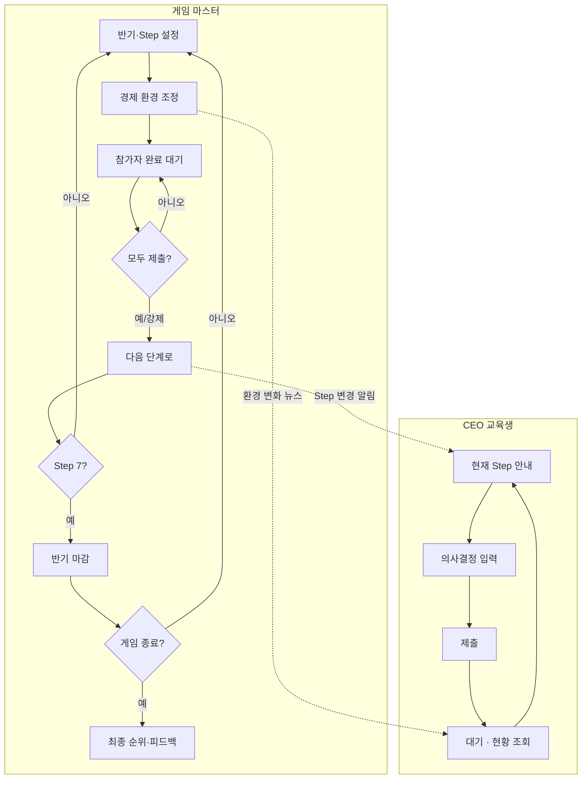

# 교육 흐름 기반 UX 설계

> **Version 1.1** — D-01 Step1 wizard, D-06 delta, D-11 period statements

---

## 1. 교육 루프 (Master Loop)



---

## 2. 시간 축 UX

### 2.1 GM · CEO 공통 타임라인

```
Year 1          Year 2          Year 3
├─ 상반기 ─┬─ 하반기 ─┤ … (×3)
   7 Steps    7 Steps
```

**헤더 표시 (고정)**  
`🎲 2년차 상반기` · `단계 5/7 · 생산` · `⏸ GM 대기 중` / `✅ 제출 완료`

### 2.2 반기 내 7 Step (교육용 라벨)

| # | 내부 코드 | CEO 화면 라벨 | 학습 포인트 (한 줄) |
|---|-----------|---------------|---------------------|
| 1 | LOAN | 자금 조달 | 차입·예금과 금리 |
| 2 | FACILITY | 설비 투자 | CAPEX와 생산능력 |
| 3 | HIRING | 인력 채용 | 인건비 vs 처리량 |
| 4 | MATERIAL | 원재료 구매 | 조달·재고·물류 |
| 5 | PRODUCTION | 생산 계획 | BOM·가동률 |
| 6 | SALES | 판매 전략 | 수요·가격·지역 |
| 7 | SETTLEMENT | 반기 결산 | 손익·재무상태 이해 |

---

## 3. GM UX — GM Desk (컨트롤 룸)

**Route**: `/gm/game/[id]`  
**목표**: 수업 중 GM이 이 화면만 보면 게임을 진행할 수 있다.

### 3.1 레이아웃

```
┌─────────────────────────────────────────────────────────────────┐
│ GM Desk · "2026 경영 시뮬레이션 A반"     [일시정지] [설정]      │
├──────────────────────────────┬──────────────────────────────────┤
│ ① 진행 제어 (Primary)        │ ③ 경제 환경 (Live)               │
│                              │                                  │
│  2년차 · 상반기              │  기준금리      [====●===] 10%    │
│  ●━━●━━●━━●━━○━━○━━○         │  환율          [===●====] +5%    │
│  1   2   3   4   5   6   7   │  원자재指数    [====●===]        │
│  현재: ④ 원재료 구매         │  시장 수요     [===●====]        │
│                              │  … (접기/프리셋: 호황·침체)      │
│  완료 7/10팀  [다음 단계로 →]│  [변경 즉시 적용] → CEO 뉴스     │
│                              │                                  │
├──────────────────────────────┤ ④ 빠른 이벤트                    │
│ ② 팀 현황 (Scoreboard)       │  [환율 급등] [원자재 부족] [+]   │
│                              │                                  │
│ 팀명    현금   Step   상태    │                                  │
│ Alpha  8,200  ✅     제출완료 │                                  │
│ Beta   6,100  ⏳     작성중   │                                  │
│ …                            │                                  │
└──────────────────────────────┴──────────────────────────────────┘
│ ⑤ 활동 로그 · 방금 Beta가 원재료 구매 제출                       │
└─────────────────────────────────────────────────────────────────┘
```

### 3.2 GM Primary Actions (우선순위)

| 순위 | 액션 | UX |
|------|------|-----|
| 1 | **다음 단계로** | Step 7이 아니면 항상 Primary 버튼 |
| 2 | **반기 마감** | Step 7(결산) 후에만 활성, 확인 모달 |
| 3 | 경제 변수 변경 | Live Panel, Apply 즉시 |
| 4 | 이벤트 발생 | Quick chip + 상세 모달 |
| 5 | 일시정지 | CEO 입력 freeze |

### 3.3 "다음 단계로" UX

**클릭 전 확인 모달**
```
다음 단계: ⑤ 생산 계획
미제출 팀: Beta, Delta (2팀)
○ 그래도 진행 (미제출 팀은 이전 입력 유지)
○ 취소
[진행하기]
```

**Step 7 → 반기 마감 전환**
```
상반기 결산이 완료되었습니다.
[반기 마감하고 하반기 시작]  ← Primary
```

### 3.4 GM 보조 화면 (Desk에서 Drawer/Modal)

| 기능 | 진입 | 이유 |
|------|------|------|
| 참가 코드·팀 관리 | Desk · 설정 | 수업 시작 전 |
| 시나리오·이벤트 편집 | Desk · 시나리오 | 수업 준비 |
| 팀 상세·개입 | 팀명 클릭 | 예외 처리 |
| 순위·AI 피드백 | 반기 마감 후 탭 | 평가 |

**별도 깊은 메뉴 트리 없음** — Desk가 허브.

---

## 4. CEO UX — Decision Journey

**Route**: `/play` (단일 앱 셸)

### 4.1 정보 구조 (3탭만)

```
[ 지금 할 일 ]  [ 우리 회사 ]  [ 소식 ]
     ↑ default
```

| 탭 | 내용 |
|----|------|
| **지금 할 일** | 현재 Step 폼 + 타임라인 |
| **우리 회사** | 현금·설비·재고·인력 + 반기 재무 요약 |
| **소식** | GM 경제 변경·이벤트·AI 뉴스 |

ERP 모듈 메뉴(finance/hr/scm/mes) **폐기** → Step이 곧 내비게이션.

### 4.2 CEO Dashboard — "지금 할 일" 탭

```
┌─────────────────────────────────────────┐
│ 2년차 상반기 · 단계 4/7                  │
│ ●━━●━━●━━●━━○━━○━━○                    │
├─────────────────────────────────────────┤
│ 📋 이번 단계: 원재료 구매                │
│ 해외·국내 시장에서 원재료를 조달합니다.  │
│ 재고와 현금의 균형을 생각해 보세요.      │
├─────────────────────────────────────────┤
│ ┌─ 의사결정 ─────────────────────────┐  │
│ │  (Step별 단일 폼 — 스크롤 one page) │  │
│ │  지역 선택 · 수량 · 예상 비용       │  │
│ └─────────────────────────────────────┘  │
│              [ 결정 제출하기 ]           │
├─────────────────────────────────────────┤
│ 💡 참고: 현금 8,200만원 · 창고 여유 OK   │
└─────────────────────────────────────────┘
```

### 4.3 Step 상태 UX

| 상태 | CEO 화면 |
|------|----------|
| **활성** | 폼 편집 가능, CTA 강조 |
| **제출 완료** | 폼 read-only + "GM이 다음 단계를 진행할 때까지 대기" |
| **잠김 (미래 Step)** | 타임라인 회색, "아직 열리지 않음" |
| **과거 Step** | 타임라인 클릭 → 제출 내용 열람만 |

### 4.4 SETTLEMENT (반기 결산) UX

CEO **입력 없음** — 학습·회고 화면.

```
┌─ 반기 결산 ─────────────────────────────┐
│ 이번 상반기 경영 결과                    │
│  [손익 요약 카드]  [현금 변화]  [순위]   │
│  "매출은 늘었지만 원재료비가 …" (AI 한줄) │
│  [자세히: 재무제표 보기]  ← 접힌 상태    │
└─────────────────────────────────────────┘
```

GM이 "반기 마감" 전까지 CEO는 결산 **미리보기**만 가능 (옵션).

### 4.5 참가 Flow

```
/join → 코드 입력 → 팀 이름·CEO 이름 → 대기실
대기실: "GM이 게임을 시작합니다" + 팀원 목록
START 후 → /play 자동 이동
```

---

## 5. 실시간 경제 환경 UX

### 5.1 GM — Live Economy Panel

- 슬라이더 드래그 → **debounce 500ms** → Apply
- Apply 시:
  1. 서버 EconomicState 갱신
  2. WorldNewsTicker: "GM이 기준금리를 10%→12%로 조정했습니다"
  3. CEO 소식 탭 push

### 5.2 CEO — 환경 인지

**소식 탭** + **지금 할 일** 하단 참고 칩:
```
🌍 환경: 환율 ▲5% · 원자재 ▲8%  (방금 업데이트)
```

의사결정 폼 내 **영향 힌트** (선택):
- 원재료 구매 Step + 환율↑ → "수입 지역 비용이 올랐습니다"

### 5.3 프리셋 (GM)

| 프리셋 | 용도 |
|--------|------|
| 안정 | 기본 교육 |
| 호황 | 수요↑ 금리↓ |
| 침체 | 수요↓ 금리↑ |
| 커스텀 | 슬라이더 자유 |

---

## 6. Screen Map (UX 재설계)

### Public
| Route | 화면 |
|-------|------|
| `/` | 플랫폼 소개 (교육용 시뮬레이션) |
| `/login` | GM 로그인 |
| `/join` | CEO 참가 |

### GM (`/gm/*`)
| Route | 화면 | 비고 |
|-------|------|------|
| `/gm` | 내 게임 목록 | |
| `/gm/game/new` | 게임 만들기 | |
| `/gm/game/[id]` | **GM Desk** | 메인 |
| `/gm/game/[id]/prepare` | 준비 (코드·시나리오) | 시작 전 |
| `/gm/game/[id]/team/[tid]` | 팀 상세 | Drawer 대체 |
| `/gm/scenarios` | 시나리오 보관함 | |
| `/gm/events` | 이벤트 보관함 | |
| `/gm/game/[id]/results` | 반기·최종 결과 | |

### CEO (`/play/*`)
| Route | 화면 | 비고 |
|-------|------|------|
| `/join` | 참가 | |
| `/play/lobby` | 대기실 | |
| `/play` | **Decision Journey** | 3탭 셸 |
| `/play/step/[n]` | (deep link) | 탭1 내 Step |

**화면 수**: Public 4 + GM 8 + CEO 3 ≈ **15 core screens** (기존 66 → 교육 UX로 대폭 축소)

---

## 7. 상태 · 알림 · WebSocket

| 이벤트 | CEO | GM |
|--------|-----|-----|
| stepChanged | 타임라인 갱신 + toast "④ 원재료 구매 시작" | 그리드 리셋 |
| economyUpdated | 소식 push | Panel 확인 표시 |
| teamSubmitted | — | 그리드 ✅ + 로그 |
| halfClosed | "하반기 시작" 배너 | 새 반기 Desk |

---

## 8. 수업 시나리오별 UX

### 8.1 대면 수업 (Projection)
- GM Desk → 팀 현황·타임라인 **프로젝터 모드** (F11, 큰 글씨)
- CEO는 각자 노트북 `/play`

### 8.2 원격
- GM "다음 단계" → 전원 toast
- 미제출 팀 강조색

### 8.3 자기 페이스 (future)
- GM "자동 진행" off → 동기 Step 유지 (현재 설계 기본)

---

## 9. 용어 사전 (UI Copy)

| 사용 | 금지 |
|------|------|
| 게임 / 수업 | Session (UI) |
| 게임 마스터 (GM) | Admin, Instructor |
| CEO | Trainee, User |
| 단계 | Step (UI) |
| 상반기 / 하반기 | Period, H1/H2 |
| 반기 마감 | closePeriod |
| 결정 제출 | Posting, Journal |
| 우리 회사 | ERP, Dashboard |
| GM Desk | Admin Console |

---

## 10. 이전 설계와의 관계

| 레이어 | 변경 |
|--------|------|
| **UX (본 문서)** | ERP式 → 교육式, GM Desk 중심 |
| **Game Flow** | 동일 (6반기 × 7 Step) |
| **API / ERD** | Role명만 GM/CEO alias, 구조 유지 |
| **Screen Map v1** | `/admin`, `/ceo` → `/gm`, `/play` 로 대체 |

구현 전 **와이어프레임·Copy 시트**는 Phase 1에서 GM Desk / CEO Play 2종만 상세화.
