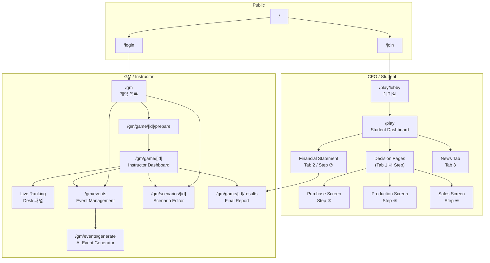
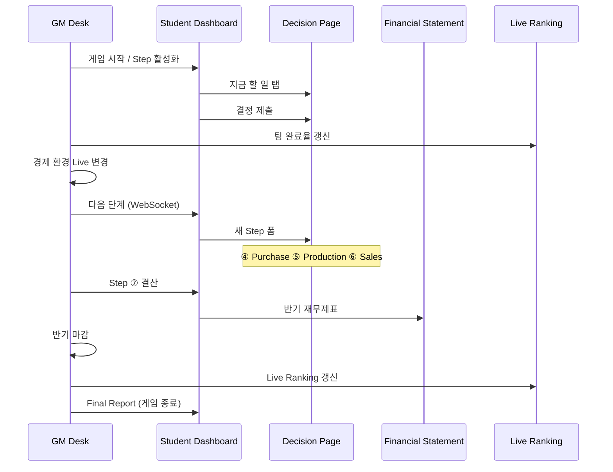

# 전체 화면 내비게이션 맵

> **Version 1.1** — D-01 Step1 wizard flow

## 역할

| UI | 사용자 |
|----|--------|
| **CEO (Student)** | 교육생 — 단계별 의사결정 |
| **GM (Instructor)** | 강사 — 게임 마스터, 환경·진행 통제 |

---

## 1. Master Navigation (전체)



---

## 2. 교육 흐름 ↔ 화면 매핑



---

## 3. 화면 인벤토리 (요청 12종 + 보조)

| # | 요청 화면 | Screen ID | Route | 소속 |
|---|-----------|-----------|-------|------|
| 1 | Student Dashboard | SCR-CEO-002 | `/play` | CEO |
| 2 | Decision Pages | SCR-CEO-D01~03,07 | `/play/step/[1-3,7]` | CEO |
| 3 | Purchase Screen | SCR-CEO-D04 | `/play/step/4` | CEO |
| 4 | Production Screen | SCR-CEO-D05 | `/play/step/5` | CEO |
| 5 | Sales Screen | SCR-CEO-D06 | `/play/step/6` | CEO |
| 6 | Financial Statement | SCR-CEO-F01 | `/play/company/finance` | CEO |
| 7 | Instructor Dashboard | SCR-GM-003 | `/gm/game/[id]` | GM |
| 8 | Event Management | SCR-GM-007 | `/gm/events` | GM |
| 9 | Scenario Editor | SCR-GM-006-E | `/gm/scenarios/[id]` | GM |
| 10 | AI Event Generator | SCR-GM-008 | `/gm/events/generate` | GM |
| 11 | Live Ranking | SCR-GM-R01 | Desk 내 패널 | GM |
| 12 | Final Report | SCR-GM-005 | `/gm/game/[id]/results` | GM |

**보조**: Join, Lobby, GM List, Prepare — `03-complete-wireframes.md` Part 0

---

## 4. CEO Shell — 공통 chrome (모든 Student 화면)

모든 CEO 화면은 동일 **App Shell**을 공유한다.

```
┌──────────────────────────────────────────────────────────────┐
│ [Logo] Alpha팀 · CEO 김OO          2년차 상반기 · ④/7  [🔔 2] │
├──────────────────────────────────────────────────────────────┤
│  ●━━●━━●━━●━━○━━○━━○   ← StepTimeline (클릭: 과거 열람)      │
├──────────────────────────────────────────────────────────────┤
│  [ ★ 지금 할 일 ]    [ 우리 회사 ]    [ 소식 ]               │
├──────────────────────────────────────────────────────────────┤
│                                                              │
│                    << SCREEN BODY >>                         │
│                                                              │
└──────────────────────────────────────────────────────────────┘
```

| Zone | 교육 역할 |
|------|-----------|
| Header | **언제** (반기) · **어디** (몇 단계) · 알림 |
| StepTimeline | 7단계 진행 시각화, GM 속도와 동기 |
| Tabs | ERP 메뉴 대신 3갈래: 행동 / 현황 / 세계 |

**진입**: Lobby → Dashboard  
**Step 화면 전환**: Tab「지금 할 일」내 GM `stepChanged` 시 body swap (route optional)

---

## 5. GM Shell — 공통 chrome

```
┌──────────────────────────────────────────────────────────────┐
│ GM Desk · 경영 시뮬레이션 3반          [프로젝터] [⏸] [⚙]   │
├──────────────────────────────────────────────────────────────┤
│ 2년차 상반기 │ Step ④ 원재료 구매 │ 7/10팀 제출 │ [Desk|순위] │
├──────────────────────────────────────────────────────────────┤
│                    << SCREEN BODY >>                         │
└──────────────────────────────────────────────────────────────┘
```

**Desk | 순위** 토글: Instructor Dashboard ↔ Live Ranking 패널 확장

---

## 6. 화면 간 이동 규칙

| From | Action | To |
|------|--------|-----|
| Student Dashboard | Tab「지금 할 일」 | Current Decision Page |
| Student Dashboard | Tab「우리 회사」→ 재무제표 | Financial Statement |
| Student Dashboard | StepTimeline ⑦ | Settlement / Financial preview |
| Decision Page | 제출 완료 | Dashboard (read-only 같은 Step) |
| GM Desk | [다음 단계] | CEO Decision Page 자동 전환 |
| GM Desk | [순위] 탭 | Live Ranking full |
| GM Desk | [이벤트+] | Event Management modal |
| Event Management | [AI 생성] | AI Event Generator |
| GM List | 시나리오 편집 | Scenario Editor |
| GM Desk | 반기 마감 후 | Live Ranking + CEO Financial |
| Game End | [최종 결과] | Final Report |

---

## 7. Step ↔ Decision Page 라우팅

| GM advances to | CEO body | Screen |
|----------------|----------|--------|
| Step 1 | 자금 조달 폼 | Decision Page ① |
| Step 2 | 설비 투자 폼 | Decision Page ② |
| Step 3 | 인력 채용 폼 | Decision Page ③ |
| Step 4 | 원재료 구매 | **Purchase Screen** |
| Step 5 | 생산 계획 | **Production Screen** |
| Step 6 | 판매 전략 | **Sales Screen** |
| Step 7 | 반기 결산 | Settlement → **Financial Statement** |

잠긴 Step: Timeline 회색, body에 "GM이 단계를 열 때까지 대기"

---

## 8. 문서 구조

| Part | 파일 섹션 | 화면 |
|------|-----------|------|
| 0 | 보조 화면 | Join, Lobby, GM List, Prepare |
| A | CEO | Dashboard, Decisions, Purchase, Production, Sales, Financial |
| B | GM | Instructor Dashboard, Live Ranking, Event, Scenario, AI Gen, Final |

상세 ASCII 와이어프레임: **`03-complete-wireframes.md`**
