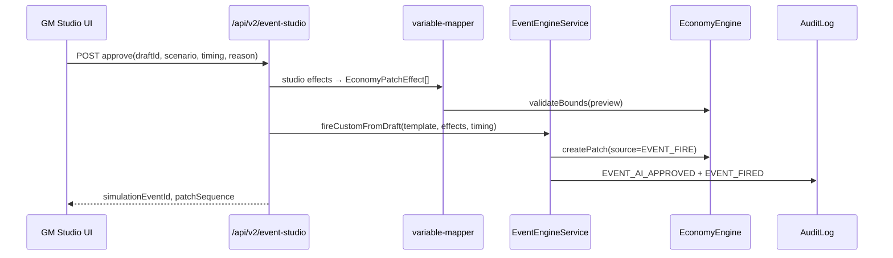

# V2.1 Event Scenario Studio — Specification

> **Status**: Design + Minimal Prototype (no OpenAI in RC codebase)  
> **V1 RC**: Frozen — no AI in `/gm` game ops  
> **Route**: `/event-studio` (separate app surface)  
> **Date**: 2026-07-27

---

## 1. 목표

강사가 **자연어**로 경영환경 이벤트를 입력하면, AI가 **비관·중립·낙관** 3가지 교육용 전망과 Economy 변수 변화안을 생성한다.  
**GM이 검토·수정·선택·승인한 결과만** 기존 P4 Event Engine으로 전달한다.

```
AI Output → Event Draft → GM Preview → GM Edit → GM Approve → Event → Economy Patch → Snapshot
```

---

## 2. V1과의 분리 원칙

| 항목 | V1 RC (`/gm`) | V2.1 Studio (`/event-studio`) |
|------|---------------|-------------------------------|
| AI 호출 | ❌ 없음 | ✅ OpenAI Responses API |
| Event Catalog | 18 fixed templates | AI draft + custom template |
| 자동 실행 | N/A | ❌ **금지** — GM Approve 필수 |
| API prefix | `/api/v1/*` | `/api/v2/event-studio/*` |
| 코드 경로 | `src/bsp/*` | `lib/v2/event-studio/*`, `components/v2/*` |

---

## 3. 입력 항목

| Field | Required | UI (Prototype) | API |
|-------|----------|----------------|-----|
| 이벤트 자연어 설명 | ✓ | textarea | `input.naturalLanguagePrompt` |
| 대상 산업 | ✓ | text | `input.targetIndustry` |
| 대상 시장/지역 | ✓ | text | `input.targetMarketOrRegion` |
| 예상 지속 기간 | ✓ | text | `input.expectedDuration` |
| 영향 반기 | ✓ | text (Y2H1, P3/6) | `input.targetHalfLabel` |
| 분석 강도 | ✓ | select LIGHT/STANDARD/DEEP | `input.analysisIntensity` |
| Economy Snapshot | ○ | session live | `sessionId` + snapshot fetch |

---

## 4. 출력 항목 (Structured Output)

| Output | Schema path |
|--------|-------------|
| 이벤트 요약 | `meta.title`, `meta.summary` |
| 주요 가정 | `assumptions[]` |
| 영향 경로 | `impactPathways[]` |
| 비관/중립/낙관 전망 | `scenarios.pessimistic|neutral|optimistic` |
| 각 전망 근거 | `scenarios.*.rationale` |
| Economy 변수 변화안 | `economyVariableChanges.*.effects[]` |
| 불확실성·주의 | `uncertainty.caveats`, `educationDisclaimer` |

JSON Schema: [`schemas/event-scenario-studio-output.schema.json`](./schemas/event-scenario-studio-output.schema.json)

---

## 5. Economy 변수 매핑

### 5.1 Studio → Engine (P4 `EconomyValues`)

| Studio key (AI 출력) | Engine key(s) | 비고 |
|---------------------|---------------|------|
| `interestRate` | `interestRateLoan`, `interestRateDeposit` | DELTA split 100% / 50% |
| `exchangeRate` | `exchangeRate` | |
| `rawMaterialCost` | `rawMaterialIndex` | |
| `logisticsCost` | `logisticsCostMultiplier` | MULTIPLY preferred |
| `tariff` | `tariffRate` | |
| `demand` | `marketDemandIndex` | |
| `marketGrowth` | `marketDemandIndex`, `businessCycleIndex` | split 50/50 PERCENT |
| `inflation` | `rawMaterialIndex`, `payrollCostMultiplier` | |
| `competitionIntensity` | `marketSupplyIndex` | |
| `energyCost` | `logisticsCostMultiplier`, `rawMaterialIndex` | |
| `esgCost` | `esgPressureIndex` | |
| `carbonTax` | `carbonTaxRatePerUnit` | |
| `governmentSupport` | `businessCycleIndex` | positive PERCENT |
| `businessCycleIndex` | `businessCycleIndex` | |

Implementation: `lib/v2/event-studio/variable-mapper.ts`  
Bounds: `ECONOMY_BOUNDS` in `economy-variable-meta.ts` — **AI는 bounds 초과 시 clamp 또는 GM 경고**

### 5.2 금지

- `corporateTaxRate`, `techInnovationIndex` 등 Studio enum 외 키
- 회계 formula / Step validator 직접 수정

---

## 6. 안전장치

| # | Rule | Implementation |
|---|------|----------------|
| S1 | AI 결과 자동 실행 금지 | `approve` API only → `fireEvent` |
| S2 | GM 명시적 승인 | `reason` required + audit `EVENT_AI_APPROVED` |
| S3 | 변수 bounds | `validateBounds()` post-map |
| S4 | 정보 부족 시 추정 표시 | `meta.isEstimate`, `effect.isEstimate` |
| S5 | 확률을 사실처럼 표현 금지 | Schema: no probability fields; prompt rule |
| S6 | Engine 규칙 불변 | Patch-only via P4 pipeline |
| S7 | V1 코드 무오염 | `/api/v2`, `lib/v2` namespace |

---

## 7. P4 Event Engine 연동 설계

상세: [`event-scenario-studio-p4-integration.md`](./event-scenario-studio-p4-integration.md)

**Approve 시퀀스**



**Custom Event Template** (runtime, not catalog file):

```typescript
{
  eventId: `AI-${draftId.slice(0, 8)}`,
  title: studioOutput.meta.title,
  description: studioOutput.scenarios[selected].narrative,
  category: mapCategory(studioOutput.meta.category),
  normalEffects: mappedEffects,
  educationPurpose: studioOutput.meta.summary,
  // ... discussionQuestions from selected scenario
  generatedFromPrompt: hash,
  approvedBy: gmActor.userId,
}
```

Reuses: `EventEngineService.fireEvent()`, `applyEffects()`, CEO `CeoEventFeed`, GM `GmEventControlPanel` history.

---

## 8. API 계약

[`event-scenario-studio-api.md`](./event-scenario-studio-api.md)

---

## 9. Prompt 설계

[`event-scenario-studio-prompt.md`](./event-scenario-studio-prompt.md)

---

## 10. UI Prototype

| Item | Path |
|------|------|
| Page | `/event-studio` → `app/event-studio/page.tsx` |
| Component | `components/v2/event-studio/EventStudioPrototype.tsx` |
| Mock data | `lib/v2/event-studio/mock-scenario-output.ts` |

**실행**

```bash
npm run dev
# → http://localhost:3000/event-studio
```

**Prototype 범위**

- ✅ 입력 폼 7항목
- ✅ Mock AI 생성 (800ms delay)
- ✅ 3-scenario 선택 UI
- ✅ Engine key Preview (mapper)
- ✅ GM Approve 버튼 (Engine **미연결**, 안내 메시지)
- ❌ OpenAI live call
- ❌ Session economy live fetch

---

## 11. 비용 계획

| 항목 | Estimate |
|------|----------|
| Model | `gpt-4.1` or `gpt-4.1-mini` (config) |
| Tokens / generate | ~2k input + ~1.5k output |
| Cost / generate | ~$0.02–0.06 (model dependent) |
| Classroom (30 generates/day) | ~$2/day upper bound |
| Mitigation | Rate limit 10/h/session; cache draft; LIGHT intensity default |

Env: `BSP_OPENAI_API_KEY`, optional org budget alerts.

---

## 12. 보안 계획

| Risk | Control |
|------|---------|
| API key exposure | Server-only; never `NEXT_PUBLIC_*` |
| Prompt injection | System prompt isolation; sanitize length; no tool use |
| Unauthorized approve | `requireGmSession(sessionId)` |
| Audit tampering | Append-only audit (P7) |
| PII in prompts | Instructor guideline; no student names in examples |
| Cost abuse | Rate limit + admin disable flag `BSP_STUDIO_ENABLED` |

---

## 13. 오류 처리

| Error | UX | Retry |
|-------|-----|-------|
| OpenAI 429/5xx | "AI 일시 unavailable — 잠시 후 재시도" | exponential backoff ×2 |
| Schema fail | Show validation errors; 1 auto-retry | server-side |
| Bounds fail | Show clamp preview; GM must confirm | manual edit |
| Approve conflict | Idempotency-Key returns original event | — |

All errors logged with `draftId`, `sessionId`, no prompt content in prod logs (hash only).

---

## 14. 구현 Phase (Post-Design)

| Phase | Scope |
|-------|-------|
| V2.1a | OpenAI wire-up + `/api/v2/event-studio/drafts/*` |
| V2.1b | Approve → P4 `fireCustomFromDraft` |
| V2.1c | GM Desk link "Studio에서 열기" (read-only deep link) |
| V2.2 | Draft persistence PG; draft history UI |

**Explicitly out of scope V2.1**: real-time news APIs, external macro data feeds, CEO auto-hints.

---

## 15. 관련 문서

| Doc | Purpose |
|-----|---------|
| [`event-scenario-studio-api.md`](./event-scenario-studio-api.md) | REST contract |
| [`event-scenario-studio-prompt.md`](./event-scenario-studio-prompt.md) | Prompt + validation |
| [`event-scenario-studio-p4-integration.md`](./event-scenario-studio-p4-integration.md) | Engine wiring |
| [`schemas/event-scenario-studio-output.schema.json`](./schemas/event-scenario-studio-output.schema.json) | Structured Output |
| V1 [`02-event-engine-spec.md`](../spec/02-event-engine-spec.md) | Baseline Event rules |

---

## 16. Prototype 승인 체크리스트

- [x] V1 `/gm` 코드 변경 없음 (deep link `?sessionId` only — optional)
- [x] Separate route `/event-studio`
- [x] JSON Schema defined
- [x] API contract documented
- [x] Prompt design documented
- [x] P4 integration sequence documented
- [x] Safety rules documented
- [x] Mock UI walkthrough available
